<a id="readme-top"></a>

<!-- LOGO -->
<div align="center">
  <a href="https://leonardo-vasconcellos.vercel.app/portfolio/semprecomvoce-next">
    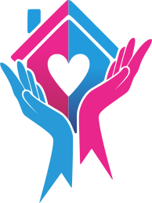
  </a>

  <h1 align="center">Instituto do Câncer Sempre Com Você</h1>

  <p align="center">The official website for a cancer care NGO in Joinville, Brazil.</p>

  <p align="center">// nonprofit website · instituto do câncer</p>

  <br />

<a href="https://leonardo-vasconcellos.vercel.app/portfolio/semprecomvoce-next"><strong>View it live »</strong></a>

</div>

<br />

<!-- SHIELDS -->

[![Creator Website][website-shield]][website-url]
[![Contributors][contributors-shield]][contributors-url]
[![Forks][forks-shield]][forks-url]
[![Issues][issues-shield]][issues-url]
[![LinkedIn][linkedin-shield]][linkedin-url]
[![Released][year-shield]][year-url]

<!-- TABLE OF CONTENTS -->
<details>
  <summary>Table of Contents</summary>
  <ol>
    <li><a href="#about-the-project">About The Project</a></li>
    <li><a href="#screenshots">Screenshots</a></li>
    <li><a href="#built-with">Built With</a></li>
    <li><a href="#getting-started">Getting Started</a></li>
    <li><a href="#learn-more-about-nextjs">Learn More about Next.js</a></li>
    <li><a href="#roadmap">Roadmap</a></li>
    <li><a href="#contributors">Contributors</a></li>
    <li><a href="#contact">Contact</a></li>
  </ol>
</details>

<!-- ABOUT THE PROJECT -->

## About The Project

[![Product Screenshot][product-screenshot]](https://leonardo-vasconcellos.vercel.app/portfolio/semprecomvoce-next)

<!-- PROJECT INTRO: 260 chars max -->

The official website for Instituto do Câncer Sempre Com Você, a cancer care NGO in Joinville, Brazil — connecting patients to support, amplifying their stories, and making donations effortless.

<!-- END INTRO -->

Instituto do Câncer Sempre Com Você is a nonprofit organization dedicated to improving the lives of cancer patients and their families across Santa Catarina, Brazil. This Next.js website serves as the NGO's complete digital presence — from a blog filled with real patient journeys, to a full donation flow that supports ongoing care.

- **Blog with real patient stories** — A content-rich blog system showcasing the NGO's mission through personal testimonials, photos, and updates from the field.
- **Monthly donation flow** — A complete donation experience with one-time and recurring options, confirmation screens, and structured payment flow.
- **Animated navigation with mobile submenu** — A polished navigation system with a sliding pill indicator on desktop and a layered, animated mobile menu with nested submenu support.

<p align="right">(<a href="#readme-top">back to top</a>)</p>

<!-- SCREENSHOTS -->

## Screenshots

<div align="center" style="display:flex;flex-wrap:wrap;gap:8px;justify-content:center;">
  <a href="screenshots/screenshot-1.png">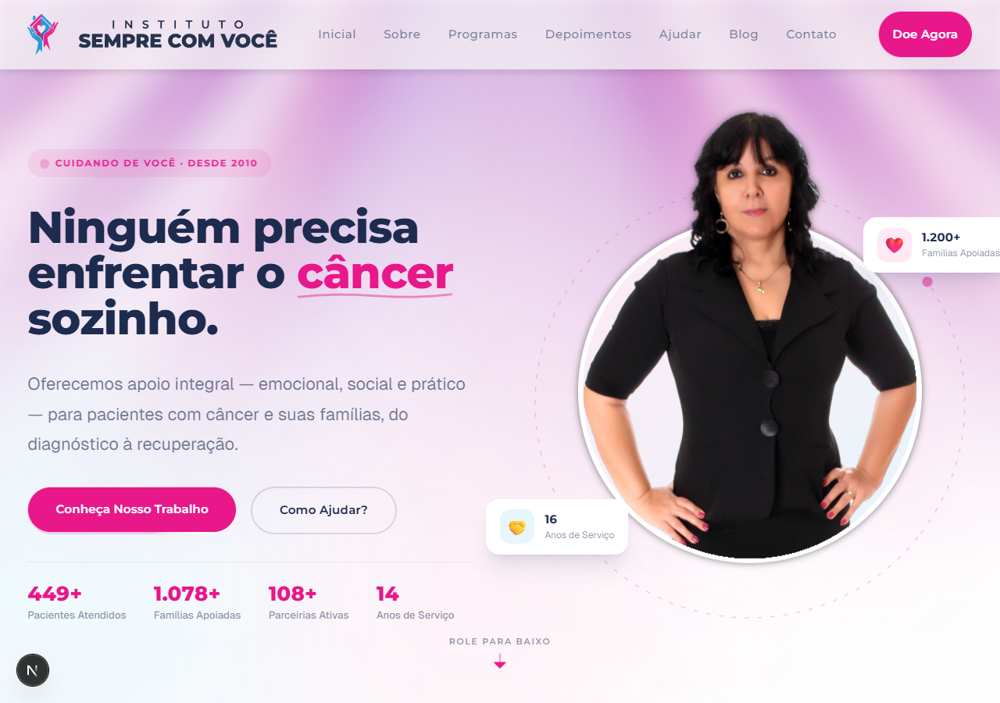</a>
  <a href="screenshots/screenshot-4-programs.png">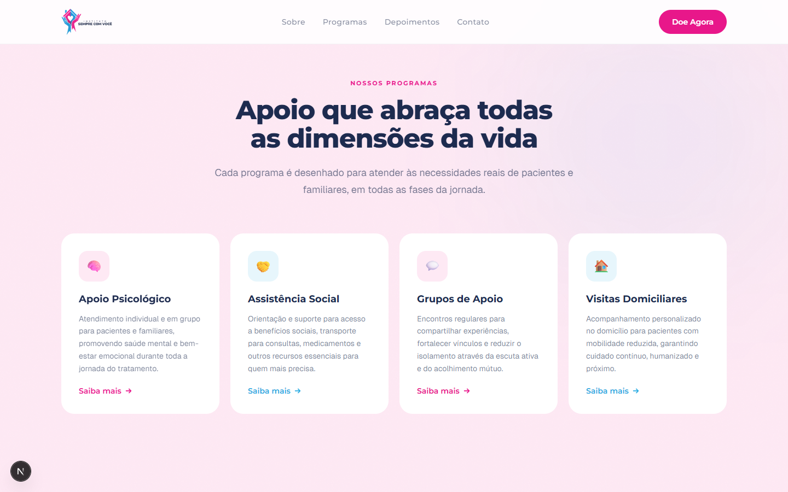</a>
  <a href="screenshots/screenshot-4-section-full.png">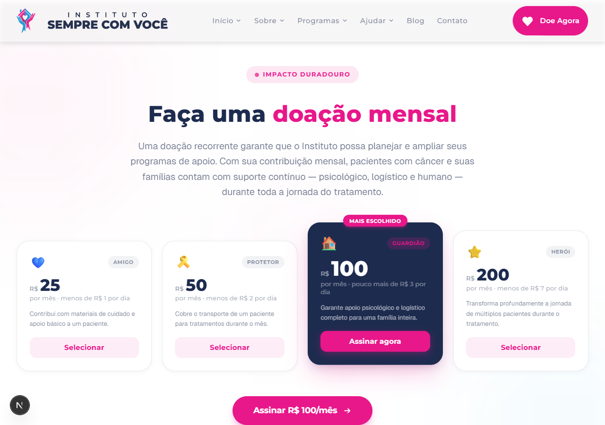</a>
  <a href="screenshots/screenshot-5-hover-test.png">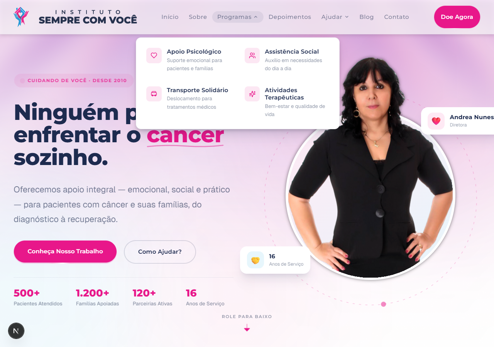</a>
  <a href="screenshots/screenshot-6-final.png">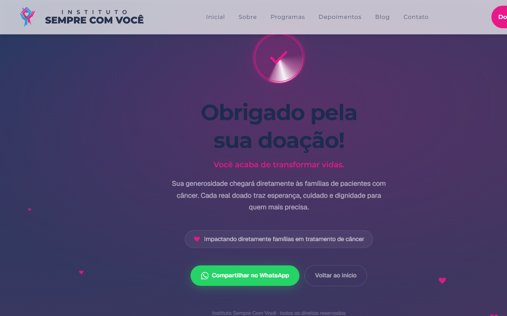</a>
  <a href="screenshots/screenshot-6-section-top.png">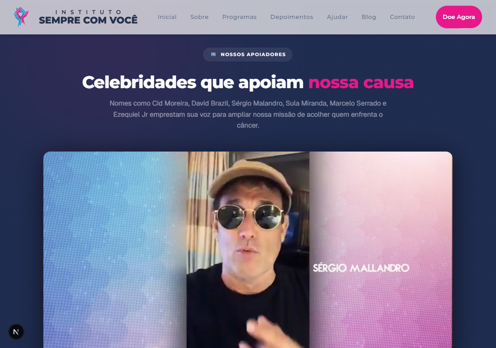</a>
  <a href="screenshots/screenshot-8-footer-links.png">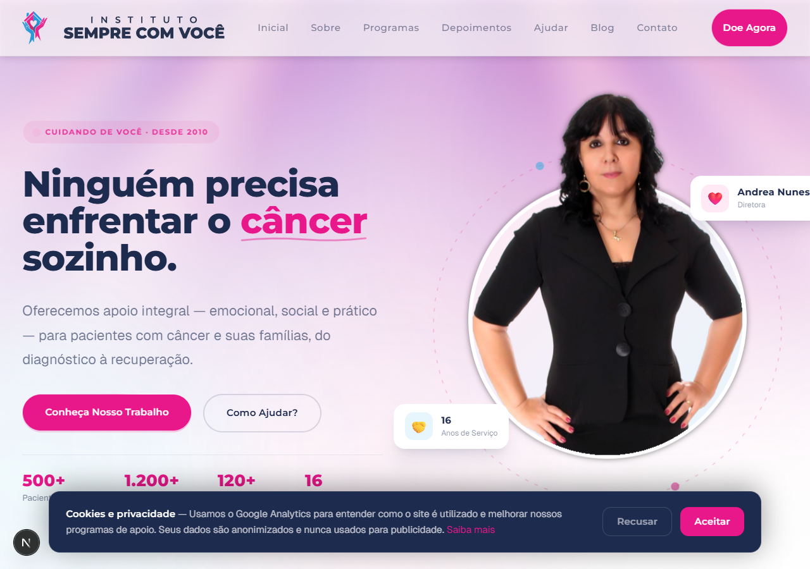</a>
  <a href="screenshots/screenshot-8-section-areas.png">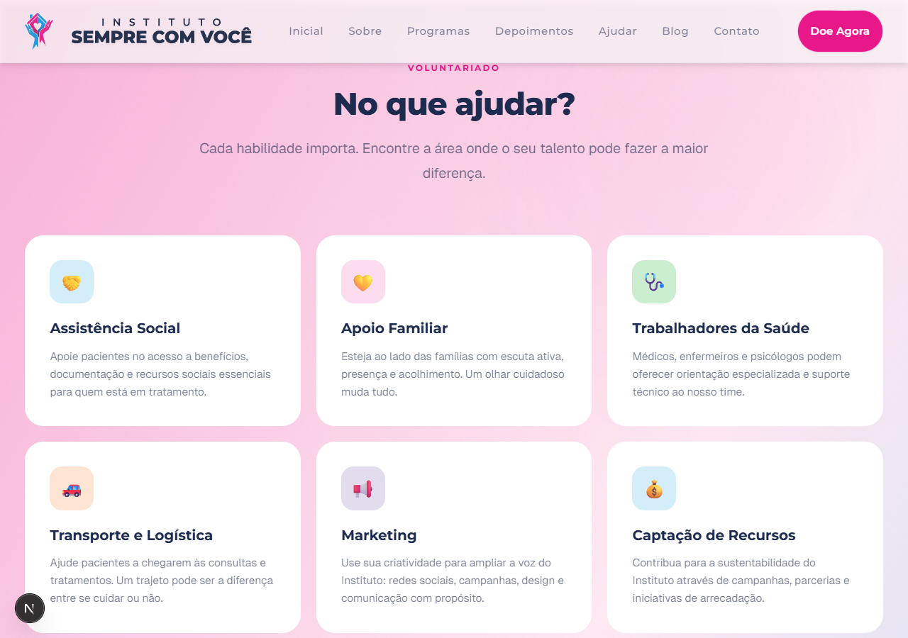</a>
  <a href="screenshots/screenshot-9-section-gratidao.png">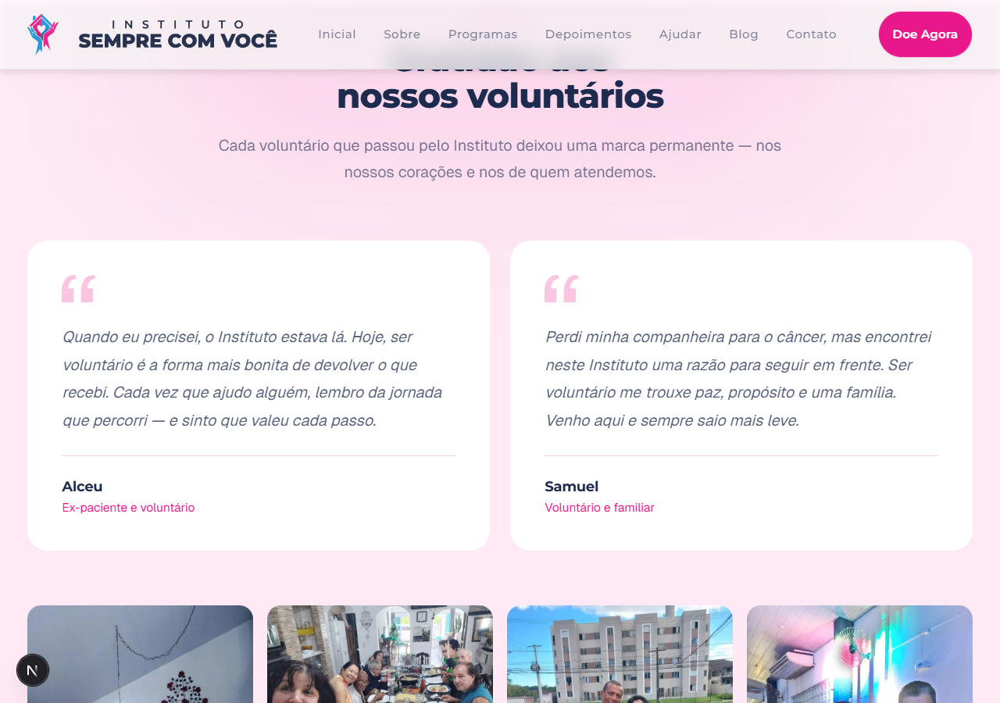</a>
  <a href="screenshots/screenshot-10-gallery.png">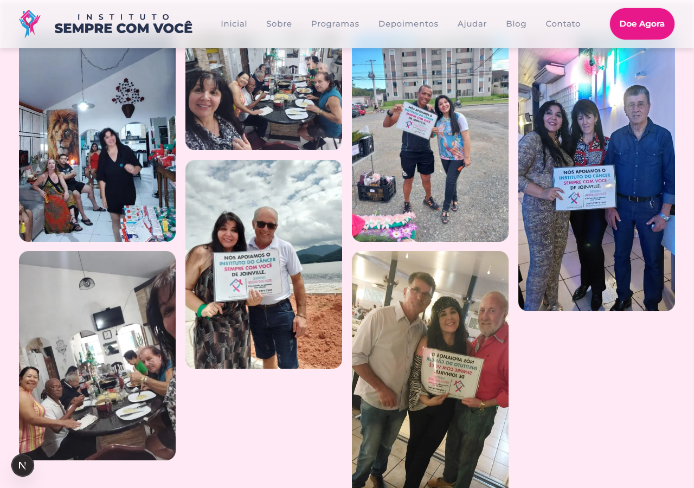</a>
  <a href="screenshots/screenshot-10-mobile-fixed.png">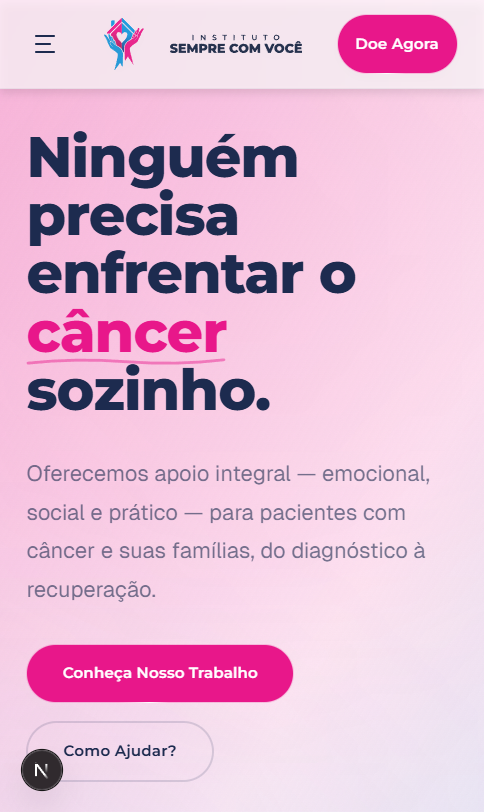</a>
  <a href="screenshots/screenshot-16-mobile-cta-correct.png">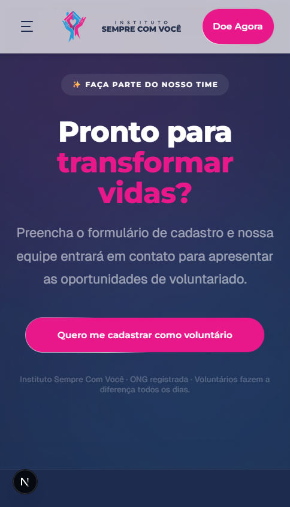</a>
  <a href="screenshots/localhost_3000_.png">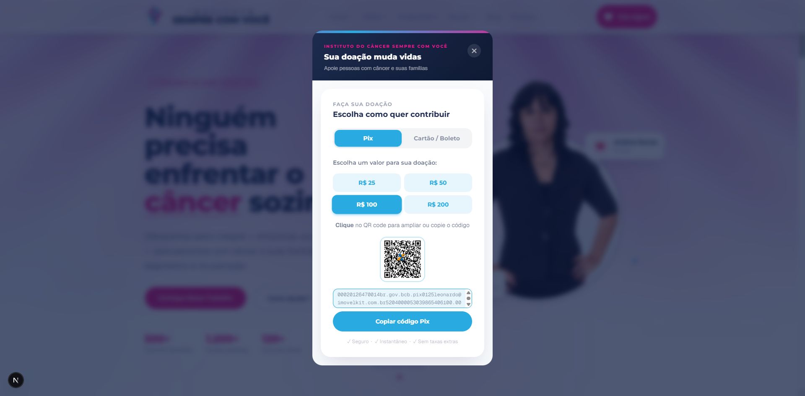</a>
  <a href="screenshots/Captura%20de%20tela%202026-06-07%20100915.png"></a>
  <a href="screenshots/Captura%20de%20tela%202026-06-07%20101008.png"></a>
  <a href="screenshots/Captura%20de%20tela%202026-06-07%20101041.png"></a>
  <a href="screenshots/localhost_3000_(iPhone%2014%20Pro%20Max).png"></a>
  <a href="screenshots/screenshot-2-blog-post.png">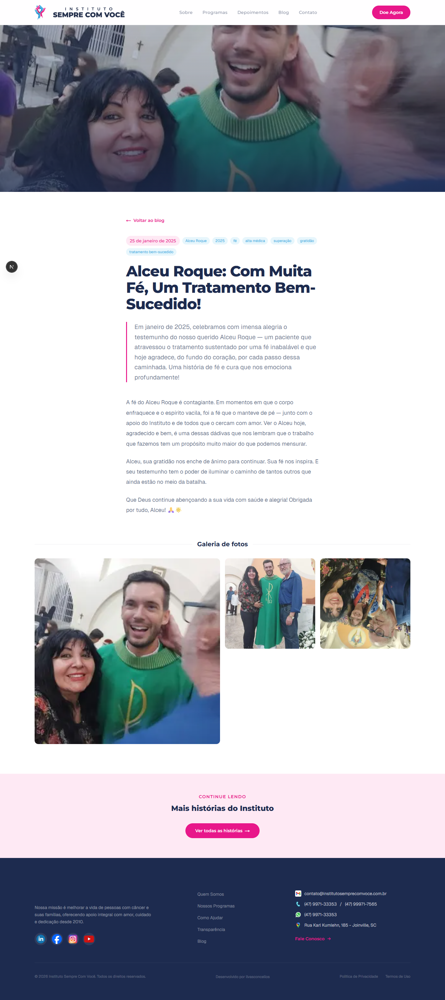</a>
</div>

<p align="right">(<a href="#readme-top">back to top</a>)</p>

<!-- BUILT WITH -->

## Built With

**Languages**

|                                                                                                                | Language   | Version |
| -------------------------------------------------------------------------------------------------------------- | ---------- | ------- |
|  | TypeScript | 5.x     |
|  | JavaScript | ES2022  |
|            | HTML       | 5       |
|              | CSS        | 3       |
|          | Python     | 3.x     |
|          | Node.js    | scripts |

**Frameworks & Libraries**

|                                                                                                                  | Framework    | Version |
| ---------------------------------------------------------------------------------------------------------------- | ------------ | ------- |
|            | Next.js      | 16.2.4  |
|              | React        | 19.2.4  |
|  | Tailwind CSS | 4.x     |

<p align="right">(<a href="#readme-top">back to top</a>)</p>

<!-- GETTING STARTED -->

## Getting Started

First, run the development server:

```bash
pnpm dev
```

Open [https://localhost:3000](https://localhost:3000) with your browser to see the result.

You can start editing the page by modifying `app/page.tsx`. The page auto-updates as you edit the file.

<p align="right">(<a href="#readme-top">back to top</a>)</p>

<!-- LEARN MORE -->

## Learn More about Next.js

To learn more about Next.js, take a look at the following resources:

- [Next.js Documentation](https://nextjs.org/docs) — learn about Next.js features and API.
- [Learn Next.js](https://nextjs.org/learn) — an interactive Next.js tutorial.

You can check out [the Next.js GitHub repository](https://github.com/vercel/next.js) — your feedback and contributions are welcome!

<p align="right">(<a href="#readme-top">back to top</a>)</p>

<!-- ROADMAP -->

## Roadmap

This project repository is for archive purposes only. No new features or issues are being tracked.

<p align="right">(<a href="#readme-top">back to top</a>)</p>

<!-- CONTRIBUTORS -->

## Contributors

<a href="https://github.com/llvasconcellos2/semprecomvoce-next/graphs/contributors">
  
</a>

<p align="right">(<a href="#readme-top">back to top</a>)</p>

<!-- CONTACT -->

## Contact

[Leonardo Vasconcellos](https://leonardo-vasconcellos.vercel.app/) — leonardolimadevasconcellos@gmail.com

<p align="right">(<a href="#readme-top">back to top</a>)</p>

<!-- MARKDOWN LINKS & IMAGES -->

[website-shield]: https://img.shields.io/badge/Creator_Website-%E2%86%97-2eba7a?style=for-the-badge
[website-url]: https://leonardo-vasconcellos.vercel.app/
[contributors-shield]: https://img.shields.io/github/contributors/llvasconcellos2/semprecomvoce-next.svg?style=for-the-badge
[contributors-url]: https://github.com/llvasconcellos2/semprecomvoce-next/graphs/contributors
[forks-shield]: https://img.shields.io/github/forks/llvasconcellos2/semprecomvoce-next.svg?style=for-the-badge
[forks-url]: https://github.com/llvasconcellos2/semprecomvoce-next/network/members
[issues-shield]: https://img.shields.io/github/issues/llvasconcellos2/semprecomvoce-next.svg?style=for-the-badge
[issues-url]: https://github.com/llvasconcellos2/semprecomvoce-next/issues
[linkedin-shield]: https://img.shields.io/badge/-LinkedIn-0A66C2?style=for-the-badge&logo=linkedin&logoColor=white
[linkedin-url]: https://www.linkedin.com/in/llvasconcellos
[year-shield]: https://img.shields.io/badge/Released-2026-gray?style=for-the-badge
[year-url]: #
[product-screenshot]: screenshots/Captura%20de%20tela%202026-06-07%20100757.png
