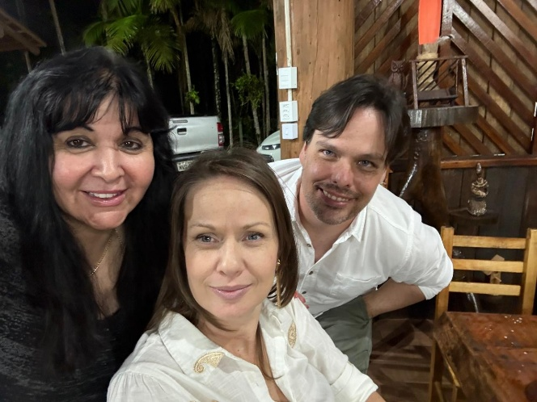
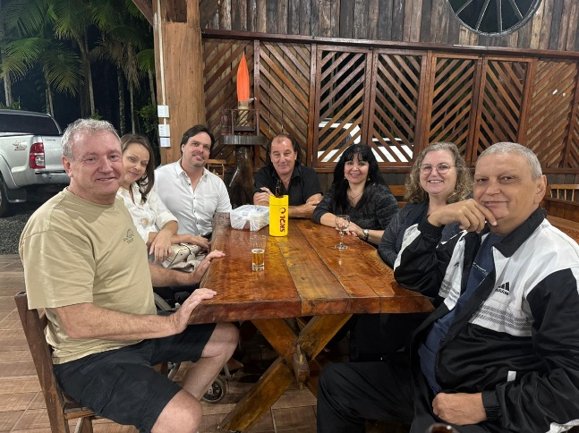
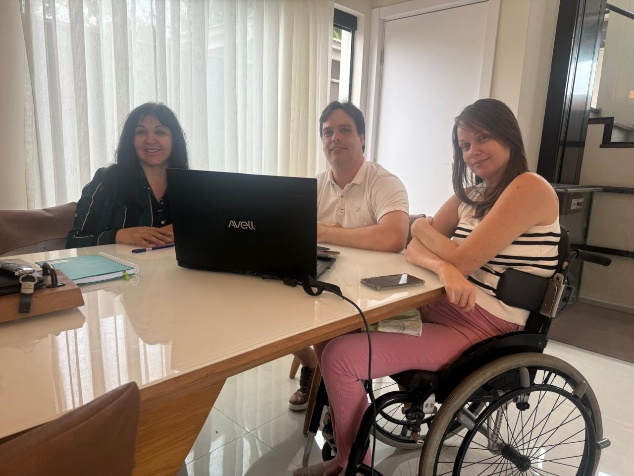
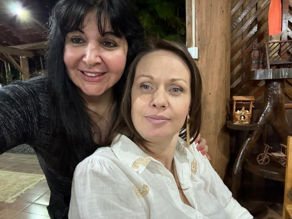
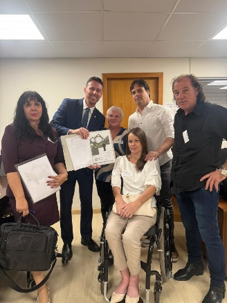
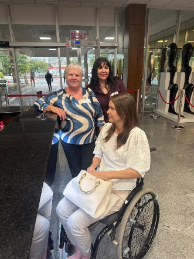

# Reuniões com Nossa Paciente: Apoio Emocional e Orientação sobre Seus Direitos

<!-- intro -->
Um dos pilares do nosso trabalho aqui no Instituto Sempre Com Você é estar presente — de verdade, de perto — em cada etapa da jornada de quem enfrenta o câncer. Em junho de 2019, nos reunimos com uma de nossas pacientes para oferecer exatamente isso: escuta, cuidado e orientação sobre os direitos que ela tem garantidos durante o tratamento.
<!-- /intro -->

Saber que existem direitos assegurados por lei a pacientes oncológicos faz toda a diferença. O acesso a medicamentos, a prioridade em filas, o direito ao acompanhante — essas informações transformam a vida de quem já carrega um peso tão grande. Parte do nosso trabalho é garantir que nenhum paciente percorra esse caminho no escuro.

Mas além das informações práticas, o que mais marca esses encontros é o cuidado humano. Sentar ao lado de alguém, olhar nos olhos, ouvir com atenção — isso tem um poder imenso de curar o que nenhum remédio alcança.

Cada reunião como essa nos reafirma a razão de existirmos. Obrigada a todos que fazem parte dessa rede de amor e cuidado. ❤️

<!-- gallery -->
- 
- 
- 
- 
- 
- 
<!-- /gallery -->

<!-- tags -->
- apoio emocional
- direitos dos pacientes
- 2019
- Joinville
- acompanhamento
- saúde mental
<!-- /tags -->
