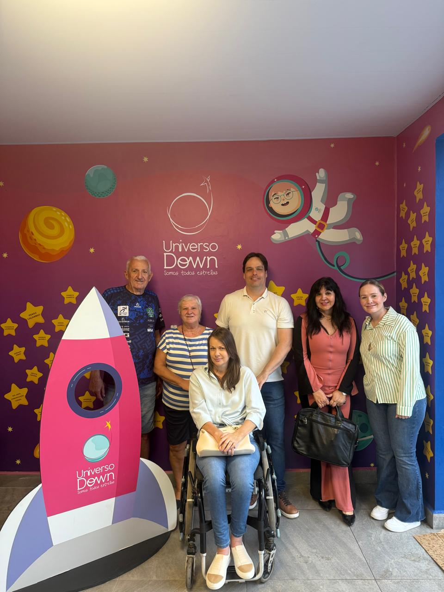

# Visita ao Universo Down: Uma Parceria que Nasce do Amor ao Próximo

<!-- intro -->
Acreditamos que cuidar vai além das fronteiras de um único instituto. Em junho de 2023, visitamos o Universo Down — uma instituição incrível dedicada às pessoas com Síndrome de Down — para explorar uma parceria que une dois propósitos: o de servir e o de incluir.
<!-- /intro -->

Foi uma visita repleta de trocas genuínas. O ambiente acolhedor do Universo Down, com seu mural colorido e cheio de estrelas, nos recebeu com toda a alegria que caracteriza quem faz o bem com o coração aberto. A missão deles — "Somos todas estrelas" — ressoa muito com o que acreditamos aqui no Instituto: toda vida merece ser iluminada, cuidada e celebrada.

Unirem forças com quem compartilha esse compromisso com a dignidade humana é sempre motivo de esperança. Estamos ansiosas para que essa parceria se fortaleça e alcance ainda mais pessoas que precisam de apoio, acolhimento e amor.

Que venham muitas colaborações juntas!

<!-- gallery -->
- 
<!-- /gallery -->

<!-- tags -->
- parceria
- Universo Down
- 2023
- Joinville
- inclusão
- colaboração
<!-- /tags -->
