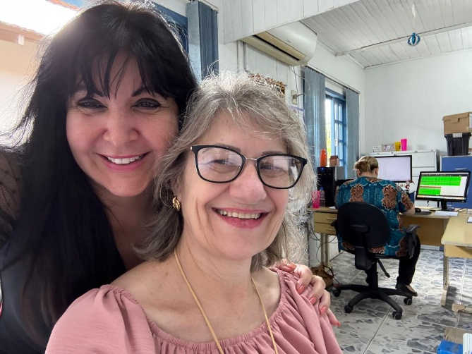
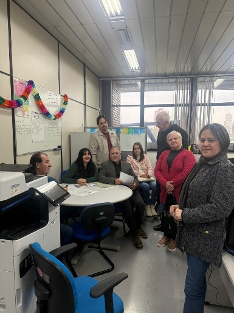
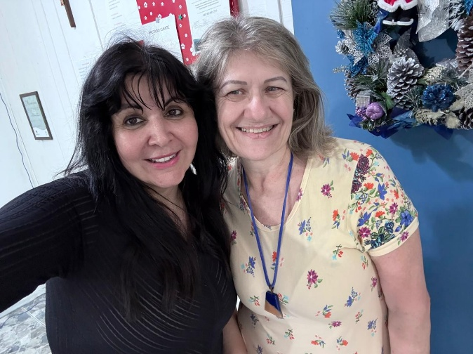
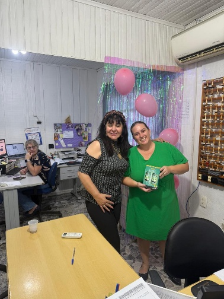
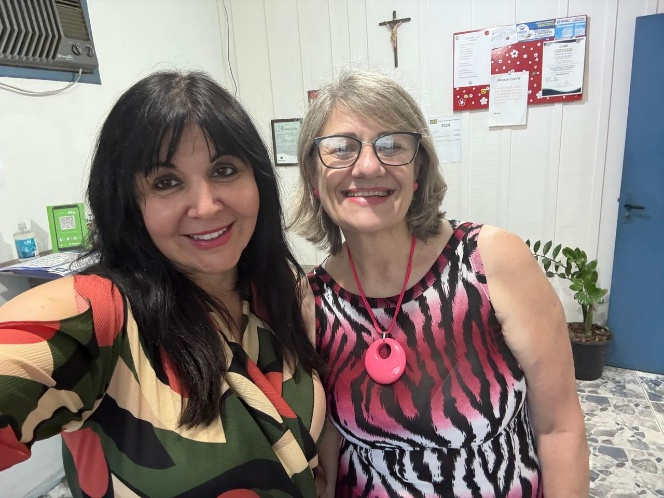
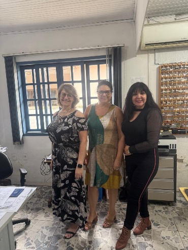

# Assistidas do Instituto do Câncer Sempre Com Você: Sorrisos que Contam Histórias

<!-- intro -->

Cada sorriso que vemos nos rostos das nossas assistidas é uma prova viva de que o cuidado faz diferença. Em junho de 2023, passamos um tempo especial com algumas das mulheres que o Instituto do Câncer Sempre Com Você acompanha, e esses momentos nos enchem de gratidão e renovam nossas forças para continuar.

<!-- /intro -->

O trabalho de assistência vai muito além de consultas e encaminhamentos. É sobre presença. É sobre ser a mão que segura quando o medo aperta, o ombro amigo quando as lágrimas vêm, a voz que diz "você não está sozinha" quando tudo parece pesado demais.

Ver nossas pacientes sorrindo, partilhando suas conquistas e suas histórias — isso é o que nos move todos os dias. Cada uma delas é uma guerreira, e é uma honra caminhar ao lado delas nessa jornada.

Com carinho e gratidão a cada uma de vocês. 💕

<!-- gallery -->

- 
- 
- 
- 
- 
- 
<!-- /gallery -->

<!-- tags -->

- assistidas
- apoio emocional
- 2023
- pacientes
- mulheres
- acolhimento
- Joinville
<!-- /tags -->
