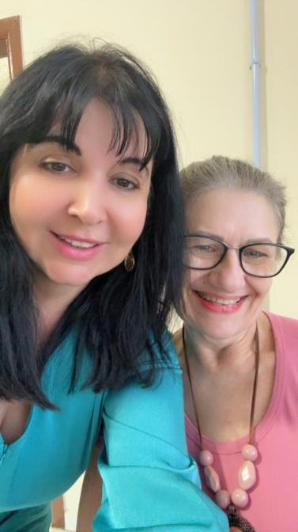

# Ação entre Amigos: A Solidariedade que Aquece o Coração

<!-- intro -->
Às vezes, o amor se manifesta de formas simples e lindas: num cesto de presentes, num abraço, numa reunião entre amigos que se reúnem para fazer o bem. Em junho de 2023, realizamos uma de nossas queridas ações entre amigos — e o resultado foi lindo!
<!-- /intro -->

Eventos como este são a prova de que a solidariedade não precisa de grandes palcos. Uma sala, rostos sorridentes, cestinhas com mimo e muito coração já são suficientes para criar memórias que aquecem a alma dos nossos pacientes e voluntários.

Agradeço do fundo do coração a cada pessoa que esteve presente e que entende que pequenos gestos de carinho têm o poder de mudar o dia — e às vezes, a vida — de quem está em tratamento. Vocês são a razão do Instituto existir!

<!-- gallery -->
- 
- 
- 
- 
<!-- /gallery -->

<!-- tags -->
- ação solidária
- amigos
- 2023
- arrecadação
- voluntariado
- Joinville
<!-- /tags -->
