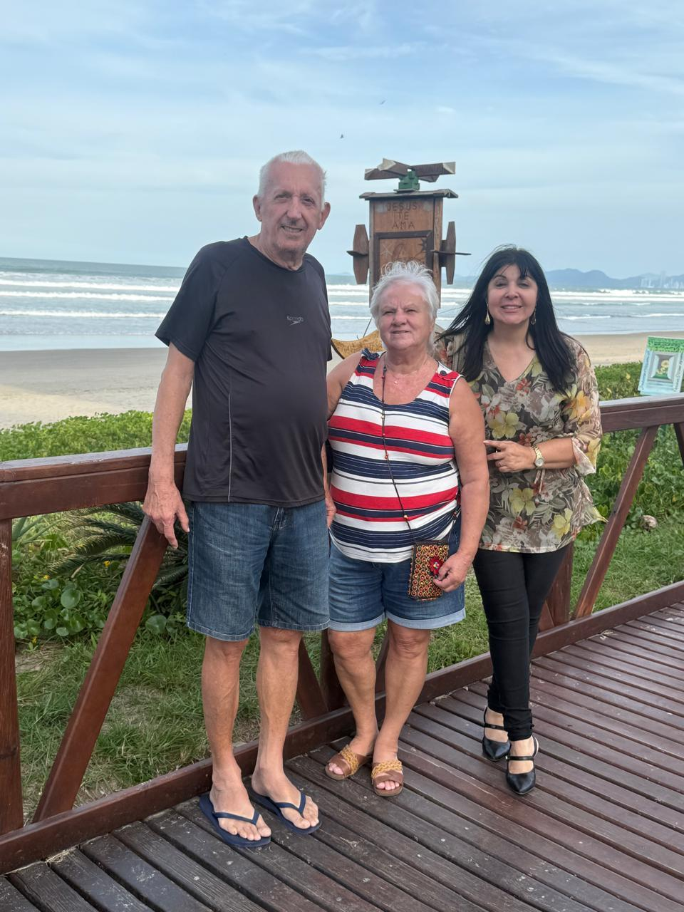

# Acompanhamento do Paciente Waldir: O Cuidado que Vai Além das Fronteiras da Cidade

<!-- intro -->
O nosso compromisso com cada paciente não conhece fronteiras geográficas. Em junho de 2023, fizemos o acompanhamento do nosso querido Waldir, que veio de São Francisco do Sul até nós — e essa dedicação mútua nos toca profundamente.
<!-- /intro -->

Waldir é um daqueles pacientes que nos lembram por que fazemos o que fazemos. Deslocar-se de outra cidade para buscar apoio emocional e assistência exige coragem e determinação — e o Instituto Sempre Com Você está aqui exatamente para garantir que essa jornada valha a pena.

O tratamento oncológico é longo e exaustivo, mas ninguém precisa percorrê-lo sozinho. Seja do lado de cá ou de lá da baía, estamos aqui — Sempre Com Você.

Força, Waldir! 💙

<!-- gallery -->
- 
- 
<!-- /gallery -->

<!-- tags -->
- acompanhamento
- paciente
- 2023
- São Francisco do Sul
- Waldir
- apoio
<!-- /tags -->
