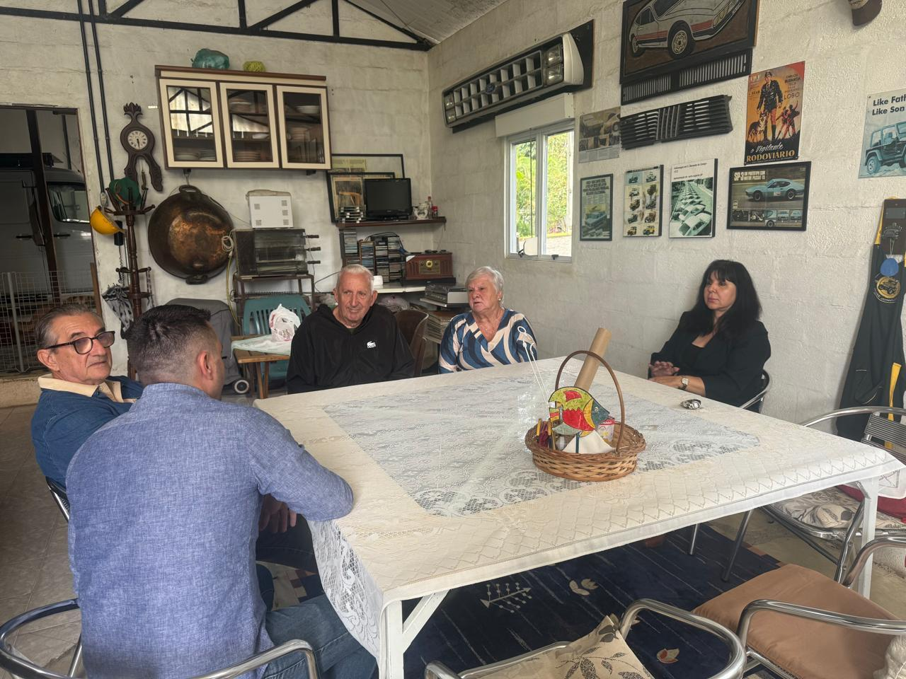

# Campanhas para o Tratamento e Acompanhamento dos Nossos Pacientes

<!-- intro -->
Manter o tratamento de nossos pacientes em dia exige muito mais do que boa vontade — exige recursos, organização e, acima de tudo, uma rede de pessoas comprometidas com o bem. Em junho de 2023, intensificamos nossas campanhas de arrecadação para garantir a continuidade do cuidado aos nossos assistidos.
<!-- /intro -->

Cada campanha que realizamos carrega o peso de uma história real: a de alguém que precisa de medicamentos, de transporte, de acompanhamento psicológico, de um simples cesto de alimentos para atravessar o mês durante o tratamento. Quando arrecadamos, não estamos apenas juntando recursos — estamos construindo pontes de esperança.

Gratidão a todos os parceiros, doadores e voluntários que acreditam nessa causa. Cada contribuição, por menor que seja, chega com força total na vida de quem mais precisa. Juntos, somos mais fortes!
