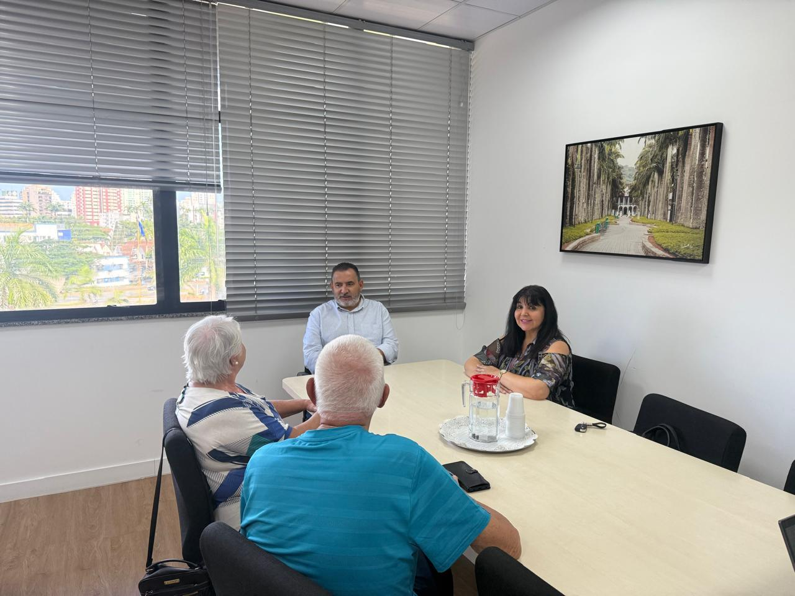
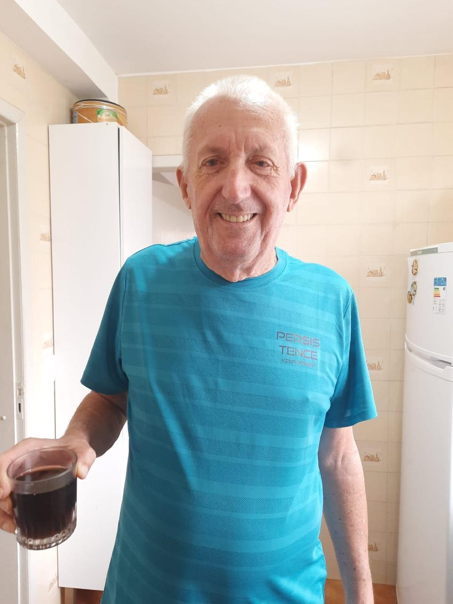
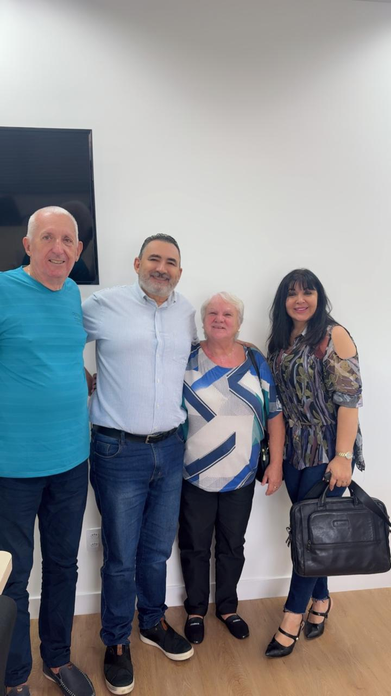

# Um Terreno, Um Sonho: A Prefeitura de Joinville nos Abre as Portas para a Nova Sede

<!-- intro -->

Em julho de 2023, vivemos um momento histórico para o Instituto do Câncer Sempre Com Você. A Prefeitura de Joinville, representada pelo Secretário de Governo Gilberto Leal, nos cedeu um terreno no Bairro Glória — coração de Joinville — para a construção da nossa nova sede. Um sonho que começa a ganhar forma!

<!-- /intro -->

Há muito tempo sonhamos com um espaço próprio e digno para receber os nossos pacientes e suas famílias. Um lugar que transmita acolhimento desde a entrada, que tenha salas para atendimento psicológico, assistência social e reuniões de apoio. E esse dia finalmente chegou.

Somos imensamente gratas à Prefeitura de Joinville e ao Secretário Gilberto Leal por reconhecerem a importância do nosso trabalho e por nos oferecerem essa oportunidade única. O apoio do poder público é fundamental para que instituições como a nossa possam ampliar seu alcance e impacto.

O Bairro Glória nos espera, e nós estamos prontas para construir — tijolo por tijolo — um lar para todos que precisam de nós. Obrigada, Joinville! 🏡💕

<!-- gallery -->

- 
- 
- 
<!-- /gallery -->

<!-- tags -->

- nova sede
- Prefeitura de Joinville
- 2023
- Bairro Glória
- Gilberto Leal
- terreno
- Joinville
<!-- /tags -->
