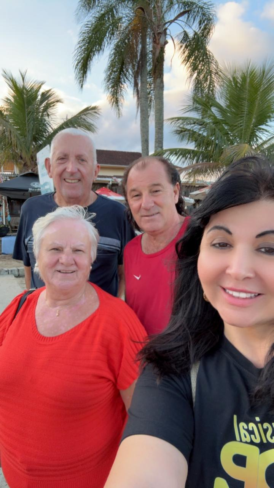
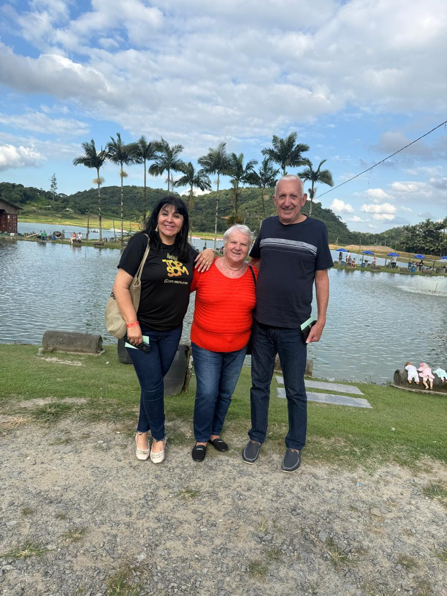
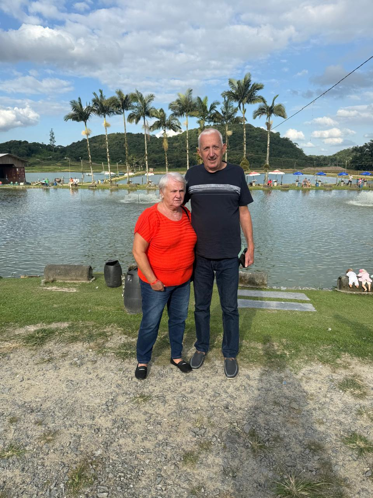

# Acompanhamento do Paciente Antônio Giacomazzi: Presença que Cura

<!-- intro -->
Em julho de 2023, estivemos ao lado do nosso querido Antônio Giacomazzi, de 61 anos. Acompanhar cada etapa da sua jornada — com atenção, carinho e escuta — é o que o Instituto Sempre Com Você faz de melhor.
<!-- /intro -->

O Antônio é um guerreiro. Enfrentar o câncer exige uma força que vai muito além do físico — é uma batalha também emocional, familiar, social. Saber que há alguém ao seu lado, que se preocupa não apenas com os exames e medicamentos, mas com o seu bem-estar como um todo, faz uma diferença enorme no ânimo para seguir em frente.

Continuamos firmes nesse compromisso: estar presentes, de verdade, em cada passo dessa caminhada. Força, Antônio! 💙

<!-- gallery -->
- 
- 
- 
<!-- /gallery -->

<!-- tags -->
- acompanhamento
- Antônio Giacomazzi
- 2023
- câncer
- apoio emocional
- paciente
<!-- /tags -->
