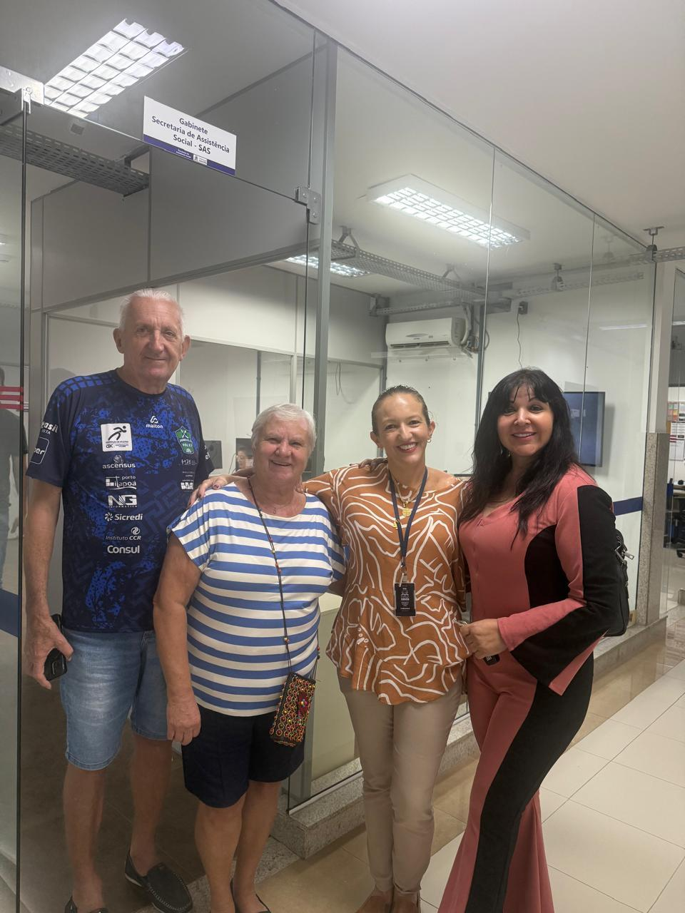
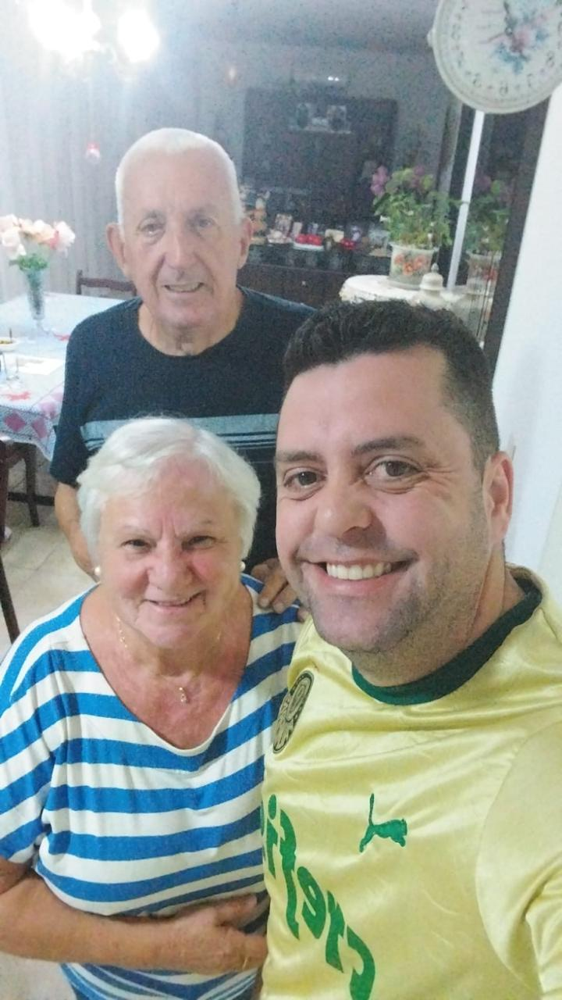
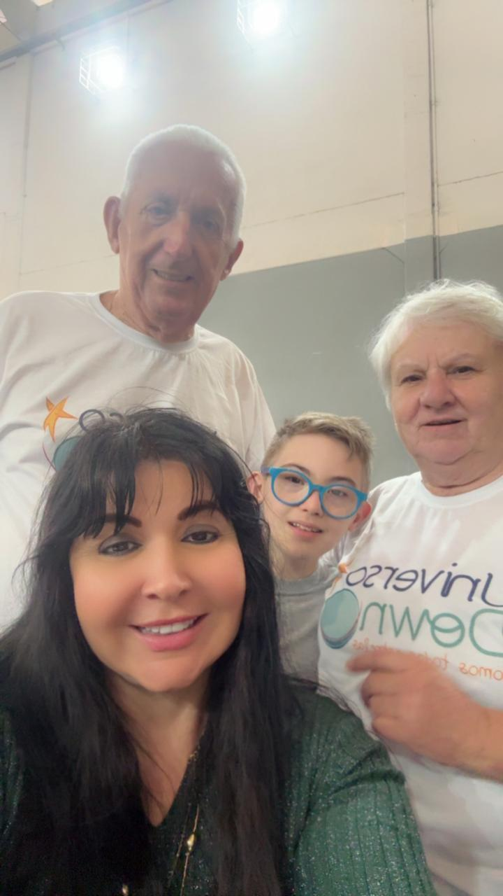

# Acompanhamento do Paciente Infantil Arthur: Cuidando de Quem Mal Começou a Viver

<!-- intro -->

Quando o câncer chega na infância, a dor é diferente — e o cuidado precisa ser ainda mais delicado. Em julho de 2023, acompanhamos o pequeno Arthur, um dos nossos pacientes mais especiais, e cada momento ao lado dele nos lembra da importância e da urgência do nosso trabalho.

<!-- /intro -->

Ver uma criança enfrentar uma doença tão séria nunca é fácil. Mas o que nos move é justamente isso: transformar esse percurso em algo mais leve, mais humano, mais cheio de afeto. O Arthur merece ter ao seu lado não apenas médicos e tratamentos, mas sorrisos, brincadeiras e toda a leveza que a infância tem a oferecer.

O Instituto do Câncer Sempre Com Você acredita que cada criança com câncer precisa de um suporte que vai além do hospital. Família apoiada, criança mais forte. Seguimos juntos, Arthur! 💛

<!-- gallery -->

- 
- 
- 
<!-- /gallery -->

<!-- tags -->

- paciente infantil
- Arthur
- 2023
- câncer
- apoio
- criança
- família
<!-- /tags -->
