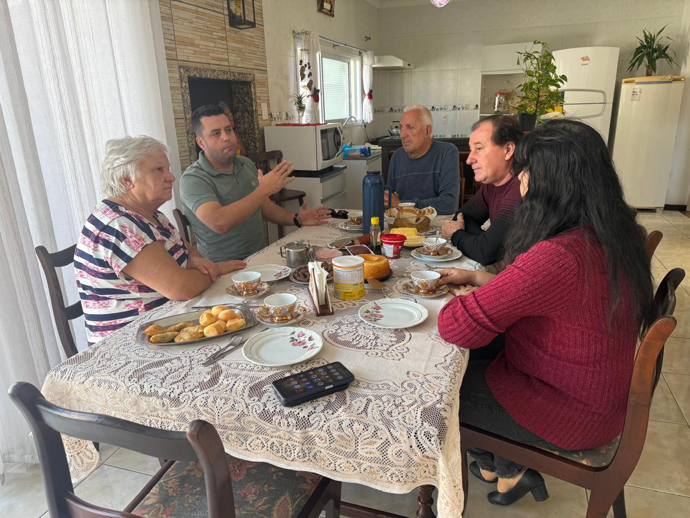

# Reuniões com Pacientes: Garantindo a Continuidade do Tratamento

<!-- intro -->
Dar continuidade ao tratamento é, muitas vezes, o maior desafio de quem enfrenta o câncer. Em agosto de 2023, reunimos nossos pacientes para alinhar os próximos passos, entender as necessidades de cada um e garantir que nenhum deles fique para trás nessa caminhada.
<!-- /intro -->

Essas reuniões são muito mais do que encontros administrativos. São espaços de escuta, de troca, de reafirmação de que o Instituto está ao lado de cada paciente. É o momento de perguntar: "Como você está? O que você precisa? Como podemos ajudar?"

Cada conversa nos dá insumo para agir com mais precisão, com mais afeto e com mais eficiência. Porque cuidar bem começa por ouvir bem. Seguimos juntos! 💙
