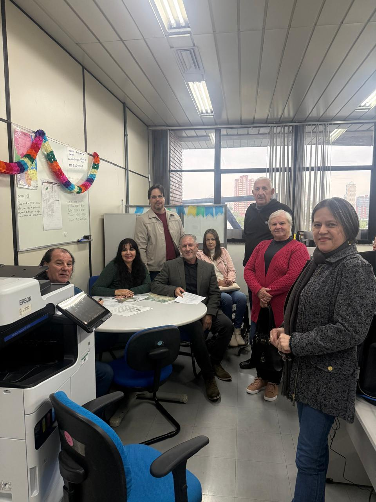
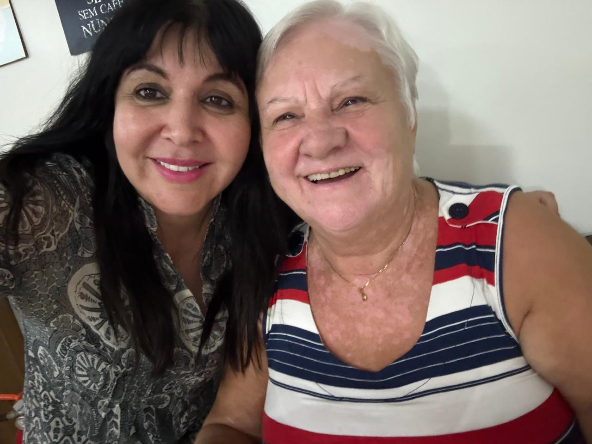

# Vibrando a Vitória! Quatro Pacientes Recebem Alta com Sucesso

<!-- intro -->
Há notícias que fazem o coração disparar de alegria — e essa é uma delas! Em agosto de 2023, comemoramos a remissão do câncer em quatro dos nossos queridos pacientes: Adair Mengarda (64 anos), Pedro Souza (72 anos), Antônio Giacomazzi (61 anos) e Leila Campanhar (46 anos). VITÓRIA!
<!-- /intro -->

Quatro histórias. Quatro batalhas vencidas. Quatro famílias que podem respirar com mais leveza. É impossível descrever em palavras a emoção de acompanhar a jornada de cada um desses guerreiros e guerreiras — e estar presente nesse momento de celebração é a maior recompensa que o nosso trabalho pode trazer.

Adair, Pedro, Antônio e Leila: vocês são a prova viva de que a determinação, o tratamento correto e uma rede de apoio fazem toda a diferença. O Instituto Sempre Com Você vibrou cada passo dessa conquista com vocês.

Que venham muitas outras vitórias como essa! 🎉💕

<!-- gallery -->
- 
- 
<!-- /gallery -->

<!-- tags -->
- alta médica
- vitória
- 2023
- comemoração
- câncer
- remissão
- Adair
- Pedro
- Leila
<!-- /tags -->
