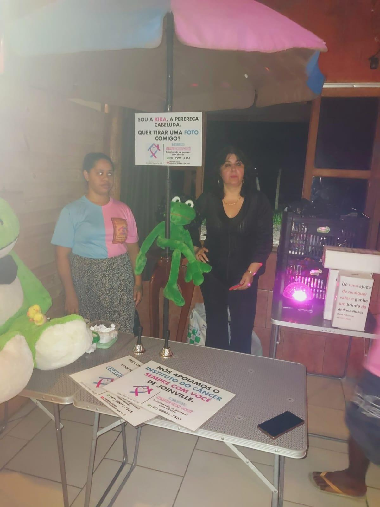
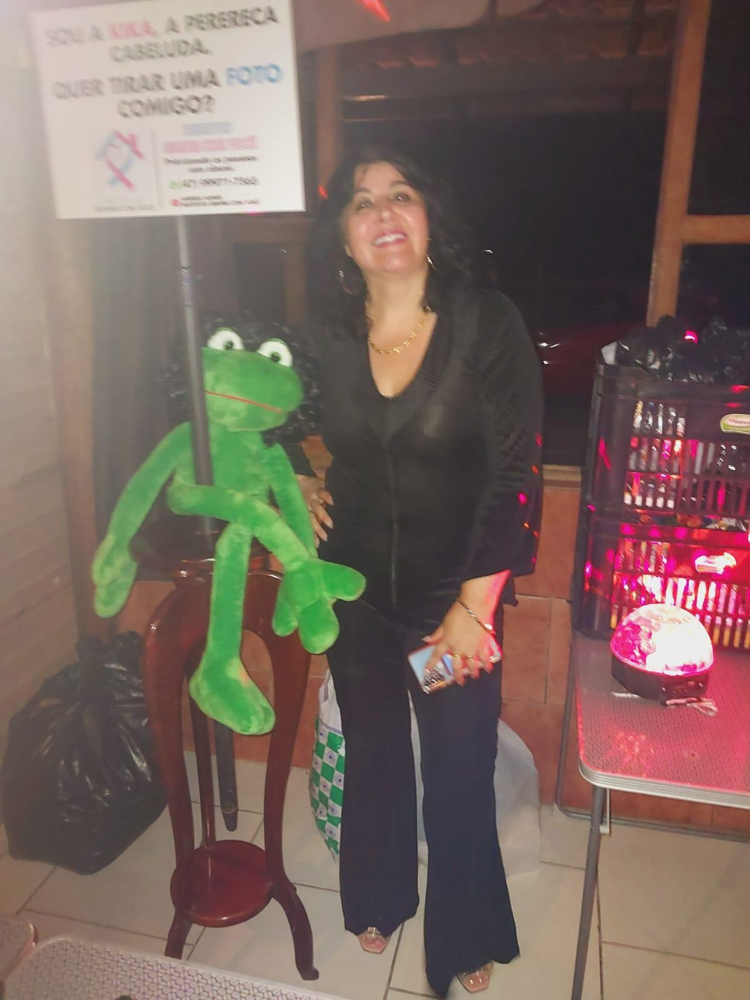
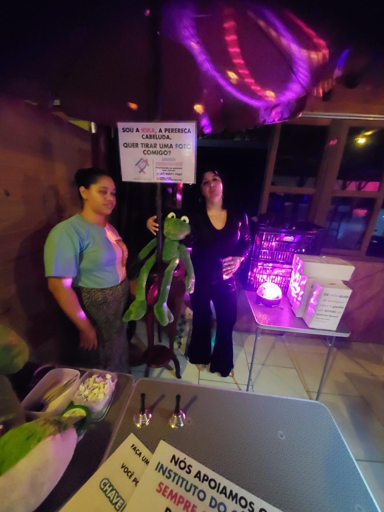
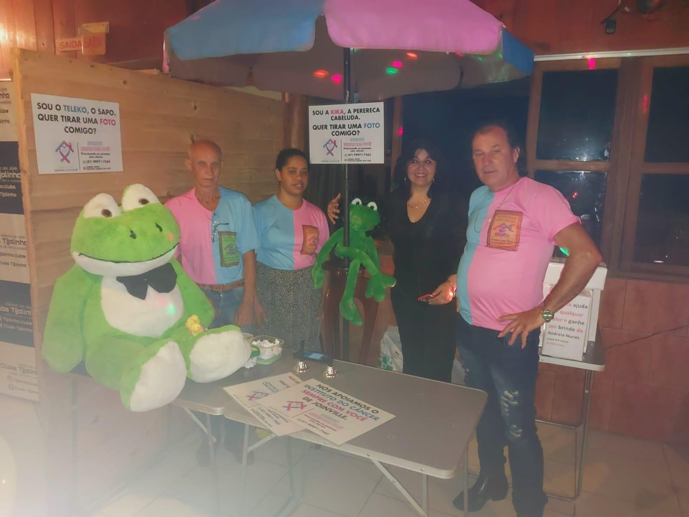
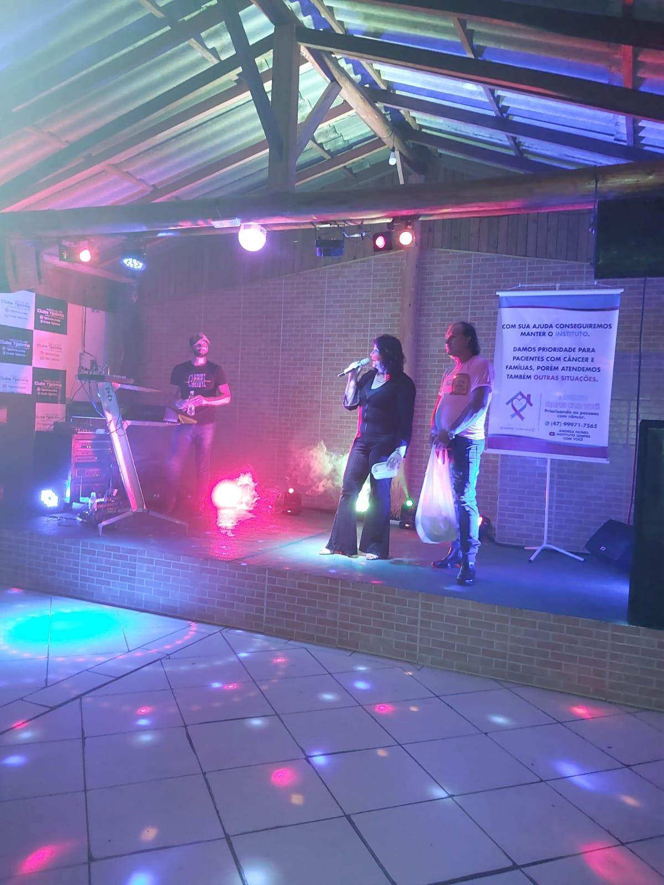
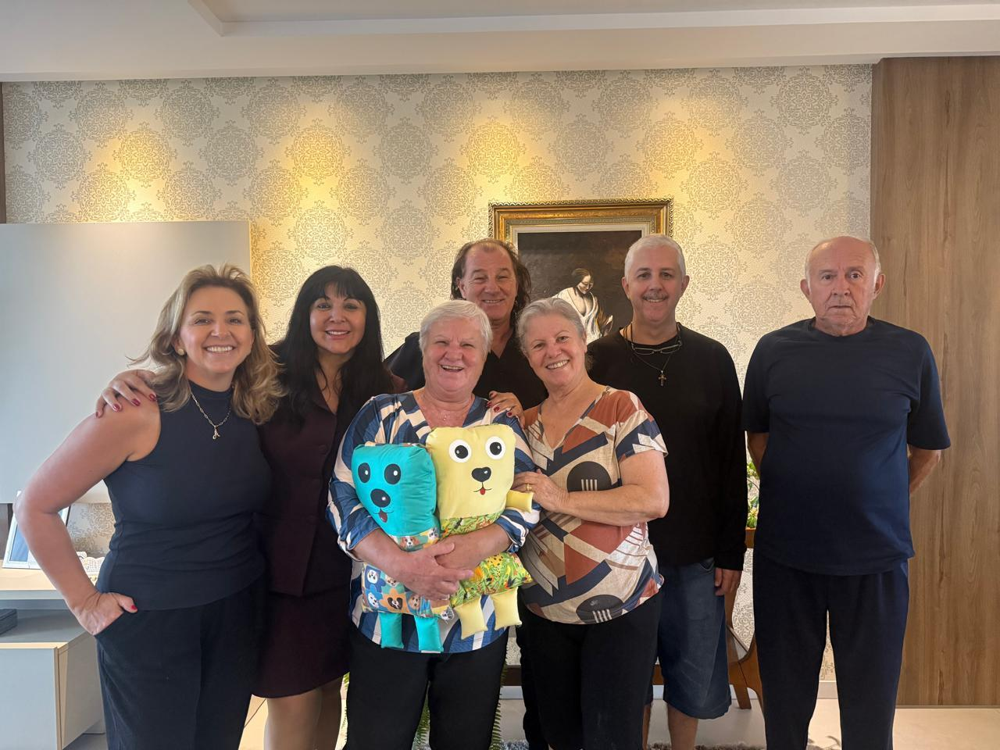
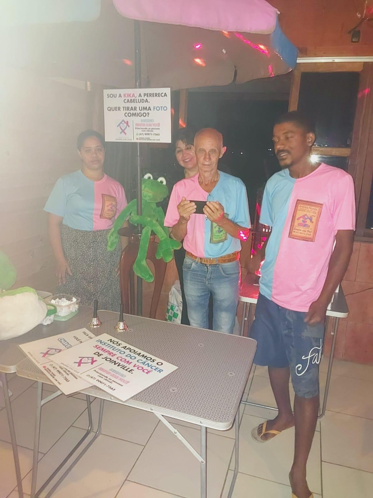
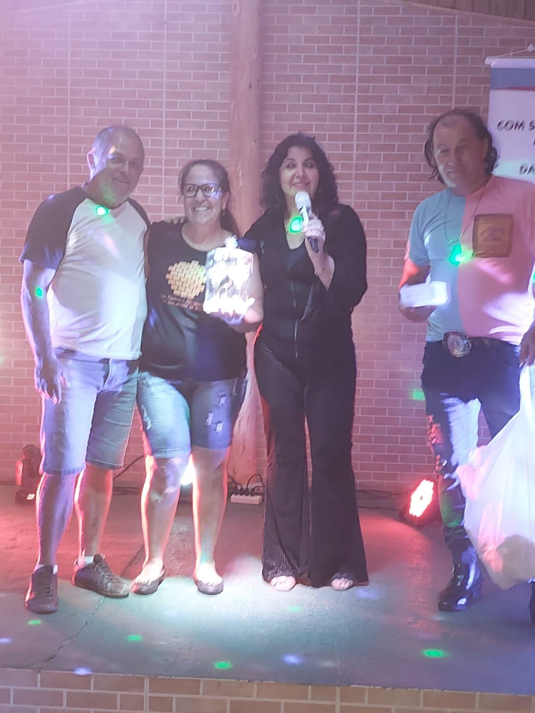

# Ação de Angariamento de Fundos: A Solidariedade em Movimento

<!-- intro -->
Para que o Instituto Sempre Com Você continue seu trabalho, precisamos de recursos. E quando a comunidade responde com generosidade, o resultado é lindo! Em agosto de 2023, realizamos uma ação especial de angariamento de fundos que teve uma ótima aceitação — e um momento muito especial de apresentar um testemunho que nos encheu de esperança.
<!-- /intro -->

Durante o evento, tivemos a honra de apresentar o José Jovelino — um dos nossos pacientes que, com o suporte do Instituto, superou a doença. Ver o José Jovelino de pé, sorridente, compartilhando sua história de superação com todos os presentes foi emocionante e inspirador.

Cada real arrecadado nessa ação vai direto para o tratamento, acompanhamento e suporte de pessoas como o José Jovelino. Gratidão imensurável a todos que compareceram, doaram e acreditaram na nossa missão. Juntos, somos capazes de transformar vidas!

<!-- gallery -->
- 
- 
- 
- 
- 
- 
- 
- 
- 
<!-- /gallery -->

<!-- tags -->
- arrecadação de fundos
- 2023
- José Jovelino
- evento beneficente
- superação
- solidariedade
<!-- /tags -->
