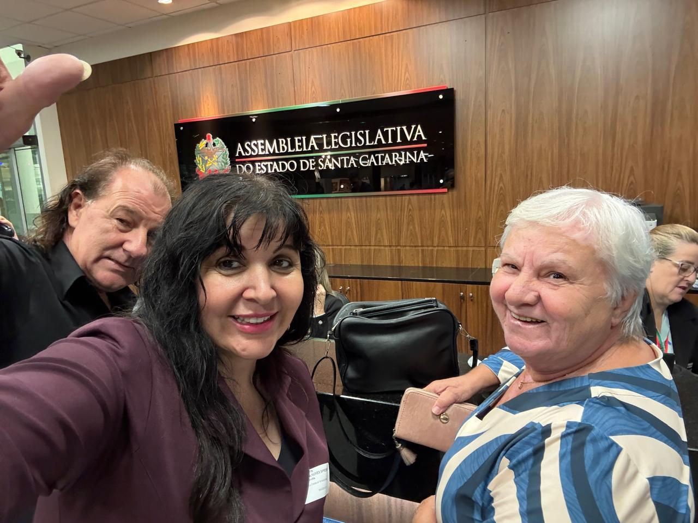
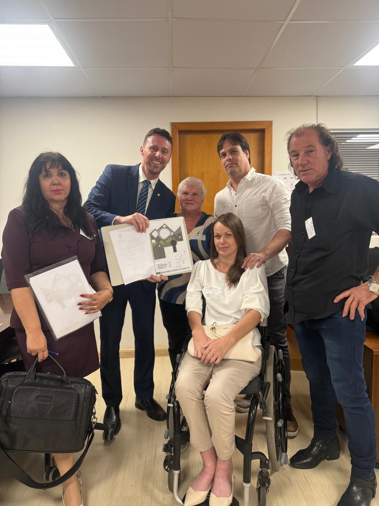

# Na ALESC: Apresentando o Instituto Sempre Com Você para Santa Catarina

<!-- intro -->
Em setembro de 2023, levamos a voz dos nossos pacientes e o nosso trabalho até a Assembleia Legislativa do Estado de Santa Catarina, a ALESC, em Florianópolis. Um momento de muita emoção, orgulho e reconhecimento!
<!-- /intro -->

Chegar às portas da ALESC com a missão de apresentar o que o Instituto Sempre Com Você faz em Joinville foi uma experiência transformadora. Ali, entre representantes do povo catarinense, pudemos mostrar que o apoio integral a pacientes com câncer e suas famílias é uma causa que merece atenção, investimento e políticas públicas comprometidas.

Somos gratas à Assembleia Legislativa de Santa Catarina pela oportunidade de nos fazermos ouvir. Quando o poder público e a sociedade civil caminham juntos, quem ganha são as pessoas que mais precisam. Seguimos em frente, com ainda mais determinação!

<!-- gallery -->
- 
- 
<!-- /gallery -->

<!-- tags -->
- ALESC
- Assembleia Legislativa
- Santa Catarina
- 2023
- Florianópolis
- legislativo
- reconhecimento
<!-- /tags -->
