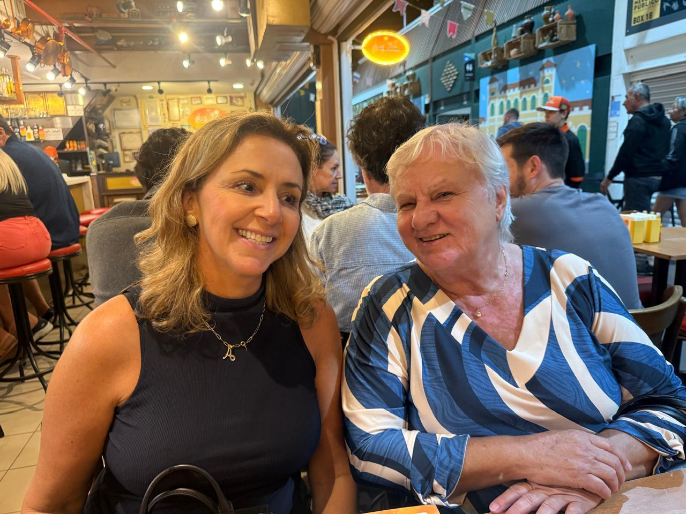
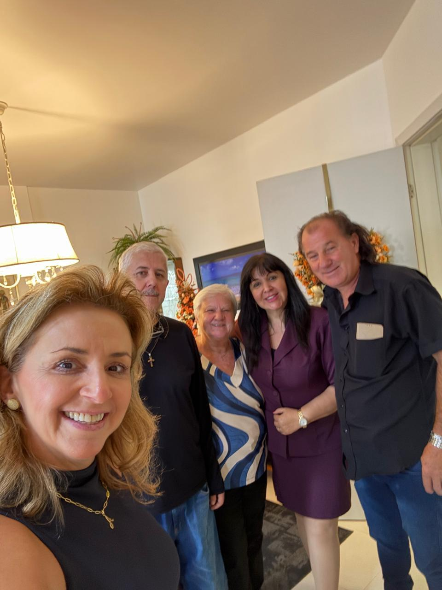
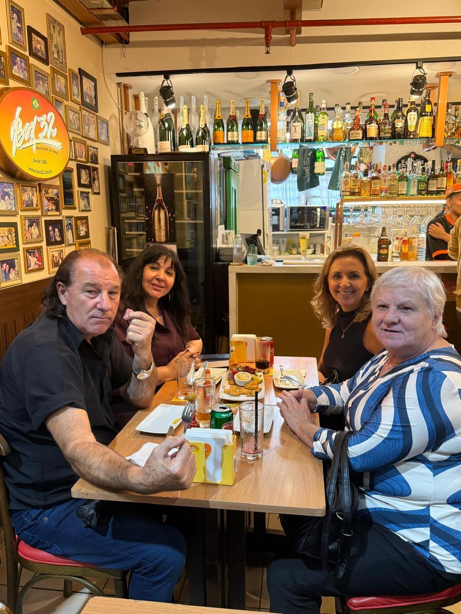

# Em Florianópolis com a Paciente Ana: O Final de Uma Jornada, O Início de Uma Nova Vida

<!-- intro -->
A cada sucesso de paciente, uma vitória alcançada — e em setembro de 2023, acompanhamos a nossa querida Ana nos momentos finais do seu tratamento, em Florianópolis. Uma jornada longa, cheia de desafios, que chegou ao fim com esperança e muita gratidão.
<!-- /intro -->

Estar ao lado de Ana nesse momento tão significativo foi uma honra. O tratamento oncológico exige meses — às vezes anos — de luta. Cada consulta, cada exame, cada sessão é uma batalha vencida. E quando chegamos ao final desse percurso, a emoção é indescritível.

Ana, você é um exemplo de força, fé e perseverança. O Instituto Sempre Com Você tem muito orgulho de ter caminhado ao seu lado nessa jornada. Que a vida te presenteie com saúde, alegria e muitas histórias lindas para contar!

Com carinho e amor, sempre. 💕
