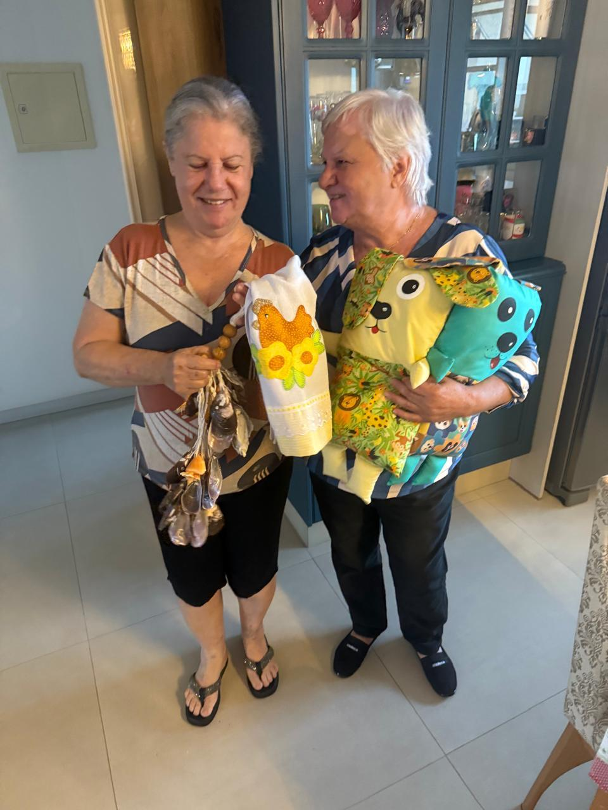
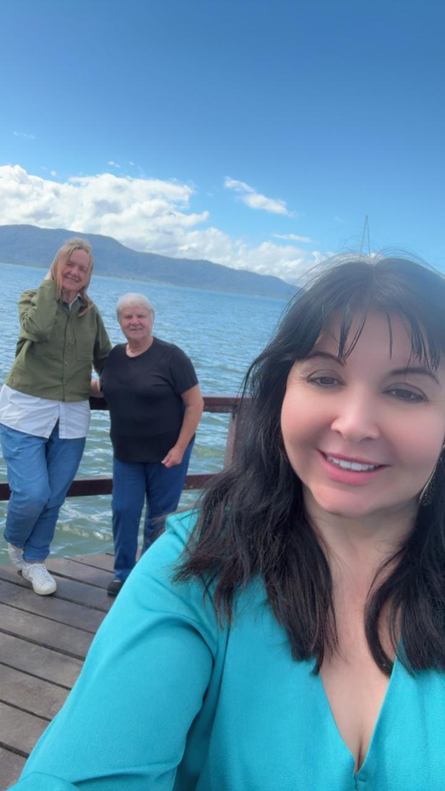
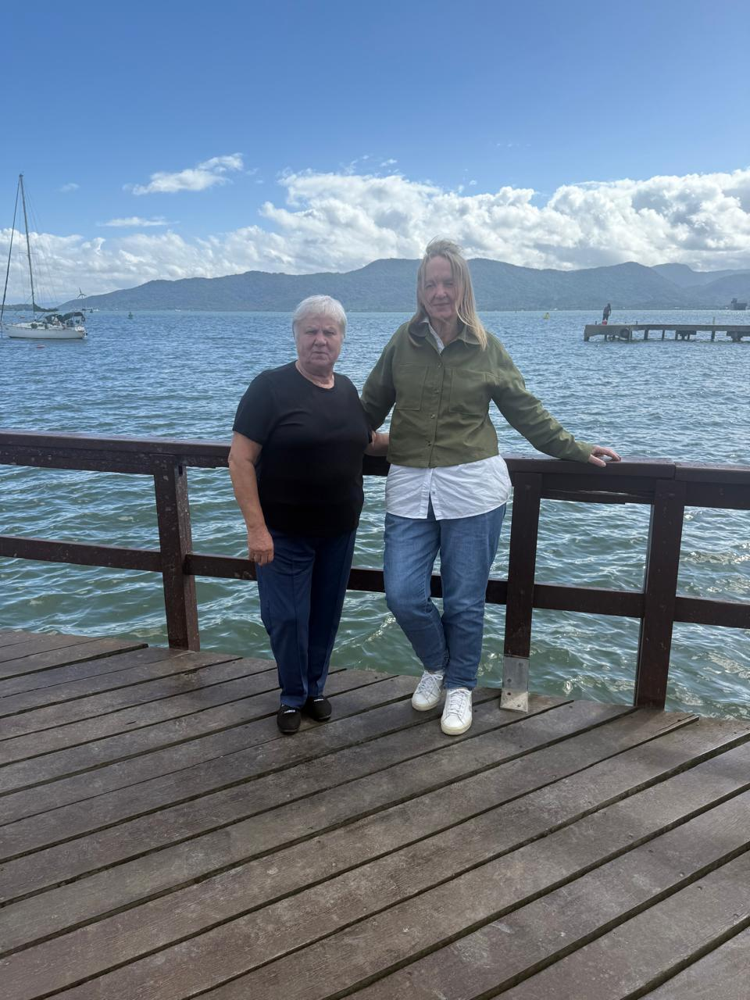

# Paciente Sônia: Mais Um Caso de Sucesso que nos Enche de Alegria!

<!-- intro -->
Tem dias em que a gente percebe que nenhum esforço é em vão. O acompanhamento da Sônia é um desses casos — uma história de superação que começou com muito desafio e que, em outubro de 2023, nos trouxe a melhor das notícias: mais um caso de sucesso!
<!-- /intro -->

Para garantir que a Sônia tivesse acesso aos medicamentos de que precisava, o Instituto Sempre Com Você foi às ruas — literalmente. Saímos para vender bonecos de pano e arrecadar fundos. Simples assim, sem glamour, com as mãos na massa e o coração cheio de propósito.

Ver a Sônia bem, com saúde renovada, é a prova de que cada boneco vendido, cada real arrecadado, cada hora dedicada valeu imensamente a pena. Obrigada a todos que nos ajudaram nessa campanha!

Sônia, você é incrível! 🌸
