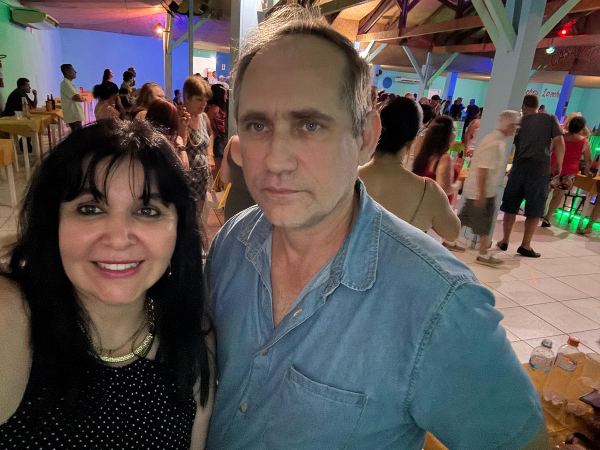

# Arrecadando Fundos para o Tratamento do Antônio Malsckitzky

<!-- intro -->

Em dezembro de 2023, mobilizamos forças para ajudar nosso querido Antônio Malsckitzky, que enfrenta o tratamento com muita coragem. Cada ação de arrecadação é uma demonstração de que a comunidade se importa — e o Antônio merece todo esse carinho!

<!-- /intro -->

O tratamento oncológico gera custos que vão muito além do que muitas famílias conseguem suportar sozinhas. Medicamentos, deslocamentos, alimentação adequada, acompanhamento psicológico — são muitas as demandas, e é exatamente para isso que o Instituto do Câncer Sempre Com Você mobiliza a comunidade.

Gratidão a todos que contribuíram com essa campanha! Cada gesto de generosidade faz uma diferença real na vida do Antônio e de sua família. Não estamos sozinhos — e ele também não está!

Força, Antônio! 💙

<!-- gallery -->

- 
<!-- /gallery -->

<!-- tags -->

- Antônio Malsckitzky
- 2023
- arrecadação
- tratamento
- solidariedade
- câncer
<!-- /tags -->
