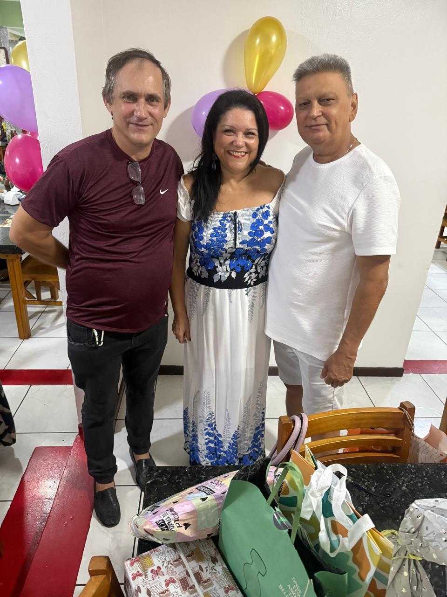
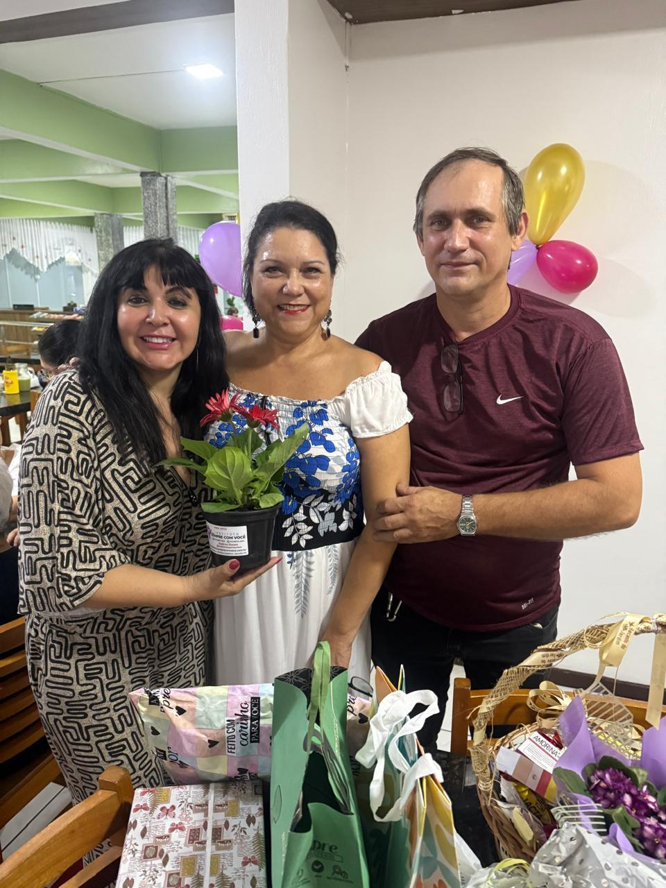

# Celebrando Superação: Comemoração com Antônio Malsckitzky e Evandro Sandro de Moura

<!-- intro -->
Dezembro de 2023 trouxe um motivo muito especial para comemorar. Reunimos o Antônio Malsckitzky e o Evandro Sandro de Moura para uma celebração da superação — porque cada passo adiante nessa batalha merece ser reconhecido e festejado com o coração cheio de alegria!
<!-- /intro -->

O Antônio enfrenta a depressão com muita determinação, e o Evandro luta contra o câncer com uma garra admirável. Os dois, cada um à sua maneira, estão escrevendo histórias de coragem que nos inspiram profundamente. E nada melhor do que reunir esses dois guerreiros para celebrar suas conquistas — a autoestima elevada, o ânimo renovado, a esperança acesa.

Esses momentos de celebração são essenciais para o processo de cura. Reconhecer o quanto já foi percorrido, celebrar cada vitória — por menor que pareça — é medicina para a alma.

Parabéns, Antônio e Evandro! Vocês nos enchem de orgulho. 🎉💕
