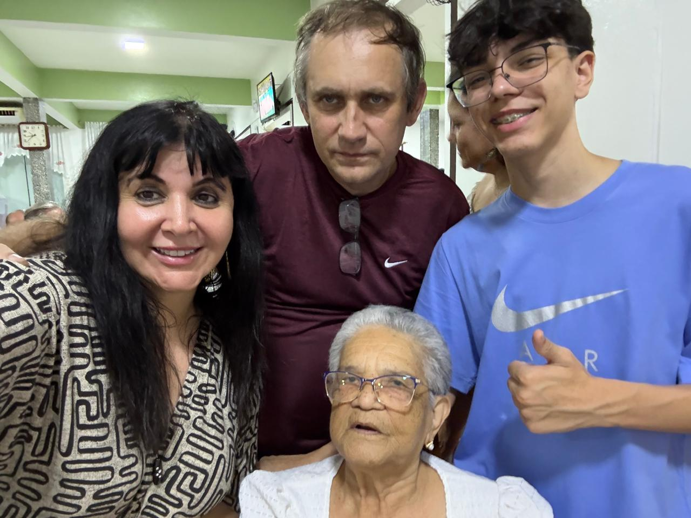

# Vencendo a Depressão: Uma Batalha que também é Nossa

<!-- intro -->
A depressão é uma das companheiras mais silenciosas e devastadoras que podem surgir ao longo do tratamento oncológico — e em dezembro de 2023, dedicamos um momento especial para abordar esse tema tão importante. Vencer a depressão é também parte do processo de cura.
<!-- /intro -->

O diagnóstico de câncer não traz apenas dor física. Ele abala a identidade, os planos, as relações e a saúde mental de quem o recebe — e também de quem ama essa pessoa. A depressão que surge nesse contexto é real, profunda e precisa de atenção especializada e acolhimento humano.

No Instituto Sempre Com Você, acreditamos que cuidar da saúde mental é tão urgente quanto cuidar do corpo. Por isso, oferecemos apoio psicológico, escuta ativa e espaços seguros para que nossos pacientes possam expressar o que sentem sem medo de julgamento.

A batalha contra a depressão pode ser longa, mas ninguém precisa travá-la sozinho. Estamos aqui, sempre. 💙
