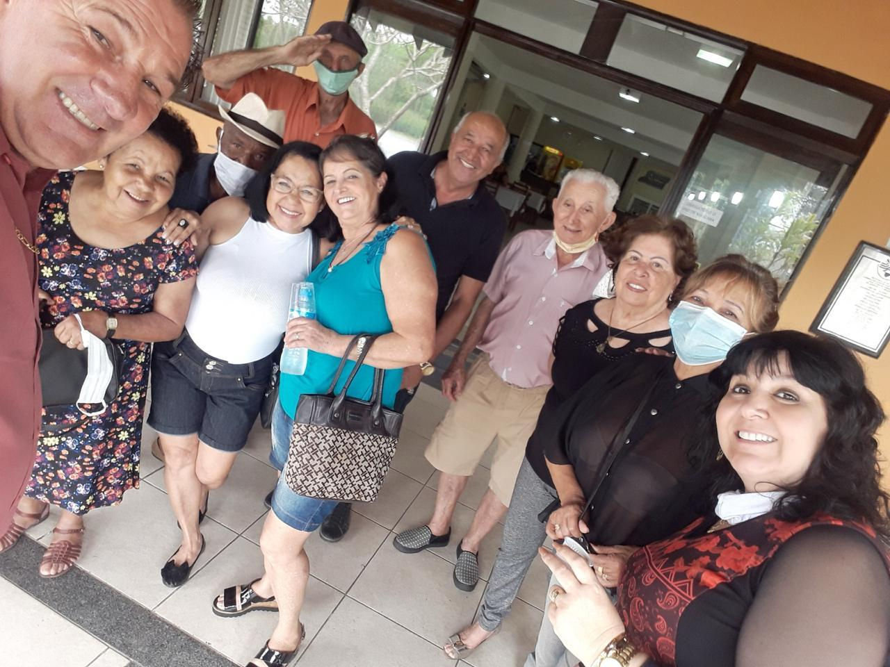
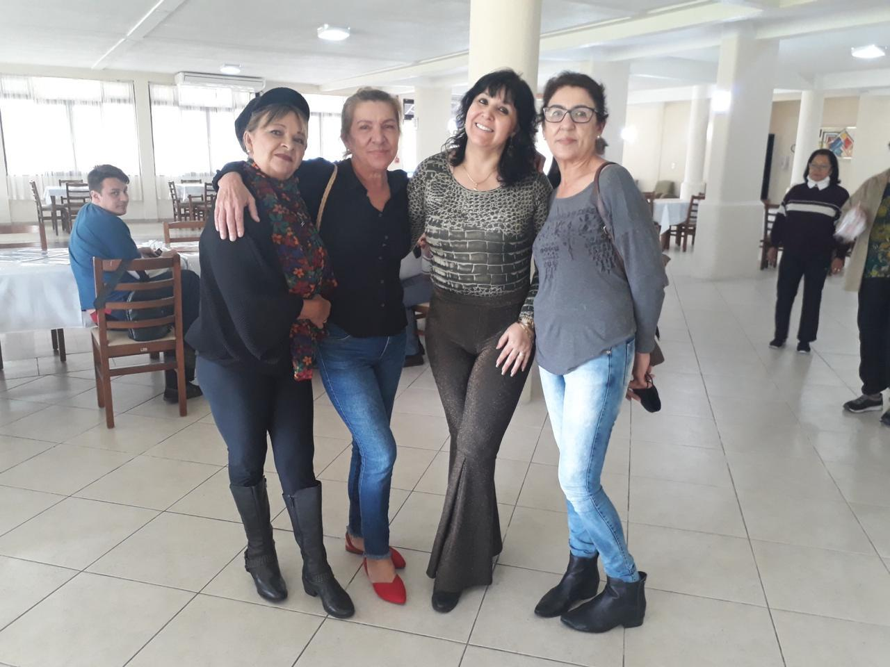
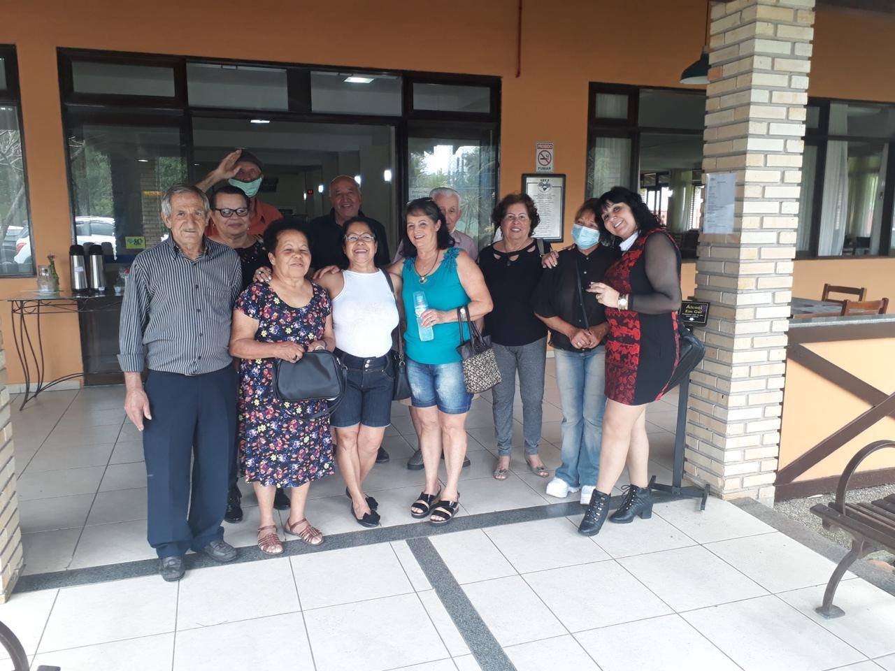
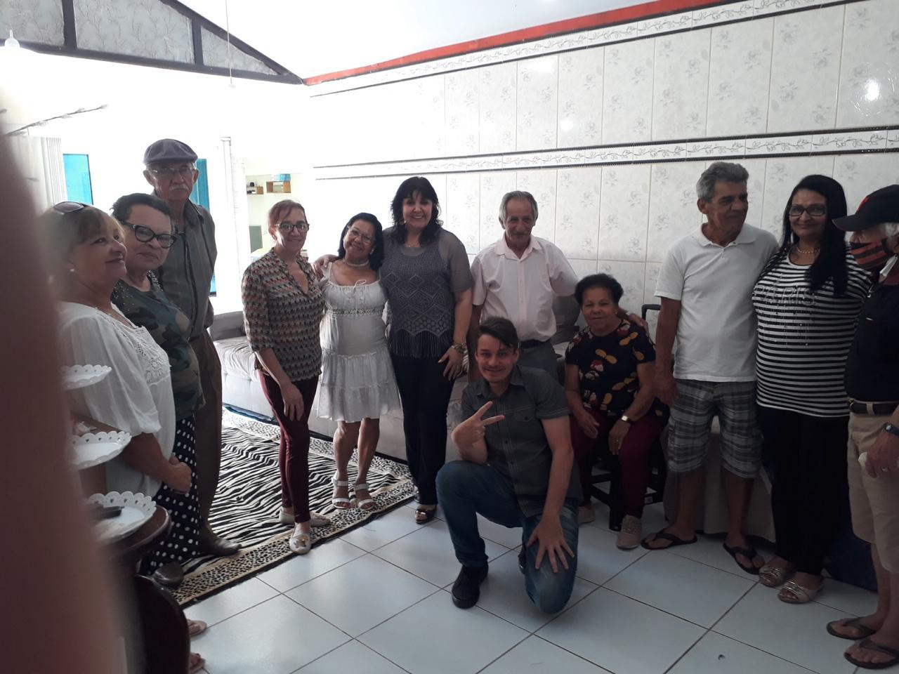

# Encerrando 2023 com o Coração Cheio: Celebração com Nosso Grupo da Terceira Idade

<!-- intro -->
O final de 2023 chegou com emoções que só quem viveu de perto consegue dimensionar. Nossa comemoração de encerramento de ano com o grupo da terceira idade foi um momento de abraços apertados, lágrimas honestas e muita esperança de dias melhores. Um ano que ficará para sempre em nossos corações.
<!-- /intro -->

2023 foi um ano intenso. Acompanhamos vitórias emocionantes, vivemos momentos de pura alegria ao ver pacientes recuperados. Mas também sentimos a dor das perdas — porque faz parte da nossa caminhada honrar a memória daqueles que não chegaram até aqui. Chorar juntos também é uma forma de cuidar.

Que 2024 traga mais vitórias, mais altas, mais sorrisos. Que cada um dos nossos pacientes sinta o calor do cuidado que tentamos oferecer com tanta dedicação. E que a nossa equipe, tão comprometida e amorosa, continue firme nessa missão tão bonita.

Gratidão por tudo, 2023. Seja bem-vindo, 2024! 🌟
