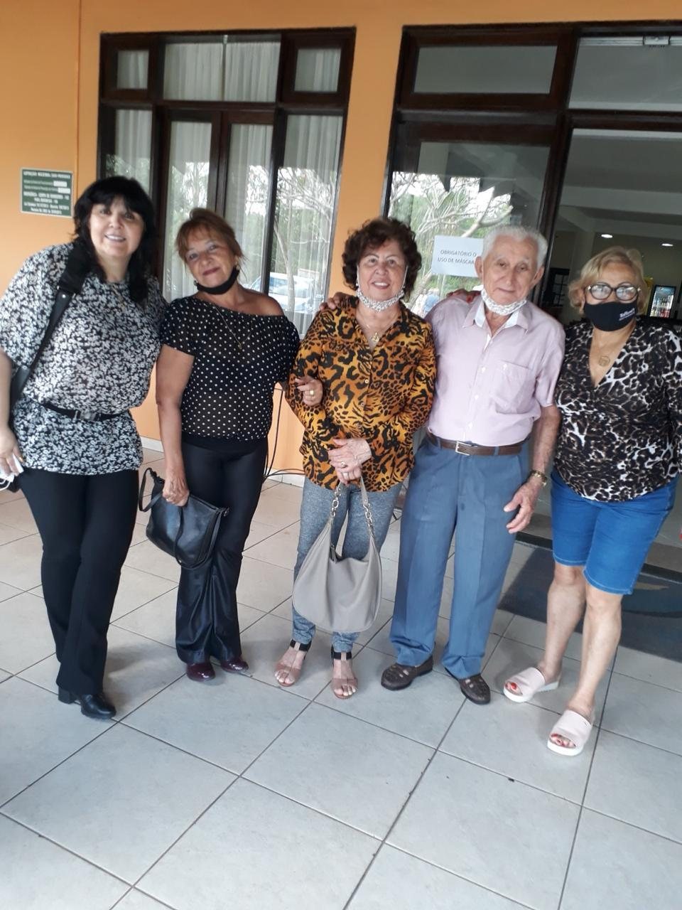
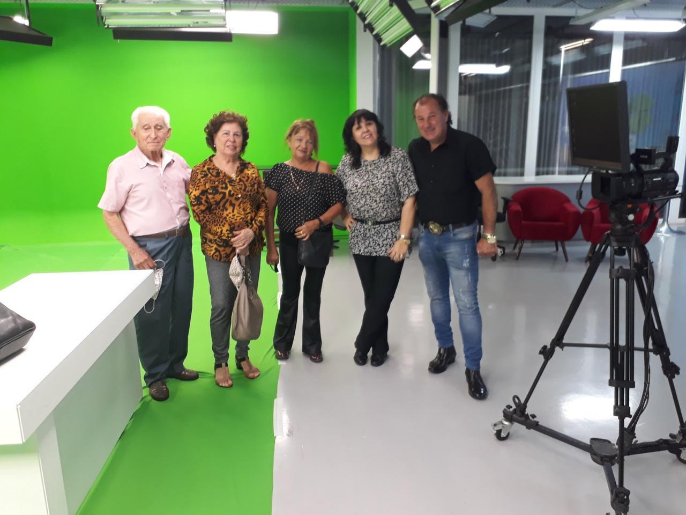

# Vânia, Claudia e Gilda: Três Histórias, Uma Só Missão

<!-- intro -->

Em fevereiro de 2024, dedicamos um momento especial ao acompanhamento de três das nossas queridas pacientes: Vânia, Claudia e Gilda. Três mulheres incríveis, cada uma com sua história, sua luta e sua garra — e o Instituto do Câncer Sempre Com Você tem o privilégio de caminhar ao lado de cada uma delas.

<!-- /intro -->

Acompanhar mulheres que enfrentam o câncer é uma experiência que nos transforma. A força, a fé e a resiliência que cada uma delas carrega são verdadeiras lições de vida. E o nosso papel é garantir que essa jornada seja um pouco mais leve — com apoio emocional, orientação prática e presença constante.

Vânia, Claudia e Gilda: vocês merecem todo o suporte e toda a força do mundo. Estamos aqui, sempre com vocês! 💕

<!-- gallery -->

- 
- 
<!-- /gallery -->

<!-- tags -->

- Vânia
- Claudia
- Gilda
- 2024
- acompanhamento
- pacientes
- mulheres
- câncer
<!-- /tags -->
