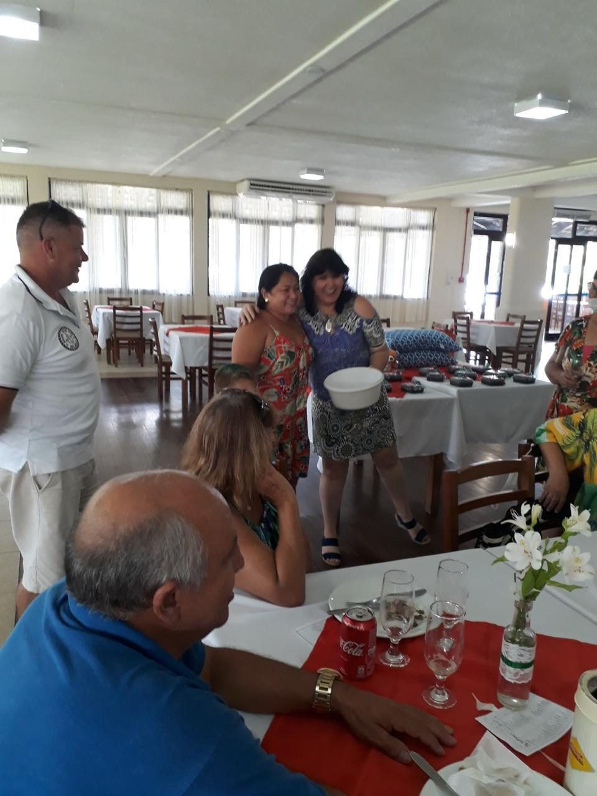

# Na TV da Cidade: Levando Nossa Causa para os Lares de Joinville

<!-- intro -->

Em fevereiro de 2024, tivemos a oportunidade incrível de apresentar os pacientes do Instituto do Câncer Sempre Com Você na TV da Cidade de Joinville, em uma campanha especial de arrecadação de fundos. Uma vitrine para a nossa causa — e uma forma de tocar o coração de quem ainda não nos conhecia!

<!-- /intro -->

Estar na televisão com nossos pacientes foi emocionante e significativo. Ver suas histórias sendo compartilhadas com toda a cidade de Joinville, despertar a empatia de quem assiste em casa, mobilizar recursos para continuar os tratamentos — tudo isso tem um impacto enorme na nossa capacidade de ajudar.

Gratidão à TV da Cidade pelo espaço e pelo compromisso com as causas sociais de Joinville. Quando a mídia local abraça uma causa como a nossa, o alcance multiplica e mais pessoas podem ser ajudadas. Obrigada a todos que assistiram, ligaram e doaram!

<!-- gallery -->

- 
- 
<!-- /gallery -->

<!-- tags -->

- TV da Cidade
- Joinville
- 2024
- mídia
- arrecadação
- campanha
- pacientes
<!-- /tags -->
