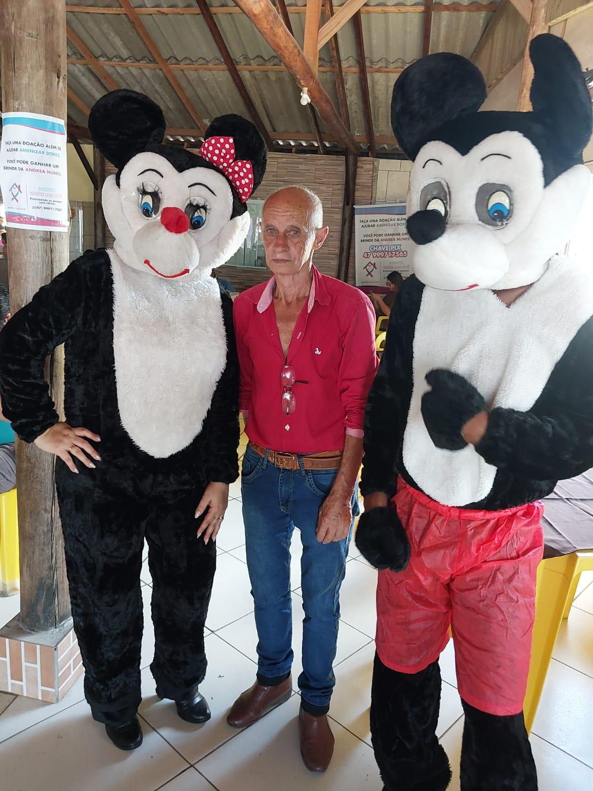
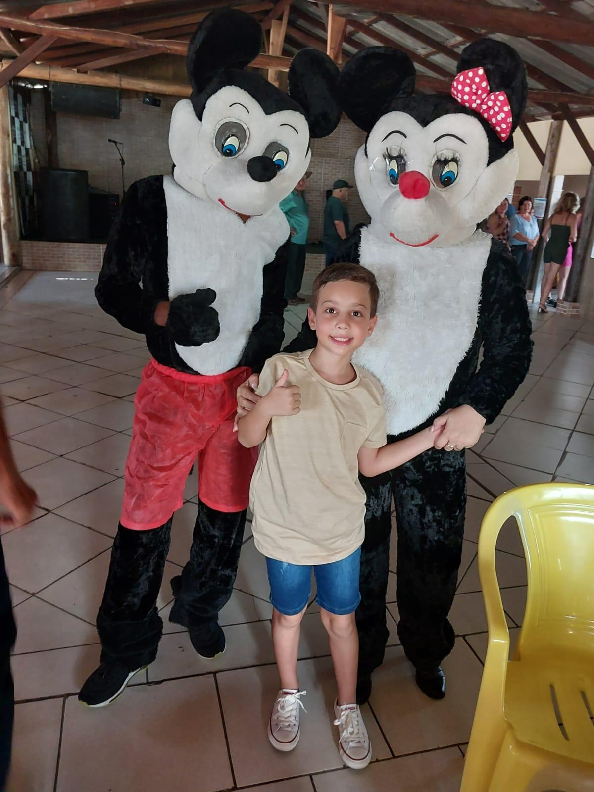
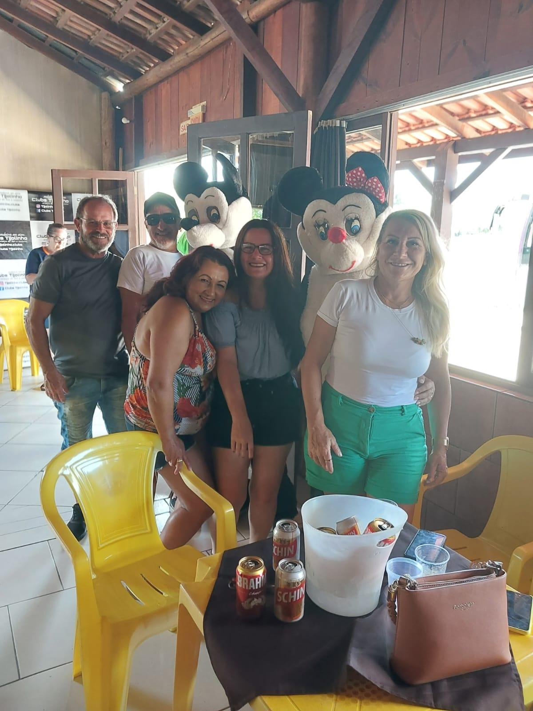

# Por Amor ao Zezinho: Doações para o Tratamento Oncológico

<!-- intro -->
Em março de 2024, toda a nossa determinação se voltou para o Zezinho — um querido paciente que precisa de apoio para continuar seu tratamento oncológico. E quando o assunto é cuidar de gente que amamos, a presidente do Instituto não mede esforços. Nenhum mesmo!
<!-- /intro -->

Nossa presidente Andrea foi às ruas com uma fantasia que, convenhamos, não era exatamente a mais confortável para o calor de março — mas isso nunca foi problema para quem tem o coração cheio de propósito! Como ela mesma disse, sorrindo: "Nenhum esforço é medido para ajudar os pacientes. Nenhum arrependimento."

Essa é a essência do Instituto Sempre Com Você: fazer o que precisa ser feito, com alegria, com dedicação e sem reclamar do calor. O Zezinho tem ao seu lado uma equipe que vai até o fim por ele.

Força, Zezinho! 💛
