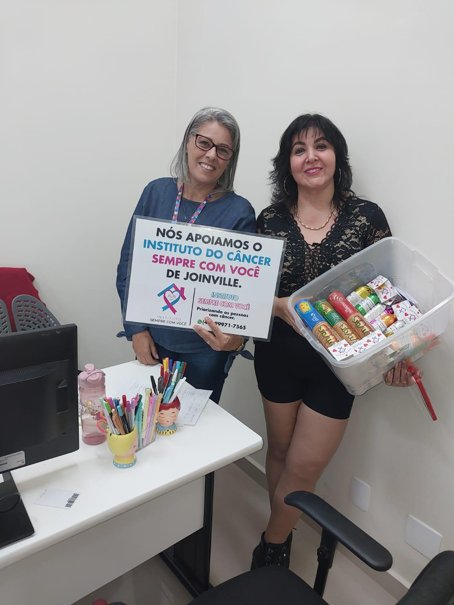
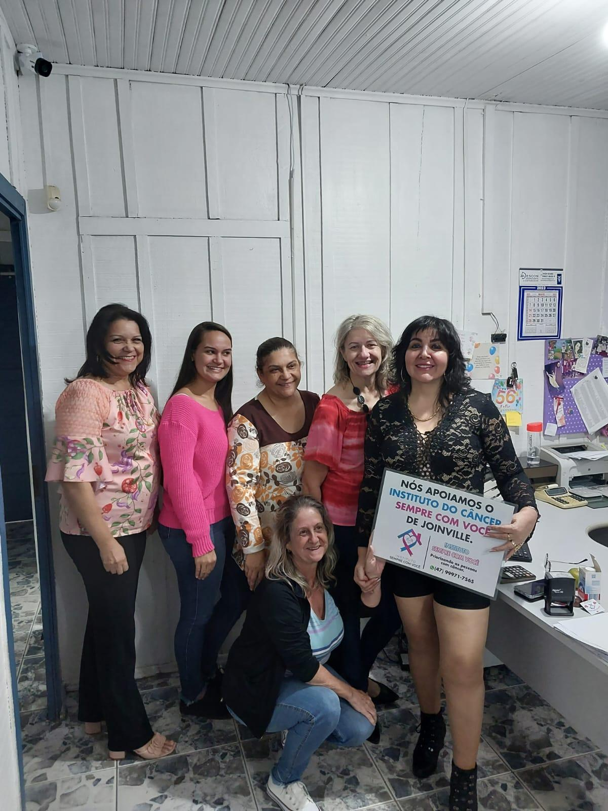
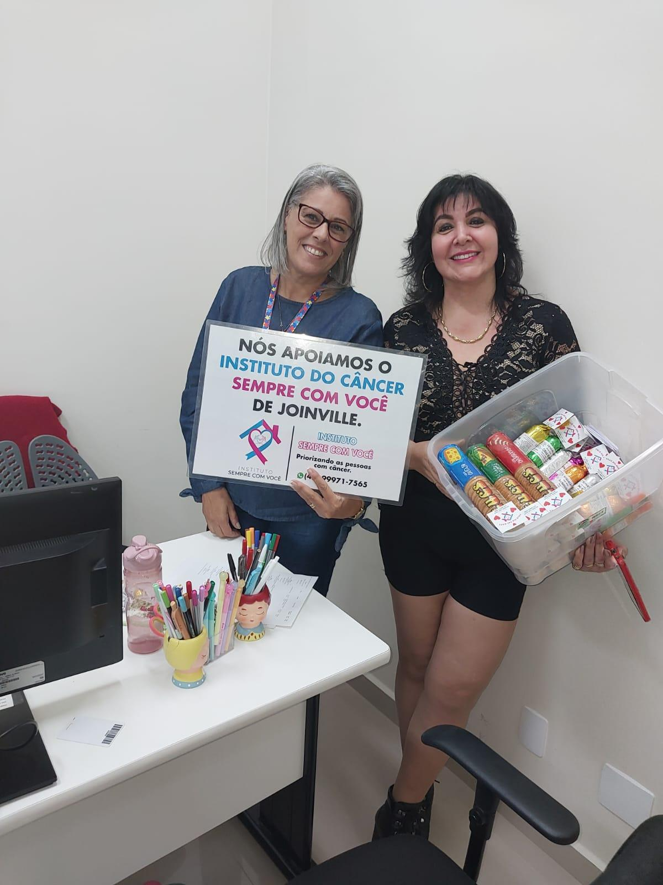
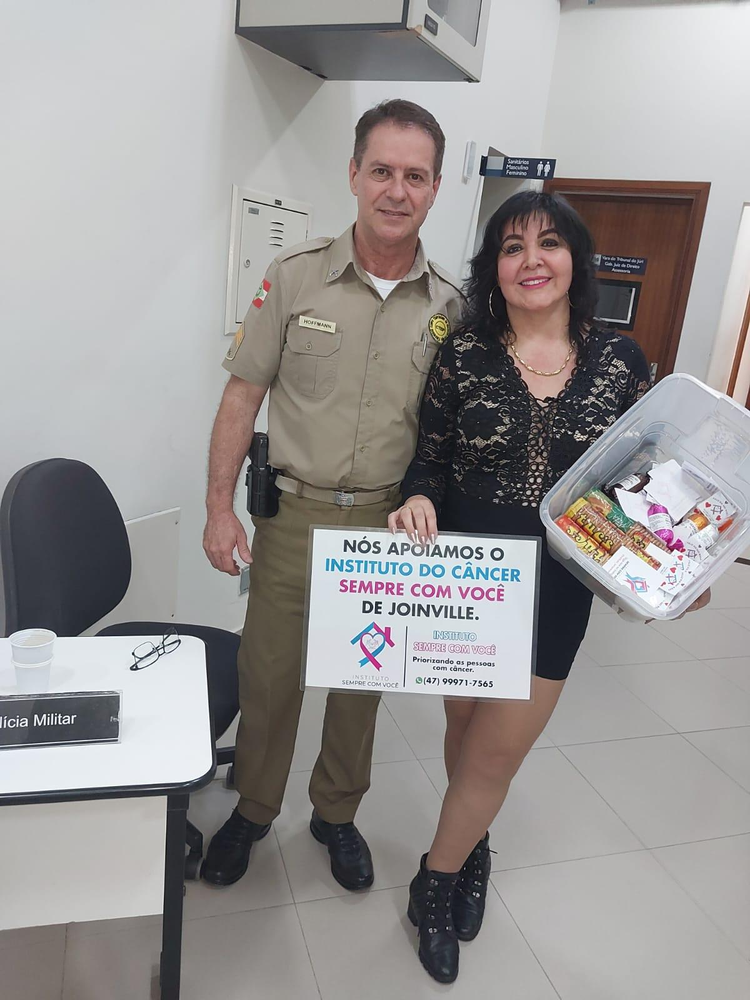

# De Doce em Doce, Mantendo o Instituto Vivo!

<!-- intro -->

Em março de 2024, nossa presidente Andrea saiu às ruas com uma cesta de doces e guloseimas para arrecadar fundos e manter o Instituto do Câncer Sempre Com Você funcionando. Porque o Instituto tem dezoito pacientes fixos que dependem do nosso trabalho — e nenhum deles pode ficar desamparado!

<!-- /intro -->

Tem dias em que o heroísmo não aparece de capa e gravata — ele aparece com uma cesta de doces na mão e um sorriso no rosto. Essa é a nossa Andrea: sem medir esforços, sem reclamar, sempre disposta a fazer o que for necessário para que o Instituto continue de pé.

"Quem conhece o trabalho comprou com a ideia" — e não foi diferente dessa vez. As pessoas reconhecem o amor e a seriedade que há por trás de cada iniciativa do Instituto, e respondem com generosidade.

Cada docinho vendido é mais um dia de cuidado oferecido. Obrigada a todos que compraram e apoiaram! 🍬💕

<!-- gallery -->

- 
- 
- 
- 
<!-- /gallery -->

<!-- tags -->

- doces
- arrecadação
- 2024
- sustentabilidade
- Instituto
- Andrea
- criatividade
<!-- /tags -->
