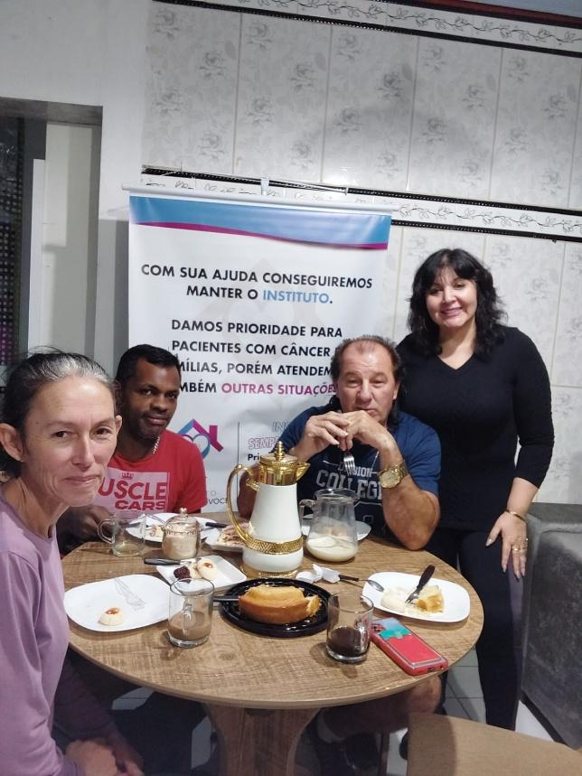
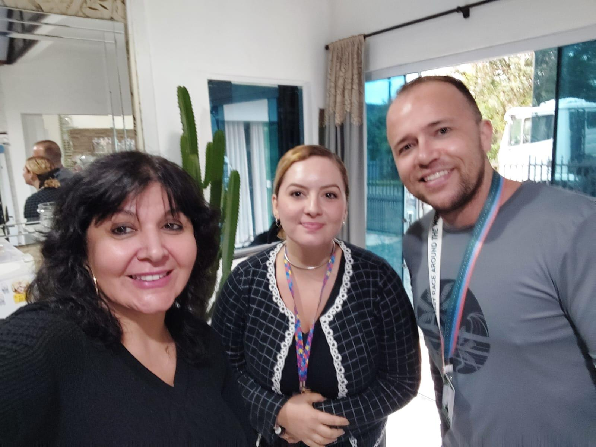
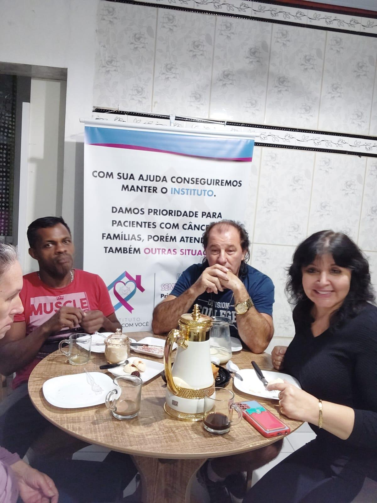
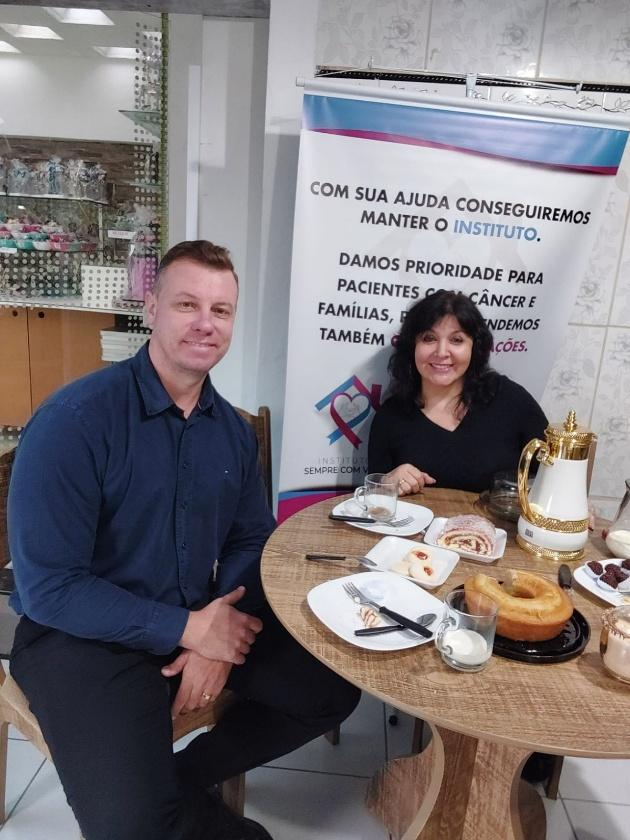
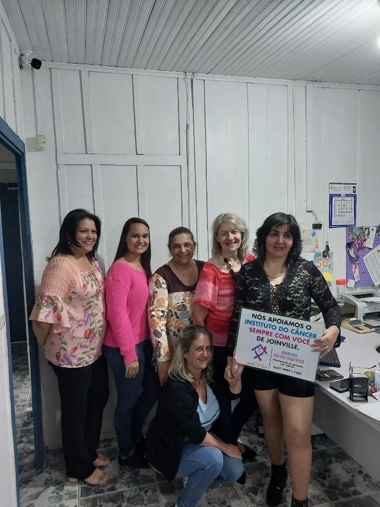
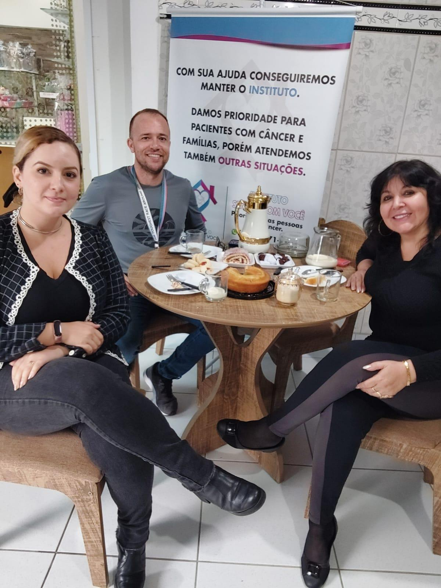

# Parceria Sólida com a CPMA: Seis Anos de Trabalho Conjunto

<!-- intro -->

Em abril de 2024, realizamos mais uma prestação de contas com a CPMA — Central de Penas e Medidas Alternativas da comarca de Joinville — com quem mantemos uma parceria de seis anos. Uma relação de confiança e compromisso mútuo que beneficia diretamente nossos pacientes e a comunidade.

<!-- /intro -->

Há seis anos, o Instituto do Câncer Sempre Com Você e a CPMA trabalham lado a lado: a Central encaminha pessoas para prestar serviço comunitário no Instituto, e nós integramos essas pessoas ao nosso trabalho de cuidado e assistência social. É uma parceria que, além de cumprir uma função social importante, enriquece a todos os envolvidos.

Nessa visita, estivemos com Rodrigo, encarregado da CPMA, e com Gabriela, Psicóloga da instituição — dois profissionais dedicados que fazem essa parceria acontecer com seriedade e humanidade.

Além da prestação de contas, também iniciamos o tratamento de dois novos pacientes: Luciana do Prado e Felipe dos Santos. Bem-vindos ao Instituto! Estamos aqui por vocês.

Obrigada à CPMA de Joinville por essa parceria transformadora. Juntos, fazemos mais! 🤝

<!-- gallery -->

- 
- 
- 
- 
- 
- 
<!-- /gallery -->

<!-- tags -->

- CPMA
- Central de Penas e Medidas Alternativas
- 2024
- Joinville
- parceria
- serviço comunitário
- Rodrigo
- Gabriela
<!-- /tags -->
