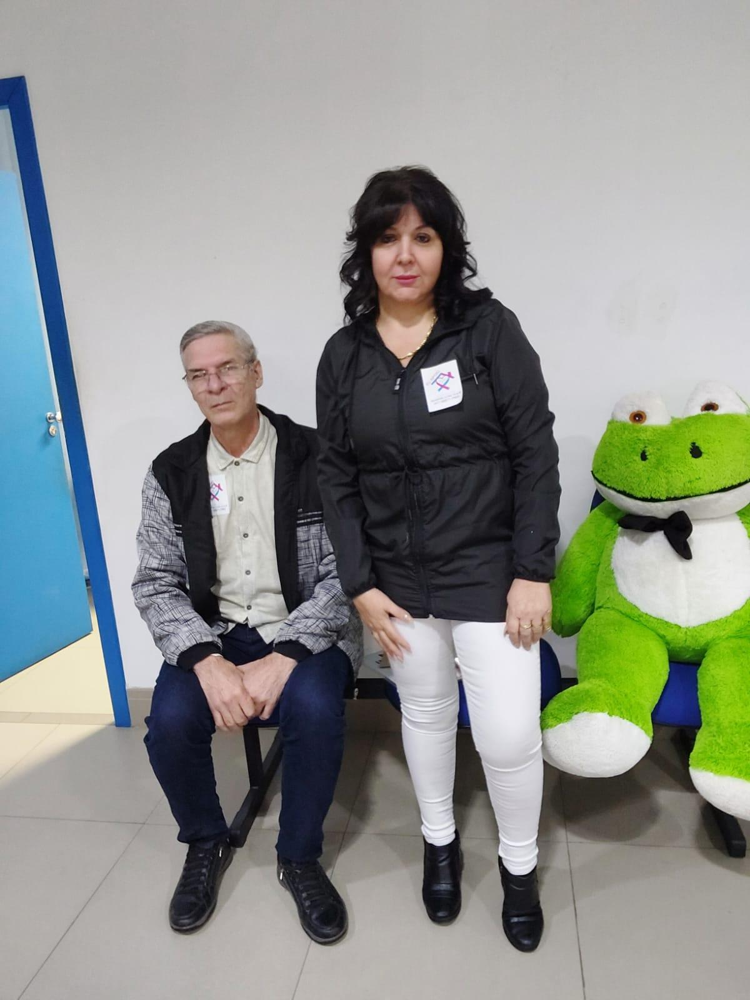
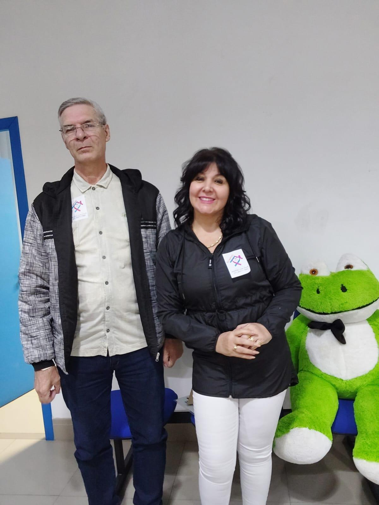

# Adair: Uma Jornada de Superação da Dor e da Depressão

<!-- intro -->

Em abril de 2024, acompanhamos o nosso paciente Adair — um homem que passou por três cirurgias na coluna e que carrega não apenas a dor física, mas também os desafios da depressão. A boa notícia que nos alegra muito: hoje o Adair se encontra bem!

<!-- /intro -->

A história do Adair é a de muitos pacientes que chegam ao Instituto do Câncer Sempre Com Você: o sofrimento físico — no caso dele, uma condição séria na coluna com três cirurgias — abre portas para a depressão, que tantas vezes passa despercebida ou sem tratamento adequado. O nosso papel é enxergar o todo — o corpo e a mente — e oferecer suporte integral.

Ver o Adair bem hoje é a recompensa de um trabalho persistente e amoroso. Ele não desistiu — e nós nunca desistimos dele. É exatamente esse compromisso que define quem somos.

Parabéns pela sua força, Adair! Que você continue se sentindo cada vez melhor. 💙

<!-- gallery -->

- 
- 
<!-- /gallery -->

<!-- tags -->

- Adair
- 2024
- depressão
- coluna
- superação
- cirurgia
- acompanhamento
<!-- /tags -->
