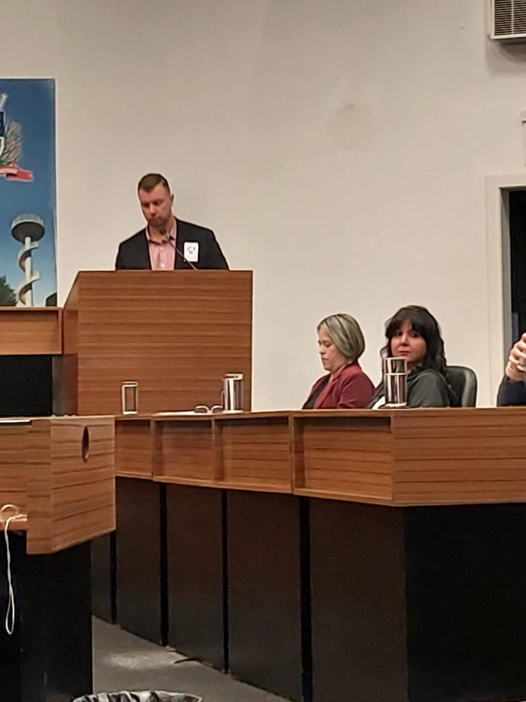
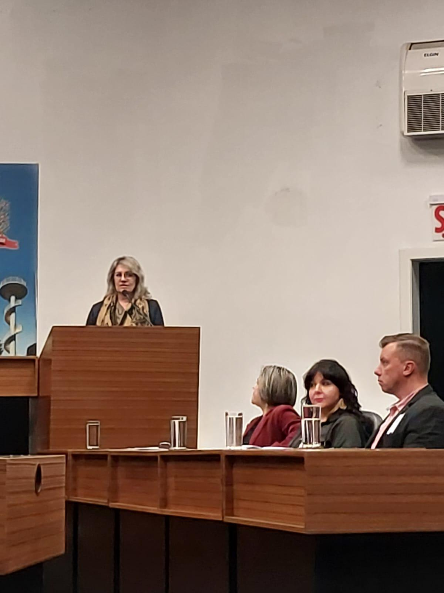

# Na Câmara de Vereadores: Nossa Causa Ganha Voz no Coração de Joinville

<!-- intro -->
Em abril de 2024, o Instituto Sempre Com Você apresentou seu trabalho e suas necessidades na Câmara de Vereadores de Joinville — um momento importante de diálogo com os representantes da cidade para avançar em um dos nossos maiores sonhos: a construção da nova sede.
<!-- /intro -->

Levar nossa missão ao plenário dos vereadores de Joinville é um passo de grande significado. A pauta central foi a discussão sobre a permissão já concedida pela Prefeitura para o uso do terreno no Bairro Glória, que será destinado à construção da nova sede do Instituto. Uma sede que vai ampliar nossa capacidade de atendimento e oferecer um espaço digno para nossos pacientes.

Somos muito gratas aos vereadores de Joinville pela receptividade e pelo interesse em apoiar essa causa tão nobre. Quando os representantes eleitos abrem as portas para quem trabalha pelo bem das pessoas, a cidade inteira se fortalece.

Seguimos avançando, um passo de cada vez, rumo à nossa nova sede! 🏡
