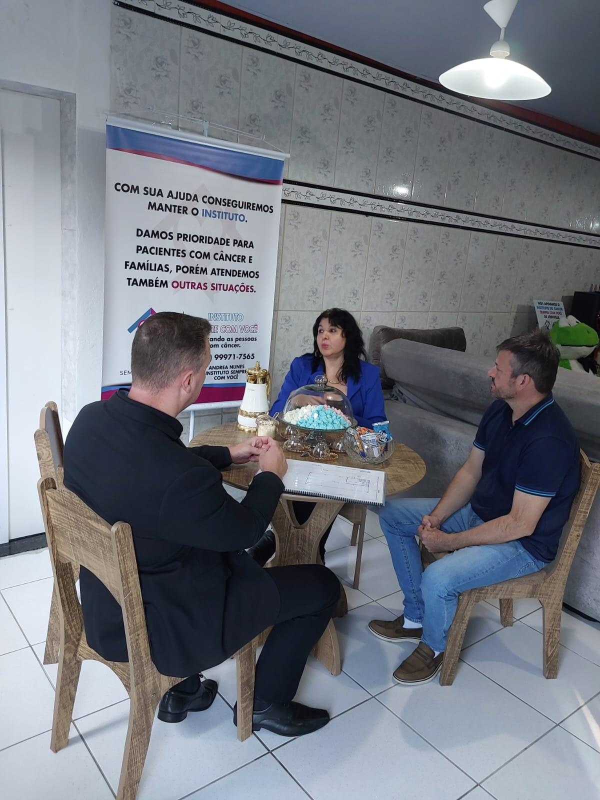
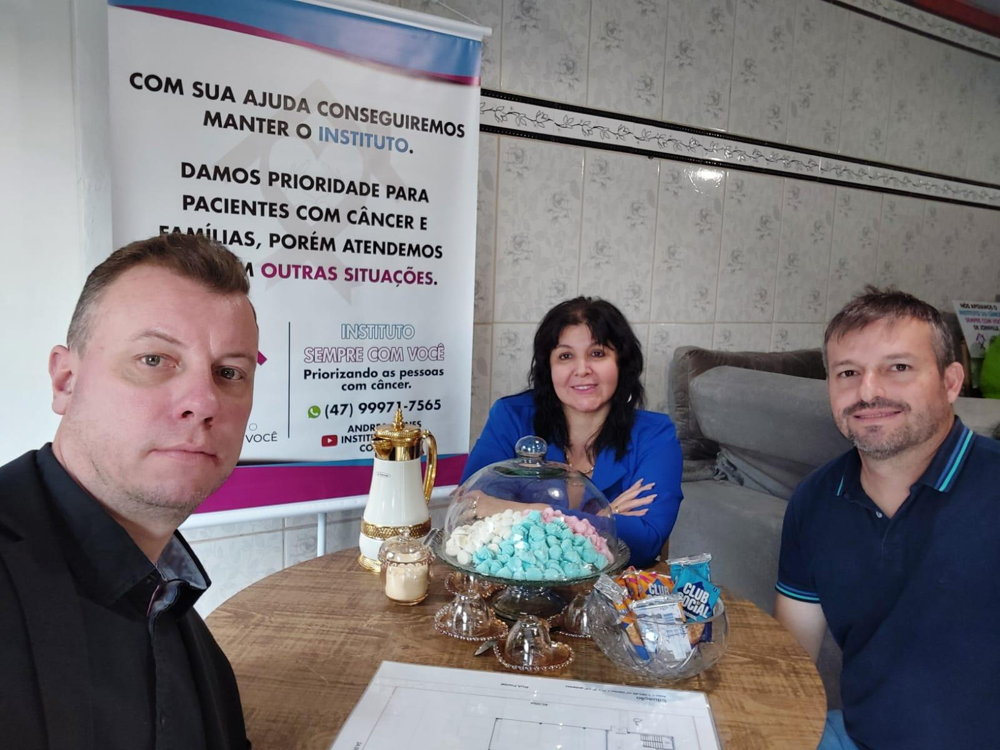

# Planejando a Nova Sede: Reunião com Advogado e Engenheiro

<!-- intro -->
Em maio de 2024, demos mais um passo concreto rumo à nossa nova sede. Reunimos o advogado Carlos Meier e o engenheiro Michel para discutir o projeto e os aspectos técnicos e jurídicos da construção. O sonho está se tornando realidade!
<!-- /intro -->

Construir uma sede própria para o Instituto Sempre Com Você exige muito além de vontade — exige planejamento, assessoria jurídica, projeto arquitetônico e engenharia competente. É por isso que cercamos esse projeto de profissionais sérios e comprometidos com a nossa missão.

A Carlos e Michel: muito obrigada pela dedicação e pelo profissionalismo. Saber que pessoas qualificadas e comprometidas estão ao nosso lado nessa empreitada nos dá segurança e confiança para seguir em frente.

Nossa nova sede está chegando — e ela vai ser linda! 🏗️💕

<!-- gallery -->
- 
- 
<!-- /gallery -->

<!-- tags -->
- nova sede
- Carlos Meier
- Michel
- 2024
- planejamento
- engenharia
- jurídico
<!-- /tags -->
