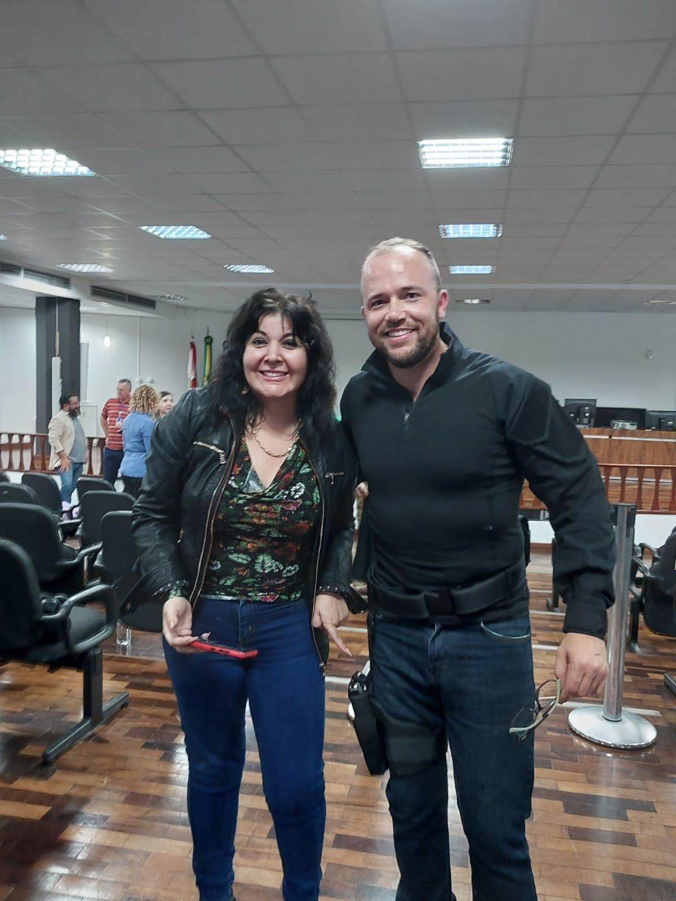
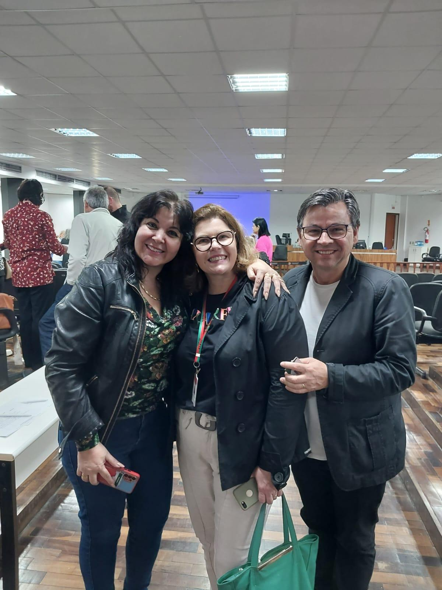
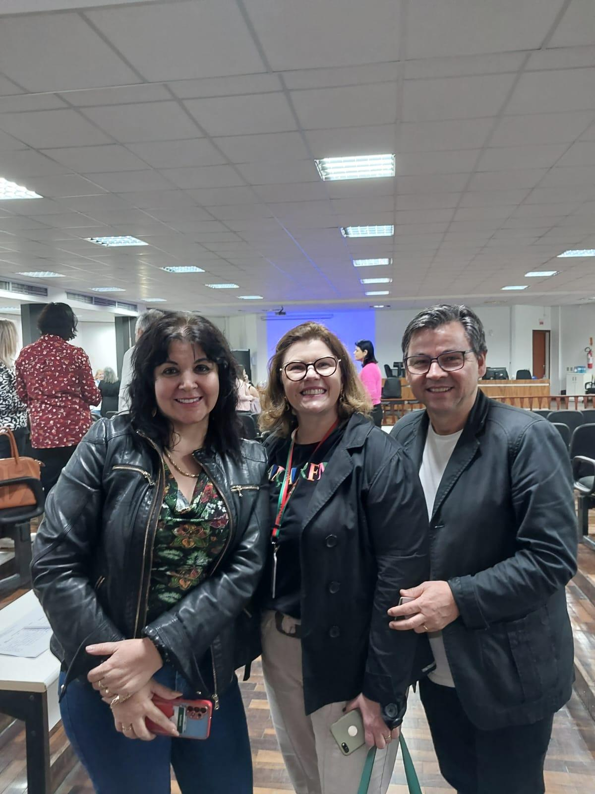

# Capacitação em Trabalho Social: Sempre Aprendendo para Servir Melhor

<!-- intro -->
Em maio de 2024, participamos de um curso de capacitação na área de Trabalho Social — porque quem cuida de pessoas precisa estar sempre aprendendo, se atualizando e aperfeiçoando suas ferramentas de apoio. Um excelente curso que nos trouxe muito crescimento!
<!-- /intro -->

O Instituto Sempre Com Você acredita que a qualidade do cuidado que oferecemos está diretamente ligada à formação contínua de quem o presta. Assistência social é uma área que exige conhecimento técnico, atualização constante e uma profunda compreensão das realidades vividas por nossos pacientes e suas famílias.

Cada aprendizado adquirido aqui reflete diretamente na qualidade do atendimento que oferecemos. Nossos pacientes merecem o melhor, e é para isso que continuamos nos preparando.

Aprendemos, crescemos e voltamos ainda mais prontas para servir! 📚💙
