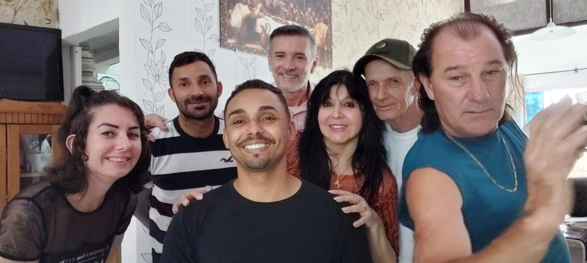
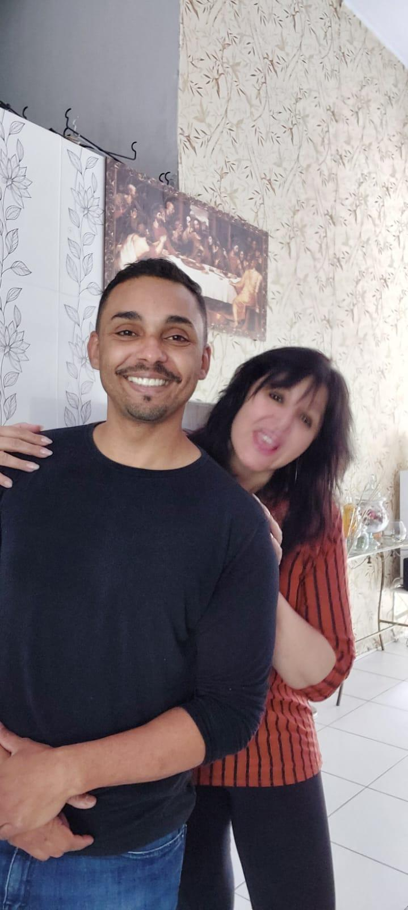
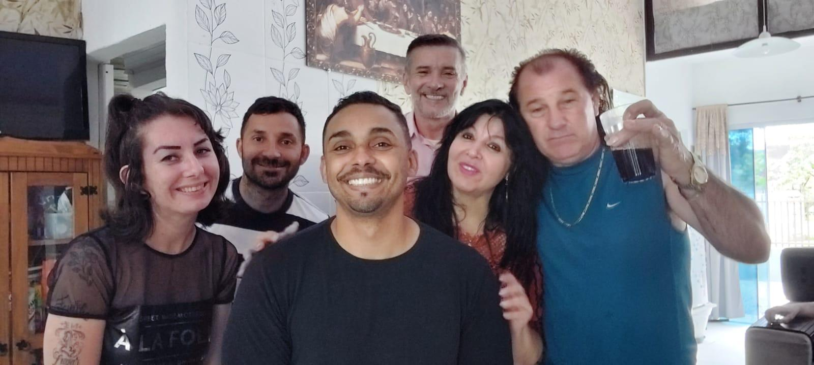

# Uma Tarde com Cinco: Quando os Pacientes se Encontram e Trocam Força

<!-- intro -->
Em junho de 2024, reunimos cinco pacientes do Instituto Sempre Com Você em um único encontro — e foi um dia simplesmente incrível! Ana, Francisco, Arthur, Lucas e Cirilo se encontraram, conversaram, trocaram experiências e se fortaleceram mutuamente. Isso é o que chamamos de cura coletiva!
<!-- /intro -->

Quando pacientes que enfrentam ou enfrentaram o câncer se reúnem, algo muito especial acontece. As palavras têm um peso diferente quando vêm de quem realmente entende. O olhar de reconhecimento, o sorriso de solidariedade, a história compartilhada que diz "eu passei por isso também e estou aqui" — tudo isso tem um poder terapêutico que nenhum livro consegue ensinar.

Ana, Francisco, Arthur, Lucas e Cirilo: obrigada por nos ensinarem, mais uma vez, que a jornada se torna mais leve quando é percorrida em companhia. Que continuemos nos encontrando, trocando e crescendo juntos! 💙

<!-- gallery -->
- 
- 
- 
<!-- /gallery -->

<!-- tags -->
- grupo de pacientes
- 2024
- Ana
- Francisco
- Arthur
- Lucas
- Cirilo
- troca de experiências
<!-- /tags -->
