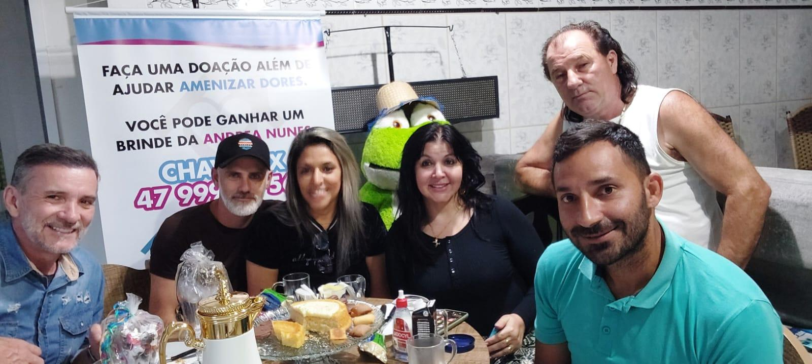

# Arthur, Francisco e Katia: O Valor de Quem Está Sempre do Lado

<!-- intro -->
Em junho de 2024, recebemos a visita especial de três queridos pacientes: Arthur, Francisco e a Katia — que veio acompanhada do seu esposo, que nunca perde uma sessão. Um lindo exemplo de como o amor e o apoio familiar fazem toda a diferença no tratamento!
<!-- /intro -->

A história do esposo da Katia nos emociona profundamente. Estar presente em cada sessão, em cada consulta, em cada momento difícil é um ato de amor imenso. O apoio familiar é, segundo a ciência e a nossa experiência prática, um dos fatores que mais influencia positivamente a recuperação de um paciente oncológico.

Ao esposo da Katia e a todos os familiares que acompanham seus entes queridos com tanta dedicação: obrigada! Vocês são parte fundamental da cura. O Instituto Sempre Com Você tem muito orgulho de acolher também quem caminha ao lado dos pacientes.

Que esse amor continue sendo a maior medicina. 💕

<!-- gallery -->
- 
<!-- /gallery -->

<!-- tags -->
- Arthur
- Francisco
- Katia
- 2024
- família
- apoio
- esposo
- acompanhamento
<!-- /tags -->
