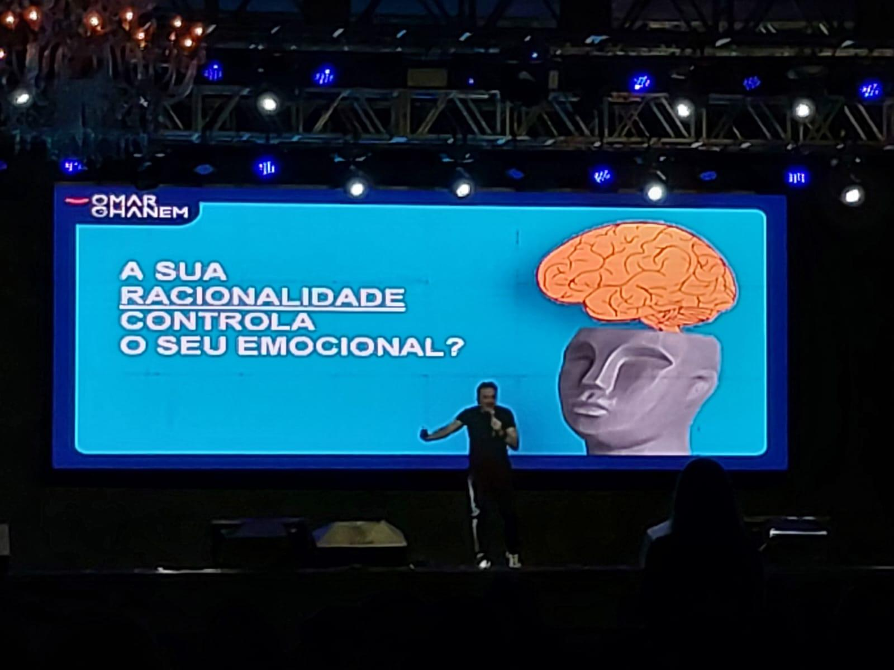
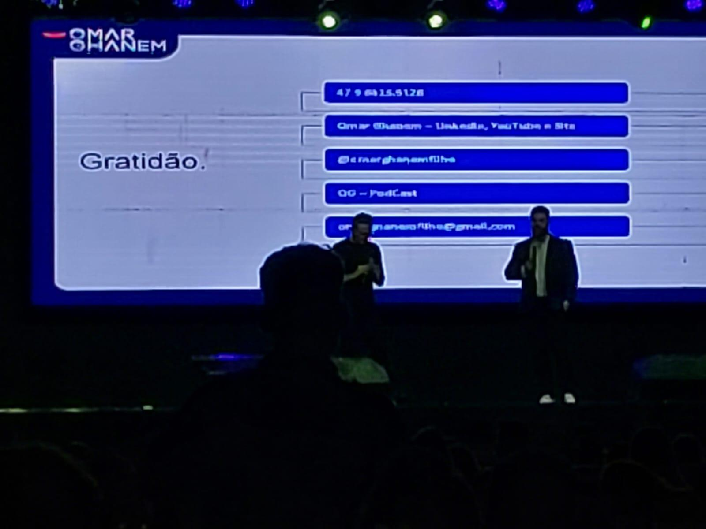

# Inteligência Emocional: Crescendo para Cuidar Melhor

<!-- intro -->
Em julho de 2024, participamos do Curso de Inteligência Emocional com o palestrante Omar Ghanem — uma experiência enriquecedora que nos ofereceu novas ferramentas para lidar com nossos pacientes com ainda mais sabedoria, presença e equilíbrio emocional.
<!-- /intro -->

Trabalhar com pacientes oncológicos exige muito além de boa vontade. Exige preparo emocional, capacidade de escuta ativa, autoconhecimento e habilidade para estar presente sem se perder no sofrimento do outro. O curso do Omar Ghanem nos ofereceu justamente isso: uma visão aprofundada de como gerir nossas emoções para servir melhor.

Omar Ghanem é referência em gestão emocional e liderança — e foi uma honra aprender com ele. Cada ferramenta adquirida aqui vai diretamente para o nosso atendimento cotidiano. Nossos pacientes merecem quem cuida com inteligência e com o coração.

Obrigada, Omar! 🙏

<!-- gallery -->
- 
- 
<!-- /gallery -->

<!-- tags -->
- inteligência emocional
- Omar Ghanem
- 2024
- capacitação
- formação
- palestra
<!-- /tags -->
