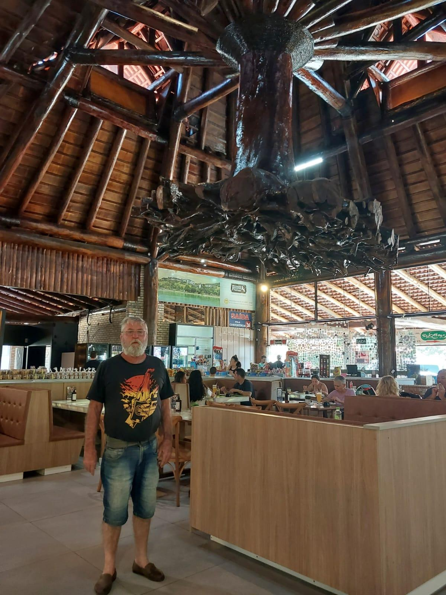
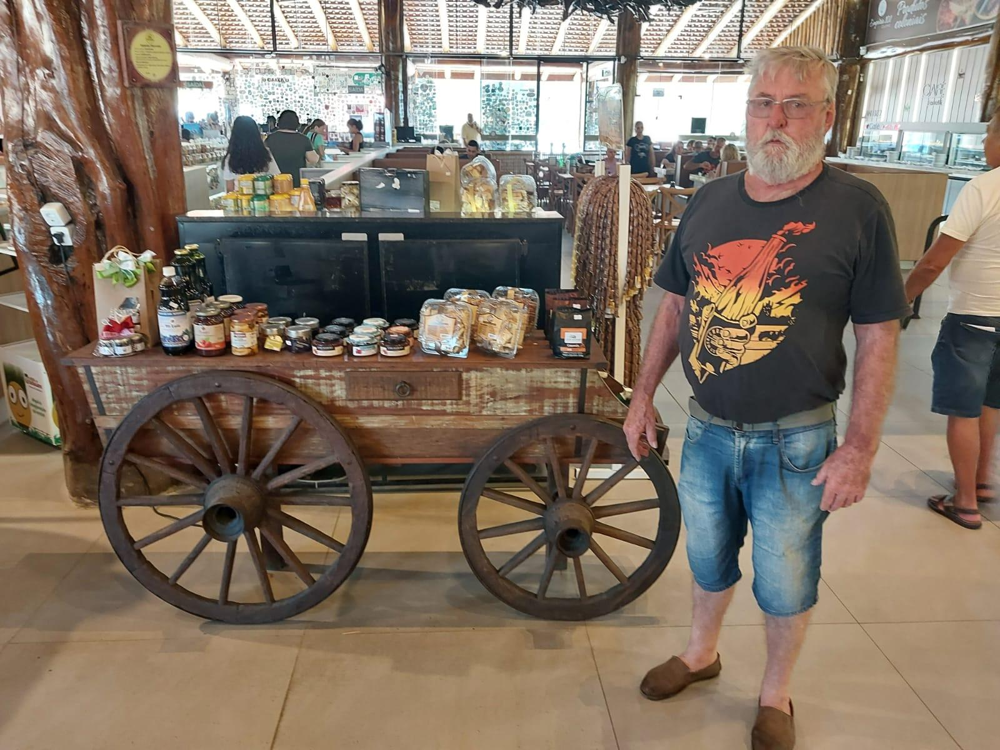
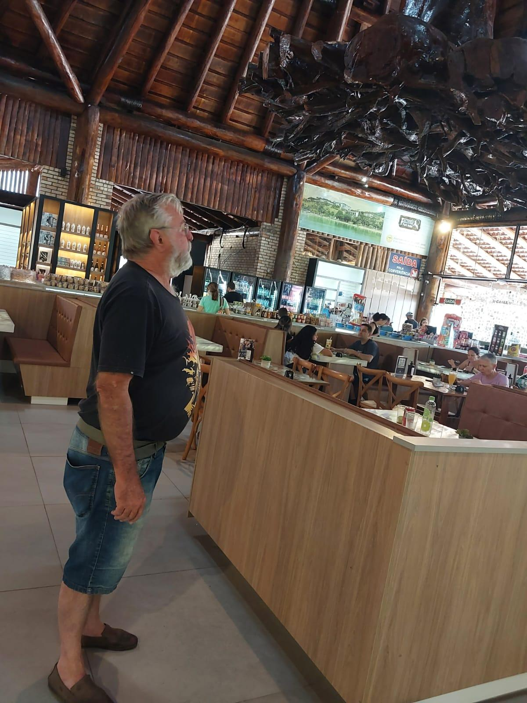
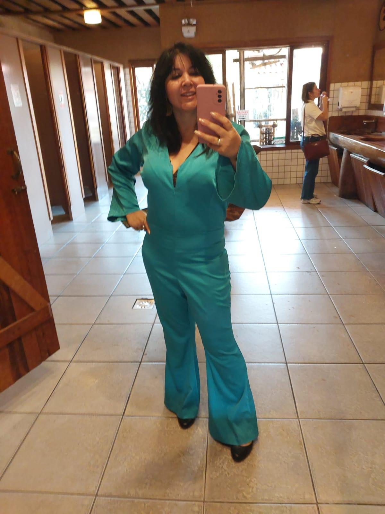
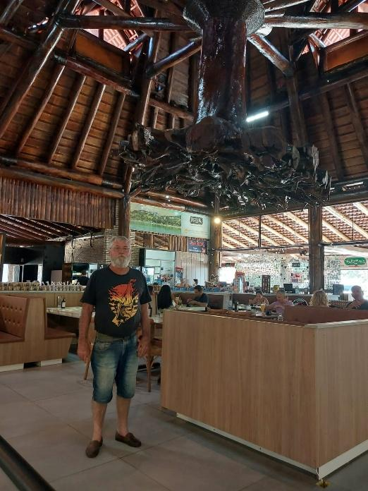
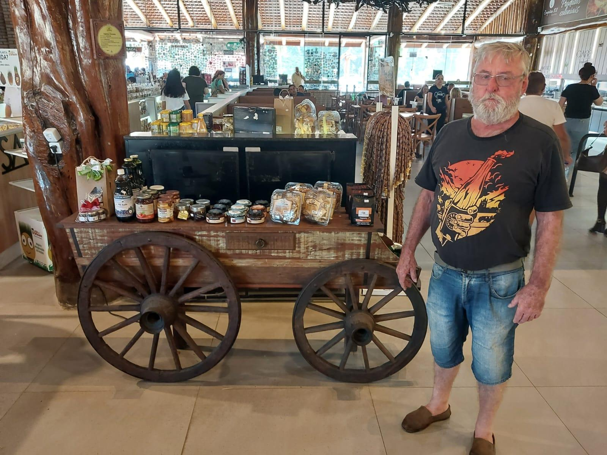
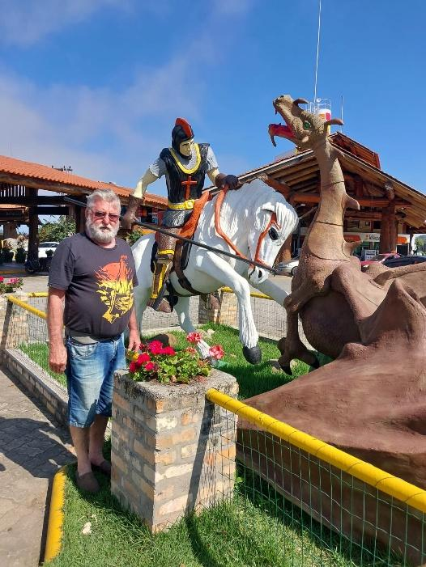

# Passeio com Artur Mohr: Celebrando uma Vida que Recomeçou

<!-- intro -->

Em julho de 2024, saímos para um passeio muito especial com o nosso querido Artur Mohr — e que passeio lindo foi esse! Artur hoje está estável, cheio de vida, e ainda auxilia o Instituto com outros pacientes. Uma história de superação que nos enche de alegria e esperança!

<!-- /intro -->

Artur Mohr é um daqueles casos que a gente nunca esquece. Ver a trajetória dele — de paciente a parceiro do Instituto — é emocionante e inspirador. Hoje, estável e com saúde renovada, o Artur usa sua própria experiência para confortar e encorajar outros que estão no início dessa batalha.

Esse é o ciclo mais lindo que o Instituto do Câncer Sempre Com Você produz: pacientes que se curam e, cheios de gratidão, voltam para ajudar quem ainda está na luta. O Artur é um exemplo vivo disso.

Obrigada, Artur, por tudo o que você representa para nós e para nossos pacientes! 🌟

<!-- gallery -->

- 
- 
- 
- 
- 
- 
- 
<!-- /gallery -->

<!-- tags -->

- Artur Mohr
- 2024
- passeio
- superação
- voluntário
- ex-paciente
- celebração
<!-- /tags -->
