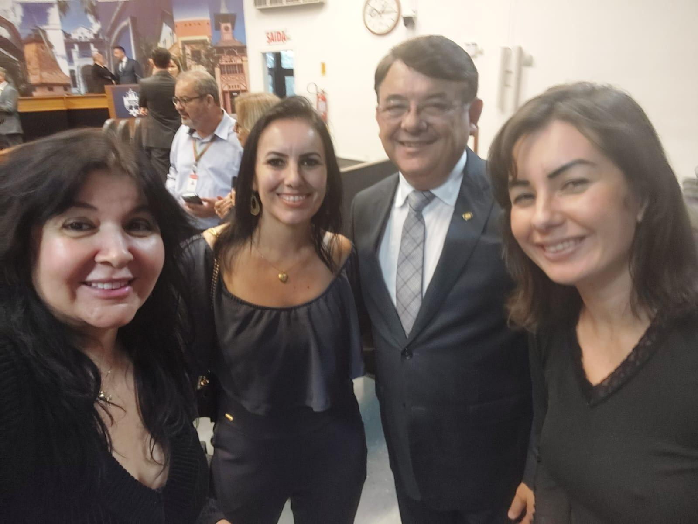
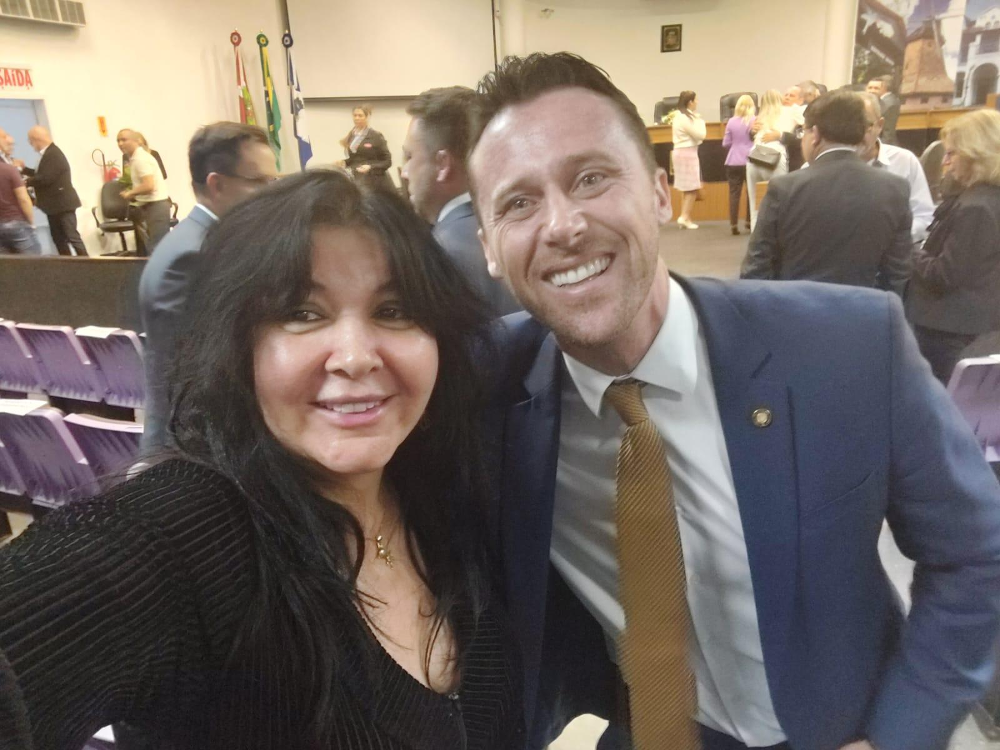

# Reconhecidos pelos Deputados Estaduais: Uma Honra que nos Fortalece

<!-- intro -->
Em agosto de 2024, recebemos um reconhecimento que nos tocou profundamente: o Deputado Estadual Maurício Peixer e o nosso apoiador, o Deputado Fernando Krellig, elogiaram publicamente o trabalho do Instituto Sempre Com Você. Uma honra que nos enche de responsabilidade e gratidão!
<!-- /intro -->

Ser reconhecido por quem representa o povo catarinense na Assembleia Legislativa é uma confirmação de que o trabalho que fazemos importa — e chega longe. O apoio de parlamentares comprometidos com causas sociais como a nossa é fundamental para que possamos crescer, ampliar nosso alcance e defender os direitos dos nossos pacientes em todos os espaços necessários.

Somos muito gratas ao Deputado Maurício Peixer e ao Deputado Fernando Krellig pelo reconhecimento e pelo apoio constante ao Instituto. O Estado de Santa Catarina tem em vocês representantes que olham com carinho para quem mais precisa de atenção e cuidado. Muito obrigada!

Com renovada determinação, seguimos em frente! 💙🙏
