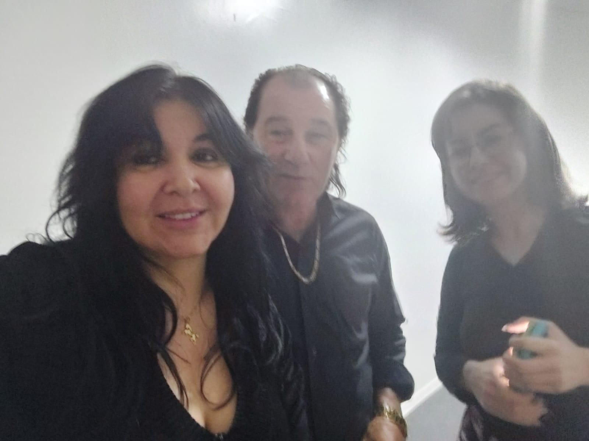

# Parabéns, Ana Cristina! Uma Recuperação que é Motivo de Muita Alegria

<!-- intro -->
Em agosto de 2024, celebramos com toda a alegria que existe em nossos corações a recuperação da nossa querida Ana Cristina. Parabéns, Ana! Você lutou, persistiu e venceu — e esse momento de celebração é muito mais que merecido!
<!-- /intro -->

A recuperação de um paciente oncológico não é apenas uma vitória médica — é uma conquista humana, emocional, familiar e espiritual. Ver a Ana Cristina bem, sorridente, cheia de vida, é lembrar por que cada dia de trabalho do Instituto Sempre Com Você faz sentido.

Ana Cristina, você é um exemplo de força e perseverança. Que sua recuperação seja plena e duradoura, e que você continue sendo essa luz que inspira tantas outras pessoas que ainda estão no meio da batalha.

Com muito amor e carinho, parabenizamos você! 🌸💕

<!-- gallery -->
- 
<!-- /gallery -->

<!-- tags -->
- Ana Cristina
- 2024
- recuperação
- alta médica
- comemoração
- superação
- câncer
<!-- /tags -->
