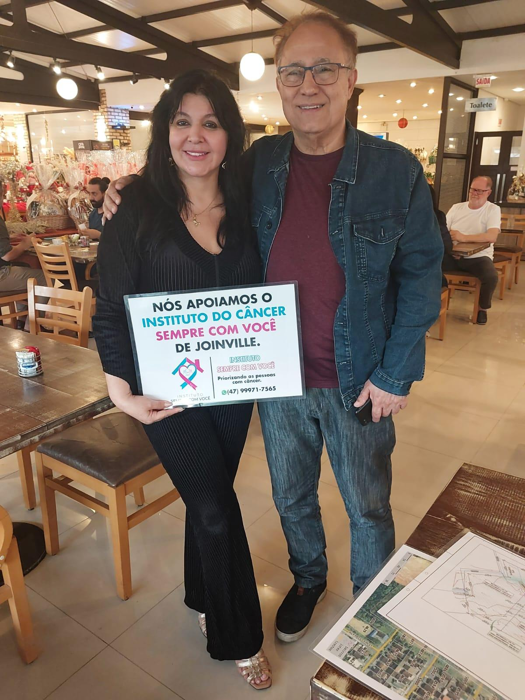

# Walter: Um Exemplo Vivo de Superação

<!-- intro -->
Em agosto de 2024, passamos um tempo especial com o nosso paciente Walter — e usamos essa palavra com toda a convicção: ele é um exemplo vivo. Uma prova real e palpável de que o tratamento funciona, que a esperança não engana e que a vida tem poder de se renovar.
<!-- /intro -->

Quando olhamos para o Walter hoje, vemos um homem que passou por um processo muito difícil e saiu do outro lado — de pé, com dignidade e com história para contar. Esse é o tipo de testemunho que mantém viva a chama da esperança nos corações de todos que ainda estão no meio do tratamento.

Walter, obrigada por nos permitir caminhar ao seu lado e por ser essa luz tão poderosa de inspiração. Que sua história continue tocando e encorajando muitas outras pessoas!

Você nos enche de orgulho. 💙
