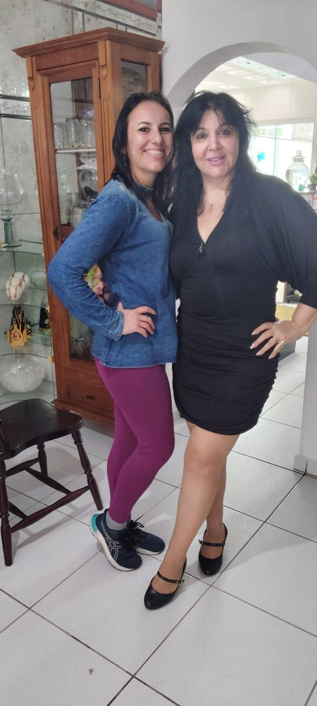
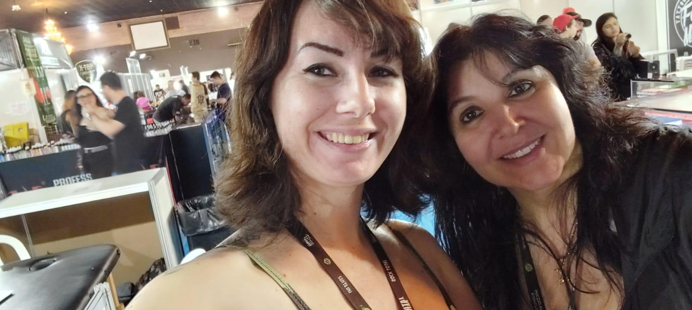

# Priscila: Uma Nova Caminhada que Começa com Esperança

<!-- intro -->
Em outubro de 2024, recebemos a Priscila — uma nova paciente que está iniciando seu acompanhamento com o Instituto Sempre Com Você. Ela chega ao Instituto se espelhando na trajetória da Ana, que já é para nós um exemplo vivo de perseverança e superação.
<!-- /intro -->

Quando uma nova paciente chega ao Instituto, trazemos com ela toda a esperança que o caminho à frente merece. E quando essa paciente já começa olhando para o exemplo de quem venceu — como a Ana — o primeiro passo já é dado com muito mais força.

A história da Ana inspira, e é lindo ver como as histórias de superação dentro do Instituto se tornam faróis de esperança para quem está chegando.

Priscila, seja muito bem-vinda! Estamos aqui para caminhar ao seu lado, ouvir sua história, entender suas necessidades e oferecer todo o suporte que você merece. Você não está sozinha nessa jornada — nunca estará.

Com carinho e acolhimento. 💕
