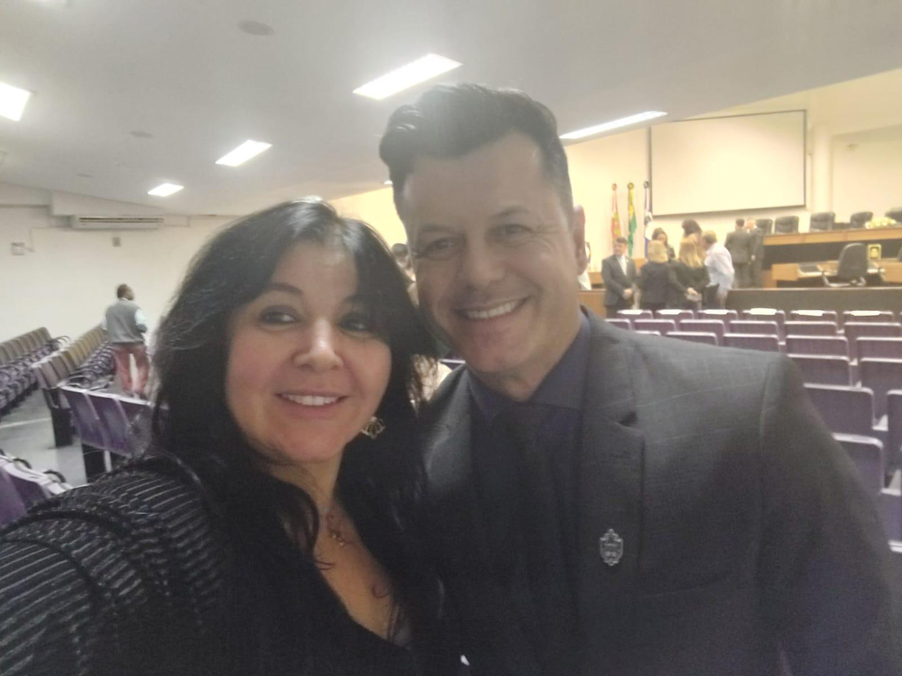

# O Instituto Recebe o Apoio do Vereador Brandel Junior

<!-- intro -->
Em outubro de 2024, tivemos a satisfação de receber o apoio do Vereador Brandel Junior ao trabalho do Instituto Sempre Com Você. Um encontro que reforça a importância de ter representantes comprometidos com as causas sociais da nossa cidade!
<!-- /intro -->

Ter o apoio de um vereador como o Brandel Junior significa ter uma voz a mais nos espaços de decisão de Joinville. Significa que a nossa causa chega onde precisa chegar, é ouvida por quem tem o poder de mobilizar recursos, aprovar projetos e criar políticas que beneficiem nossos pacientes.

Somos gratas ao Vereador Brandel Junior por reconhecer a importância do Instituto Sempre Com Você e por abraçar essa causa tão nobre. Joinville é uma cidade que cuida das suas pessoas — e representantes como ele são a prova disso.

Obrigada, Vereador! Contamos com sua parceria sempre! 🙏

<!-- gallery -->
- 
<!-- /gallery -->

<!-- tags -->
- Brandel Junior
- vereador
- 2024
- Joinville
- apoio
- Câmara de Vereadores
<!-- /tags -->
