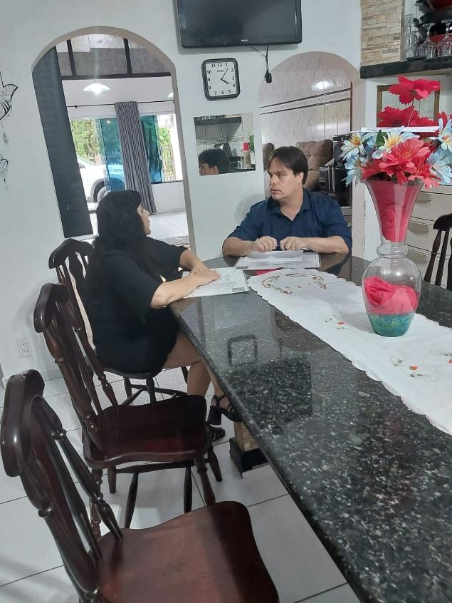
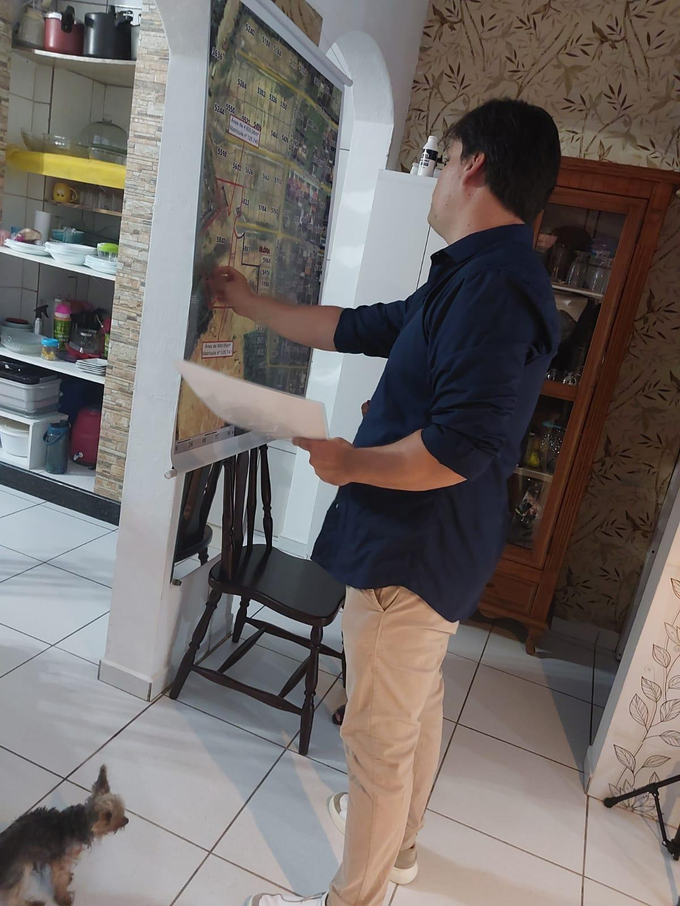
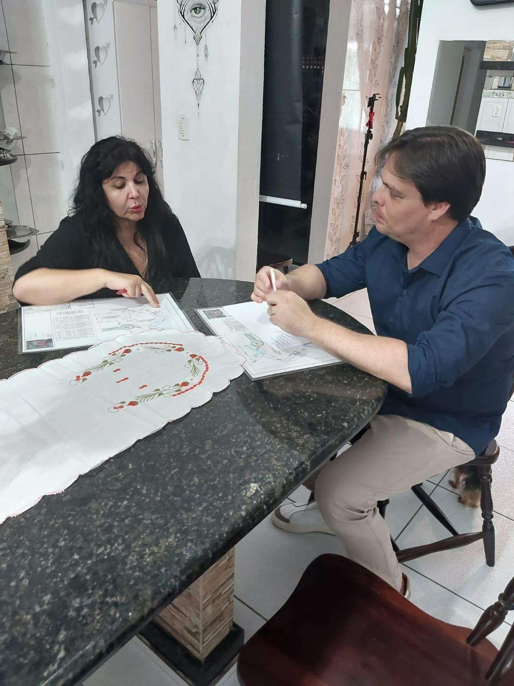

# Rubens: De Paciente a Parceiro do Instituto!

<!-- intro -->
Em outubro de 2024, celebramos uma história linda: o Rubens, já recuperado, voltou ao Instituto Sempre Com Você — não mais como paciente, mas como parceiro! Ver alguém que superou o câncer retornar para ajudar outros é a realização mais bonita da nossa missão.
<!-- /intro -->

O Rubens é a prova viva de que o amor gera mais amor. Ele passou pelo tratamento, recebeu todo o apoio do Instituto, venceu — e não ficou com essa vitória apenas para si. Voltou com os braços abertos, disposto a ajudar, a contribuir, a ser a presença que faz diferença para outros pacientes.

Rubens, que honra ter você ao nosso lado! Você nos lembra todos os dias por que fazemos o que fazemos — e que o trabalho de cuidar gera frutos que duram por muito tempo.

Muito obrigada, Rubens! 💙🌟

<!-- gallery -->
- 
- 
- 
<!-- /gallery -->

<!-- tags -->
- Rubens
- 2024
- ex-paciente
- voluntário
- superação
- parceria
- câncer
<!-- /tags -->
