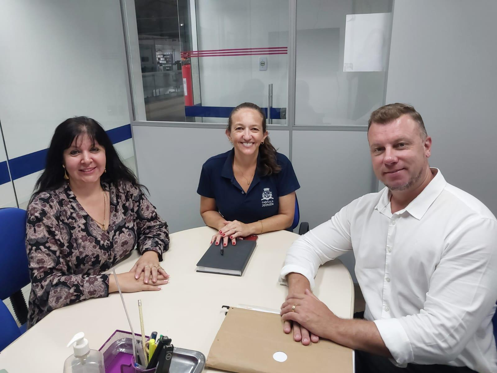
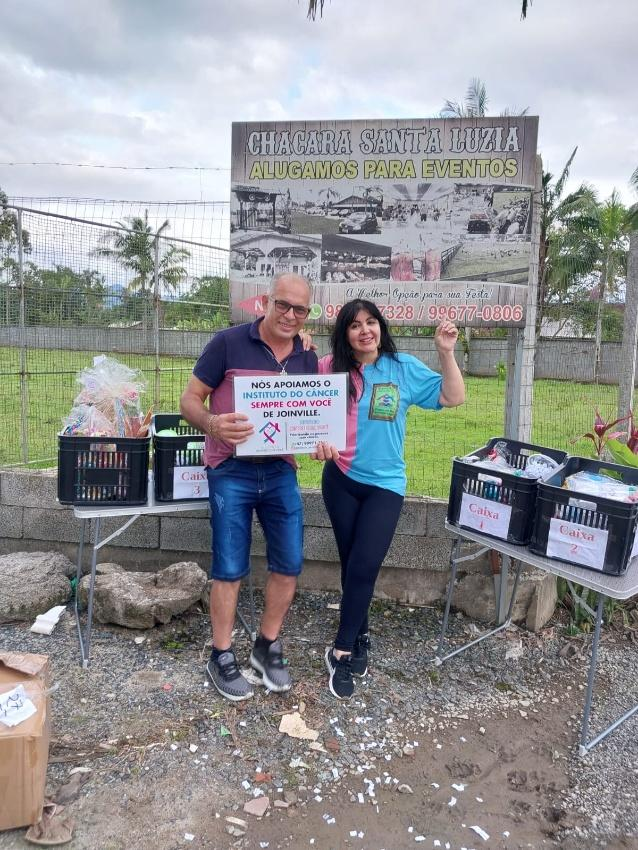

# Apoio aos Familiares: Porque a Dor da Perda Também Precisa de Cuidado

<!-- intro -->
Em novembro de 2024, dedicamos um momento muito especial para apoiar o Jovelino — um homem que sofre profundamente com a depressão após perder sua esposa, vítima do câncer. Porque o nosso cuidado não termina com o fim do tratamento: ele se estende a quem ficou.
<!-- /intro -->

O luto pela perda de um cônjuge para o câncer é uma das experiências mais dolorosas que um ser humano pode vivenciar. O Jovelino chegou ao Instituto carregando esse peso — a saudade, o vazio, a dificuldade de encontrar sentido e seguir em frente.

O nosso papel, nesses momentos, é oferecer o que nenhum remédio pode dar: presença, escuta e um espaço seguro para que a dor possa ser expressa e, aos poucos, transformada.

O Instituto Sempre Com Você acredita que cuidar das famílias que perderam seus entes para o câncer é parte fundamental da nossa missão. A dor do luto merece atenção e acolhimento — e é exatamente isso que nos comprometemos a oferecer.

Jovelino, você não está sozinho. Estamos aqui. 💙
