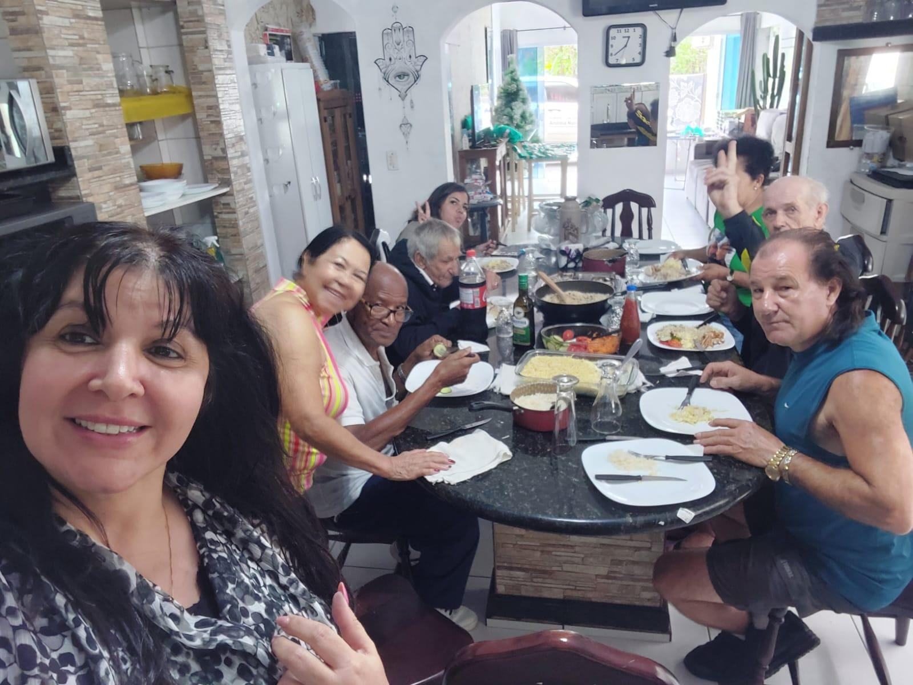
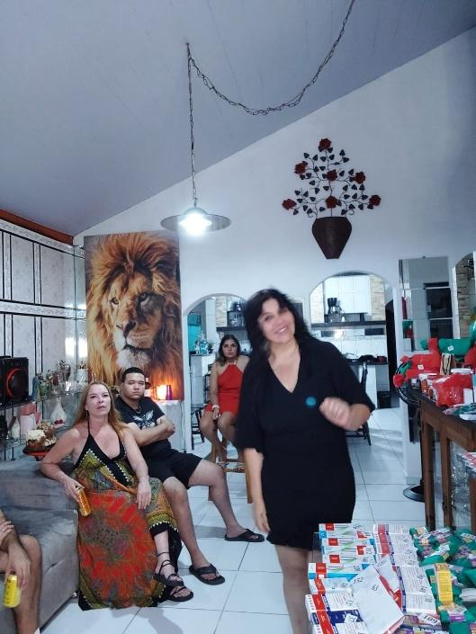
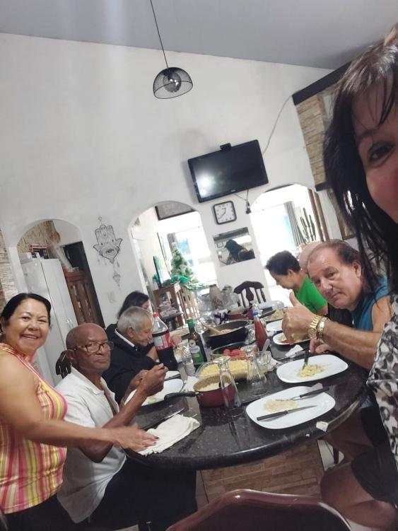

# Casa Cheia: Ex-Pacientes que Viraram Voluntários!

<!-- intro -->
Em novembro de 2024, a casa ficou cheia — e da melhor forma possível! Reunimos um grupo incrível de pacientes que, após o sucesso no tratamento, escolheram permanecer ao lado do Instituto Sempre Com Você como voluntários. Uma tarde de muita emoção, gratidão e inspiração!
<!-- /intro -->

Não existe maior reconhecimento do nosso trabalho do que ver um ex-paciente voltar com os braços abertos para ajudar outros. É o ciclo mais lindo que o Instituto produz: recebemos com amor quem está vulnerável, cuidamos, acompanhamos — e quando essa pessoa se recupera, ela escolhe ficar.

A cada voluntário que surge a partir de uma história de superação, o Instituto cresce — não apenas em número, mas em força, em propósito e em amor. Obrigada a cada um de vocês que escolheram dar de volta o que receberam!

Vocês são o coração do Instituto Sempre Com Você. 💕🌟
