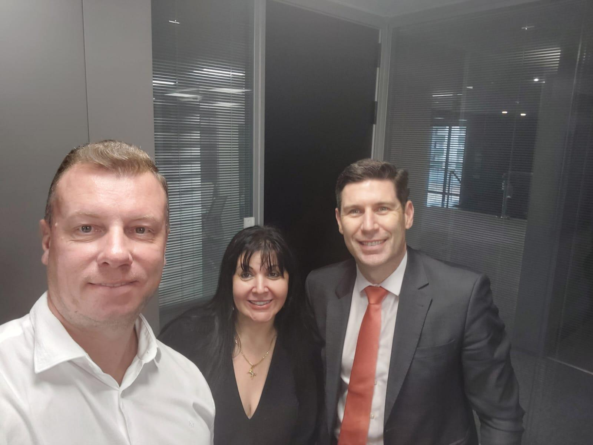
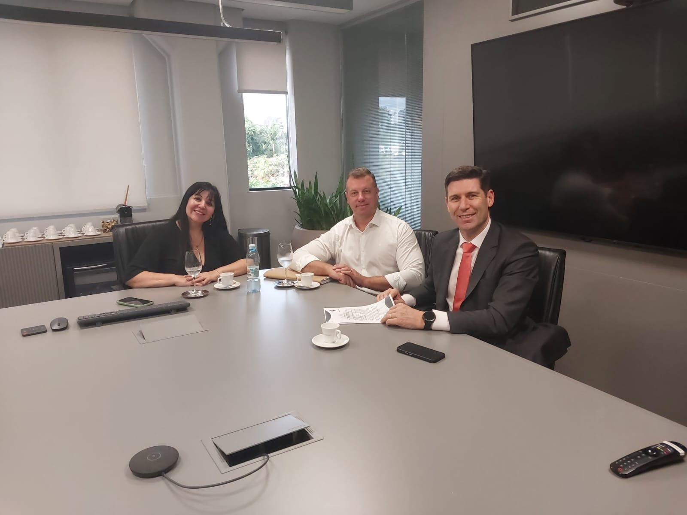

# Olhando para 2025: Planejamento com o Time Jurídico do Instituto

<!-- intro -->

Em dezembro de 2024, reunimos o time de advogados do Instituto do Câncer Sempre Com Você para alinhar os projetos e as prioridades do ano que está por vir. 2025 chegará com muito mais planejamento, segurança jurídica e determinação!

<!-- /intro -->

Encerrar o ano com o olhar voltado para o futuro é essencial para quem tem responsabilidades tão importantes quanto as nossas. A reunião com os advogados do Instituto permitiu revisar contratos, estratégias jurídicas e os próximos passos para a construção da nova sede — entre outros projetos que queremos concretizar em 2025.

Um Instituto bem assessorado juridicamente é um Instituto que pode servir melhor, com mais segurança para seus pacientes, parceiros e voluntários. Gratidão ao nosso time jurídico pela seriedade e pelo comprometimento com a nossa causa!

2025, estamos prontas para você! 🚀💙

<!-- gallery -->

- 
- 
<!-- /gallery -->

<!-- tags -->

- planejamento
- 2024
- advogados
- 2025
- projetos
- estratégia
- jurídico
<!-- /tags -->
