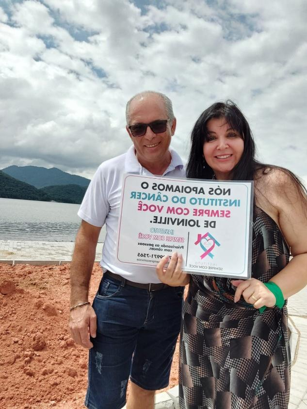
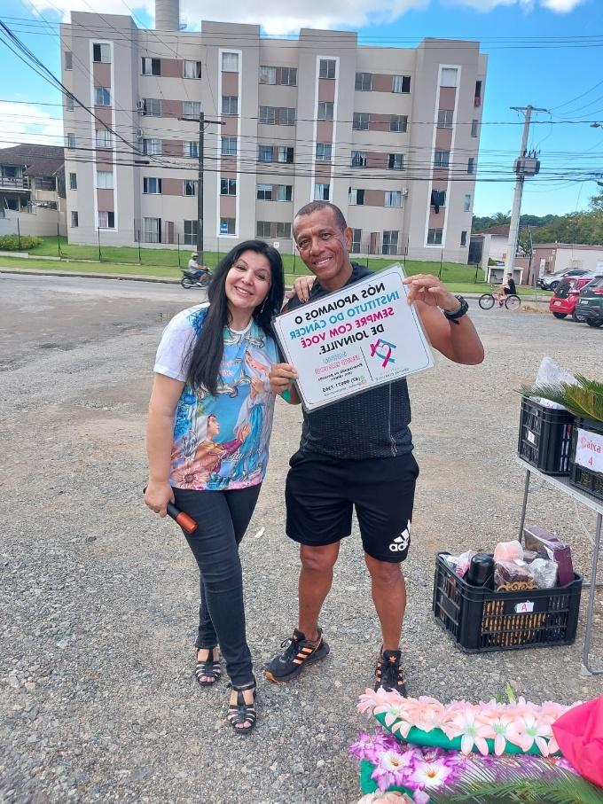

# Luto que Vira Amor: Samuel e Juvelino Transformam a Dor em Voluntariado

<!-- intro -->

Em janeiro de 2025, conhecemos de forma mais profunda a história de Samuel e Juvelino — dois homens que compartilham a mesma dor: a perda de suas companheiras, que partiram vítimas do câncer. Mas em vez de se fechar na dor, os dois escolheram se abrir para servir. Hoje, ambos são voluntários do Instituto do Câncer Sempre Com Você.

<!-- /intro -->

A perda de uma esposa para o câncer deixa uma ferida que não tem prazo para curar. Samuel e Juvelino sabem bem o que é isso. Mas o que nos emociona profundamente é a escolha que fizeram: transformar o luto em serviço, a saudade em cuidado, a dor em amor ao próximo.

Ao chegarem ao Instituto como voluntários, eles encontraram não apenas uma missão — encontraram uma família, pessoas que entendem o que é carregar esse tipo de perda, e um espaço onde a dor pode ser ressignificada em algo belo e transformador.

Samuel e Juvelino, obrigada por escolherem o amor mesmo diante de tanta dor. Vocês são um exemplo que nos move. 💙

<!-- gallery -->

- 
- 
<!-- /gallery -->

<!-- tags -->

- Samuel
- Juvelino
- 2025
- voluntários
- luto
- familiares
- viuvez
- câncer
<!-- /tags -->
