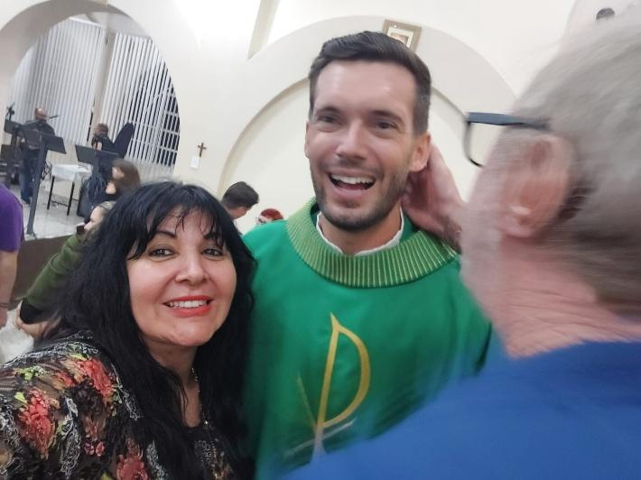
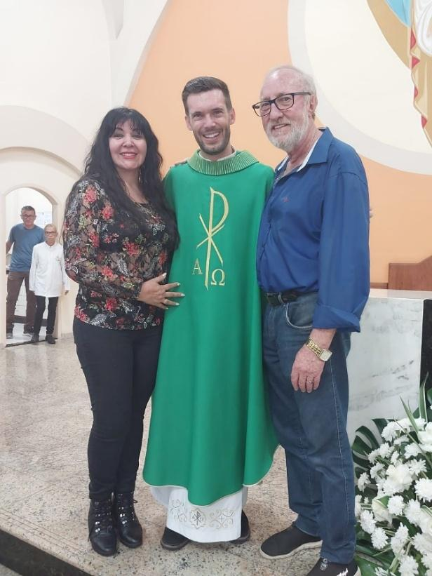
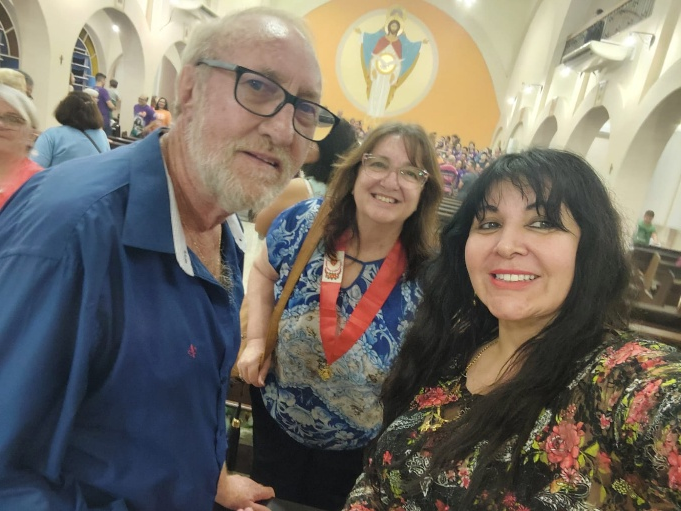

# Alceu Roque: Com Muita Fé, Um Tratamento Bem-Sucedido!

<!-- intro -->
Em janeiro de 2025, celebramos com imensa alegria o testemunho do nosso querido Alceu Roque — um paciente que atravessou o tratamento sustentado por uma fé inabalável e que hoje agradece, do fundo do coração, por cada passo dessa caminhada. Uma história de fé e cura que nos emociona profundamente!
<!-- /intro -->

A fé do Alceu Roque é contagiante. Em momentos em que o corpo enfraquece e o espírito vacila, foi a fé que o manteve de pé — junto com o apoio do Instituto e de todos que o cercam com amor. Ver o Alceu hoje, agradecido e bem, é uma dessas dádivas que nos lembram que o trabalho que fazemos tem um propósito muito maior do que podemos mensurar.

Alceu, sua gratidão nos enche de ânimo para continuar. Sua fé nos inspira. E seu testemunho tem o poder de iluminar o caminho de tantos outros que ainda estão no meio da batalha.

Que Deus continue abençoando a sua vida com saúde e alegria! Obrigada por tudo, Alceu! 🙏🌟

<!-- gallery -->
- 
- 
- 
<!-- /gallery -->

<!-- tags -->
- Alceu Roque
- 2025
- fé
- alta médica
- superação
- gratidão
- tratamento bem-sucedido
<!-- /tags -->
