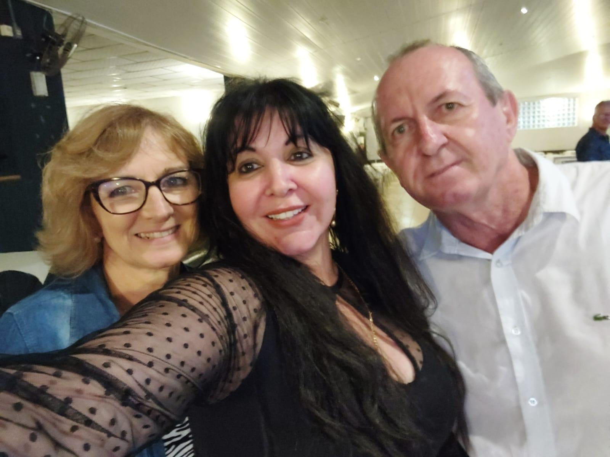
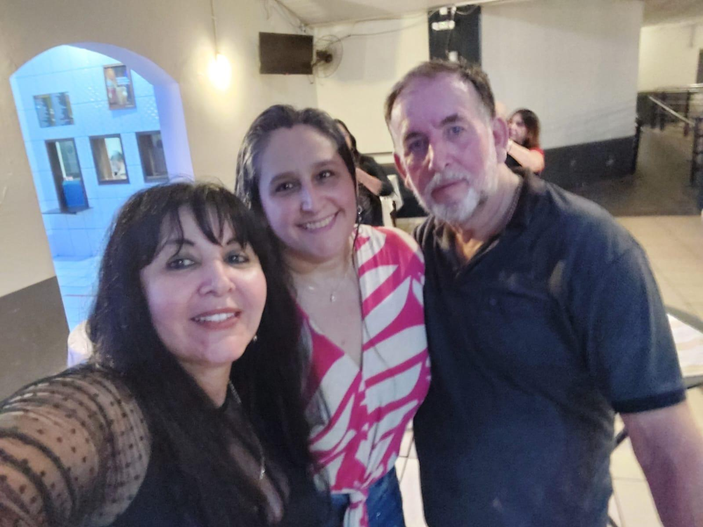

# Milton e Vinícios: Com as Esposas ao Lado, O Tratamento Fica Mais Leve

<!-- intro -->
Em fevereiro de 2025, acompanhamos dois pacientes muito especiais: Milton e Vinícios — que vieram ao Instituto junto com suas esposas. Um testemunho lindo de que o amor conjugal é, sem dúvida, uma das medicinas mais poderosas que existem!
<!-- /intro -->

Quando uma esposa acompanha o marido no tratamento — em cada sessão, em cada consulta, em cada momento difícil — ela está dizendo sem palavras: "Você não está sozinho. Eu estou aqui." Isso tem um valor terapêutico imenso que a ciência confirma e que a nossa experiência no Instituto comprova diariamente.

Milton e Vinícios, que bom tê-los conosco! E às suas esposas: vocês são guerreiras também. O cuidado que oferecem todos os dias é parte fundamental da cura.

Gratidão a essas famílias que caminham juntas! 💕

<!-- gallery -->
- 
- 
<!-- /gallery -->

<!-- tags -->
- Milton
- Vinícios
- 2025
- pacientes
- esposas
- família
- acompanhamento
- apoio
<!-- /tags -->
