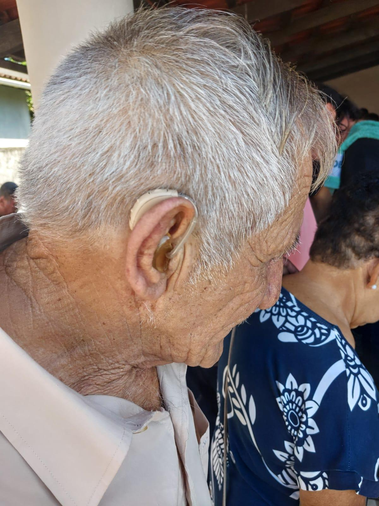
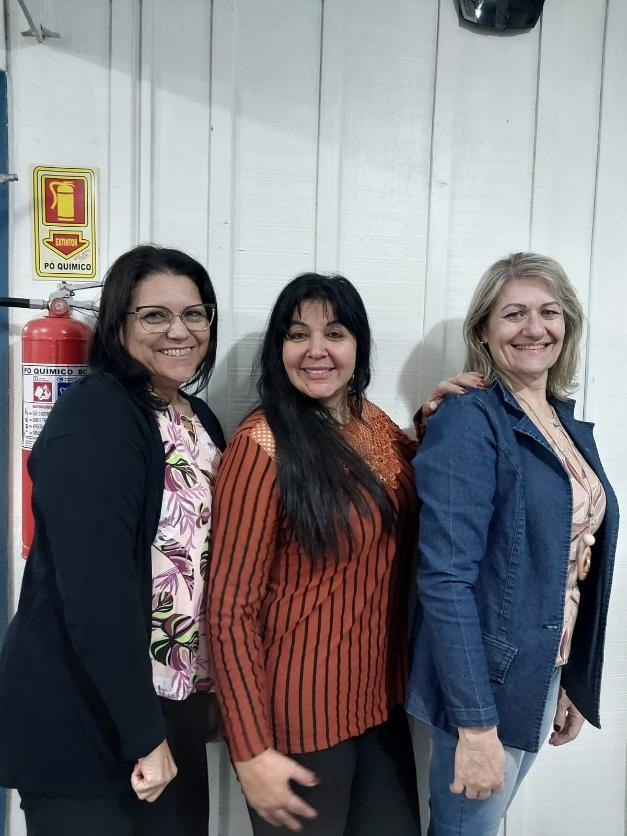
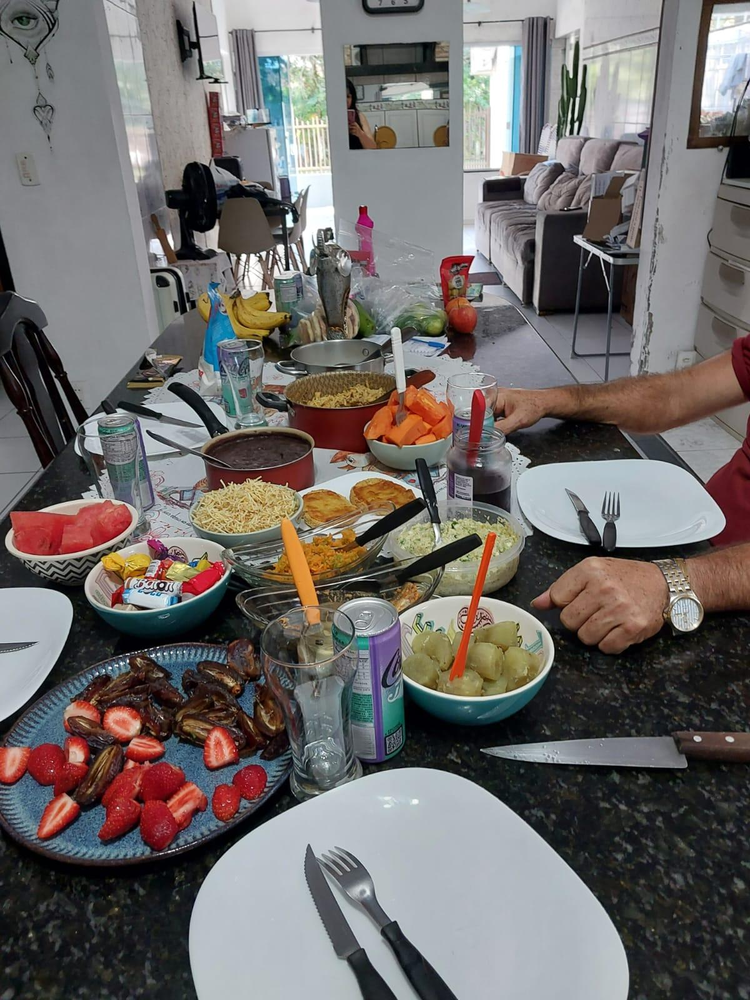

# Mesa Posta para Oito: Cuidado Que Também Alimenta a Alma

<!-- intro -->
Em fevereiro de 2025, pusemos a mesa para oito pacientes — e foi um encontro que alimentou muito mais do que o corpo. Reunir tantas histórias ao redor de uma mesa é, para nós, um dos momentos mais bonitos e significativos do nosso trabalho. E ainda tivemos uma conquista especial para comemorar!
<!-- /intro -->

A mesa posta é mais do que comida: é acolhimento, é pertencimento, é a mensagem de que "você importa, você é bem-vindo, você merece ser cuidado." Para muitos dos nossos pacientes, esse momento de partilha é também uma pausa na dureza do tratamento — um espaço de alegria simples e genuína.

E nesse encontro, tivemos uma conquista muito especial para celebrar: o senhor Paulo, de 76 anos, conquistou o seu aparelho auditivo! Uma vitória que melhorou sua qualidade de vida de forma muito concreta e que merece ser festejada com muita alegria.

Parabéns, seu Paulo! E a todos os oito que estiveram presentes: obrigada por encheram nossa mesa e nosso coração de alegria! 🍽️💕

<!-- gallery -->
- 
- 
- 
<!-- /gallery -->

<!-- tags -->
- mesa posta
- 2025
- grupo de pacientes
- Paulo
- aparelho auditivo
- celebração
- partilha
<!-- /tags -->
