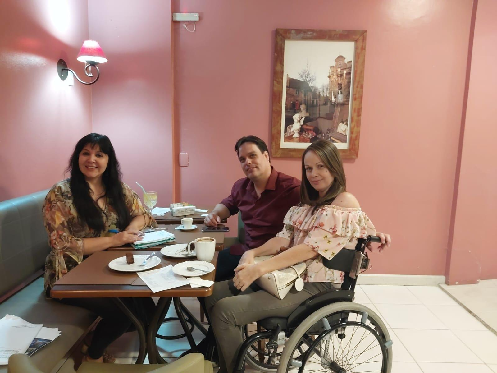
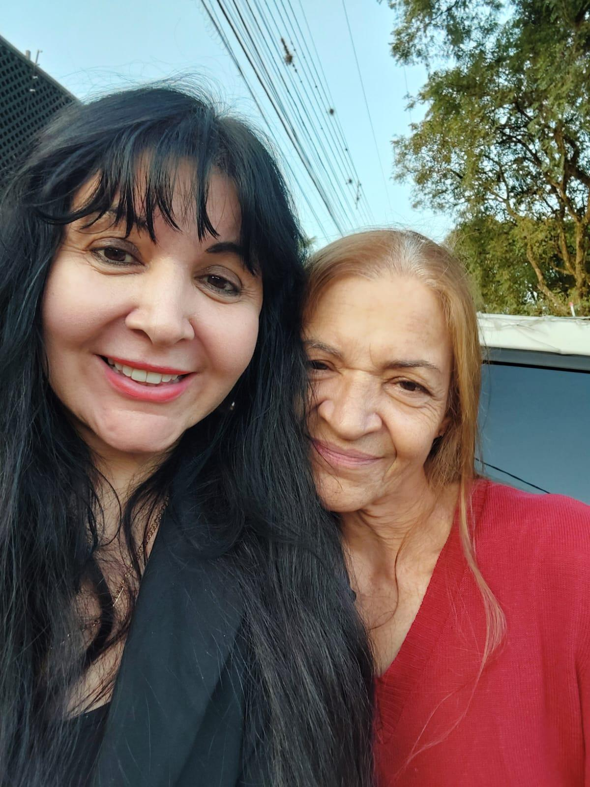

# Margarete: Uma História de Coragem que Merece Ser Contada

<!-- intro -->
Em março de 2025, dedicamos um momento especial à nossa paciente Margarete — uma mulher que nos inspira pela coragem com que enfrenta o tratamento e pela força silenciosa que carrega. Cada paciente tem uma história única, e a da Margarete merece ser conhecida e celebrada.
<!-- /intro -->

Receber um diagnóstico de câncer transforma a vida de uma forma que só quem passou pode entender completamente. E a Margarete atravessa essa transformação com uma dignidade que nos toca profundamente. O Instituto Sempre Com Você está ao seu lado — nos exames, nas consultas, nos momentos bons e nos difíceis.

Margarete, você é mais forte do que imagina. E temos a honra de caminhar ao seu lado nessa jornada.

Com muito carinho e admiração. 💕

<!-- gallery -->
- 
- 
<!-- /gallery -->

<!-- tags -->
- Margarete
- 2025
- paciente
- câncer
- acompanhamento
- apoio emocional
<!-- /tags -->
