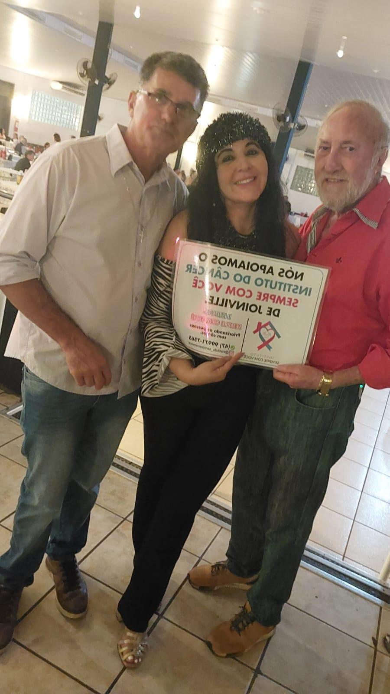

# Antes Pacientes, Agora Voluntários: Alceu e Eloi Inspiram o Instituto

<!-- intro -->
Em março de 2025, celebramos um dos momentos mais emocionantes que o Instituto Sempre Com Você pode vivenciar: ver Alceu e Eloi — antes pacientes — retornando agora como voluntários, prontos para ajudar outros que percorrem o mesmo caminho que um dia percorreram. Uma parceria que nasce da superação!
<!-- /intro -->

O caminho de paciente a voluntário é, talvez, a maior expressão de gratidão que um ser humano pode demonstrar. Alceu e Eloi passaram pelo tratamento, foram acolhidos pelo Instituto, e quando ficaram bem — decidiram ficar. Não para receber, mas para dar. Não para serem cuidados, mas para cuidar.

Essa é a corrente do bem que o Instituto Sempre Com Você ajuda a criar. Cada paciente que se cura e decide olhar para trás para ajudar quem ainda está na luta é uma vitória dupla: a da cura e a do coração.

Alceu e Eloi, obrigada pela parceria e por tudo o que representam para nós! 💙🌟

<!-- gallery -->
- 
<!-- /gallery -->

<!-- tags -->
- Alceu
- Eloi
- 2025
- voluntários
- ex-pacientes
- superação
- gratidão
<!-- /tags -->
