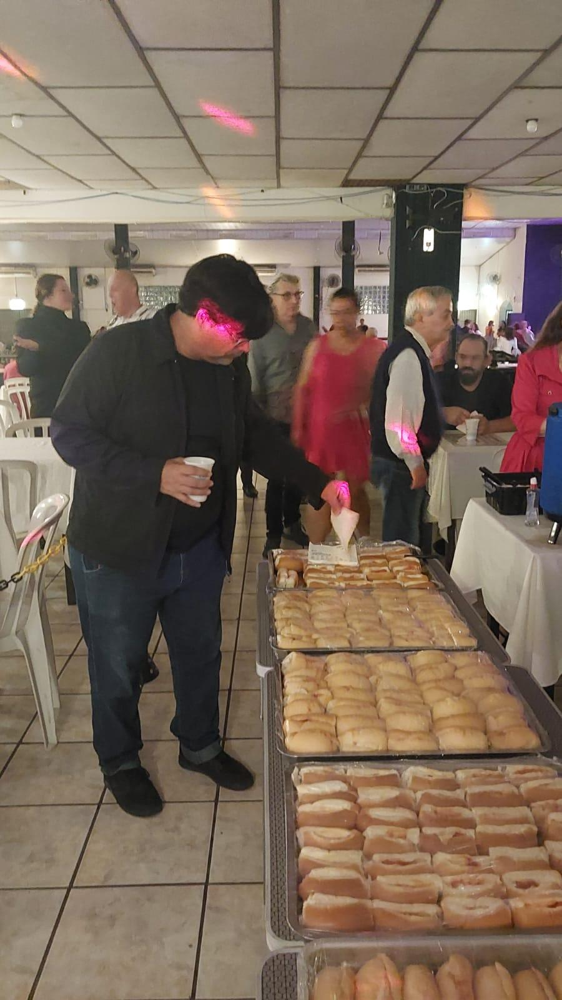
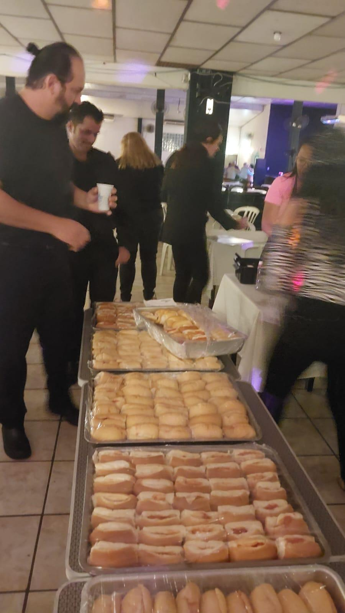
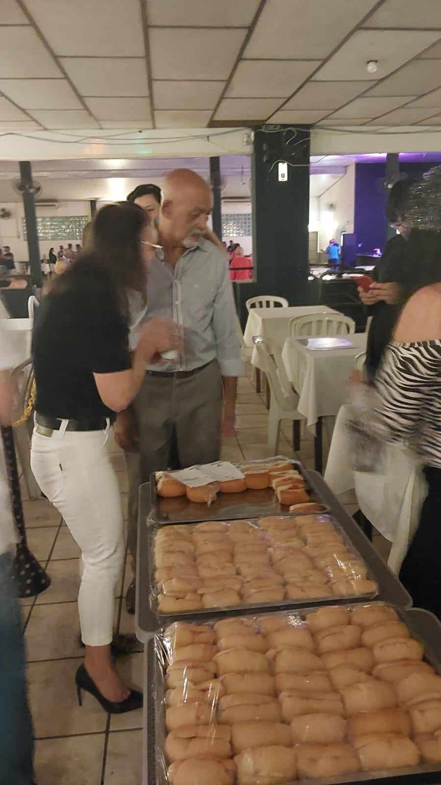
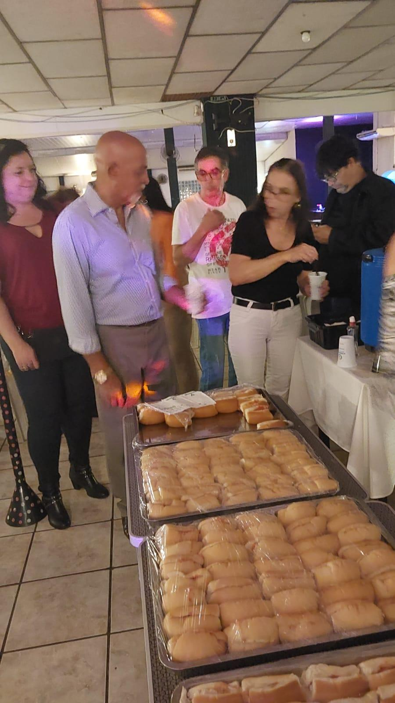
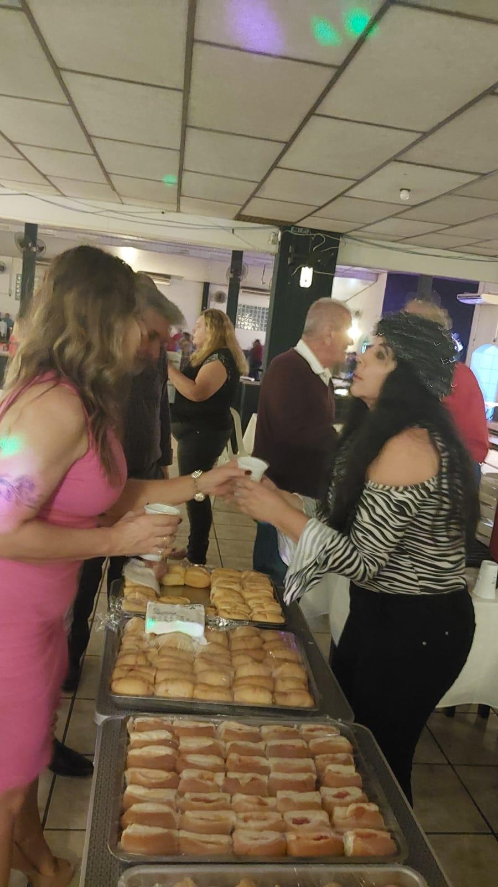
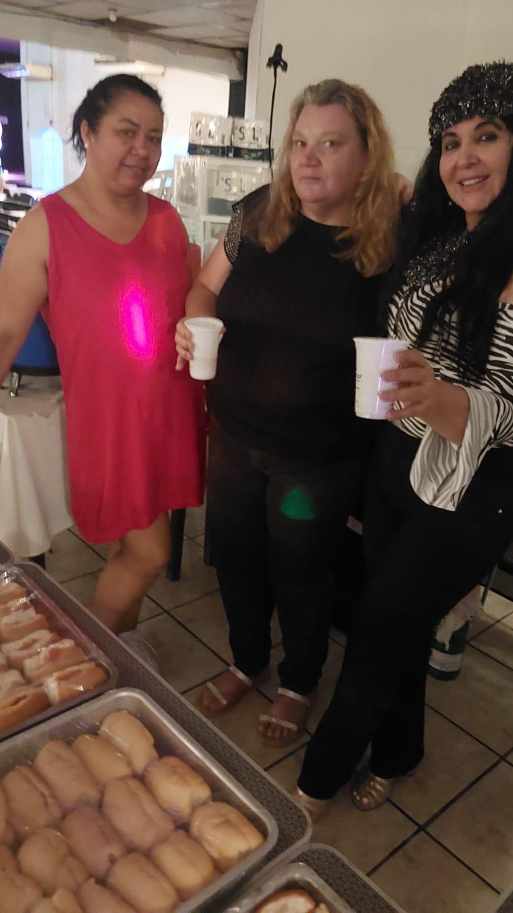
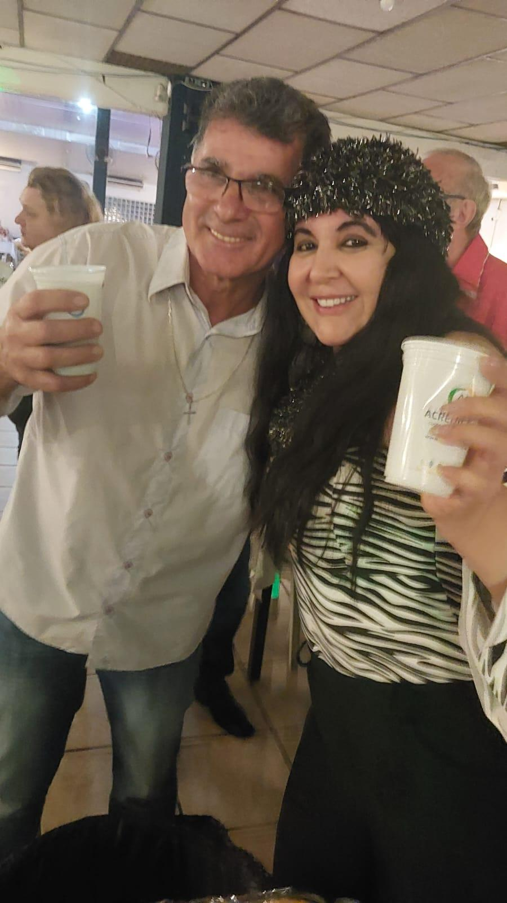

# Evento Beneficente com a Terceira Idade: A Solidariedade que Festeja!

<!-- intro -->

Em abril de 2025, realizamos um evento beneficente que contou com a participação especial do nosso grupo da terceira idade — e foi um sucesso! Uma noite de celebração, solidariedade e muita energia para ajudar a manter o Instituto do Câncer Sempre Com Você em funcionamento.

<!-- /intro -->

Não há nada mais bonito do que ver nossos amigos da terceira idade com aquela disposição de fazer o bem! Eles chegaram com entusiasmo, com sorriso no rosto, prontos para contribuir — e a noite foi exatamente isso: uma festa da solidariedade, onde cada presença fez diferença.

Cada real arrecadado nessa noite vai direto para o cuidado dos nossos pacientes. E a energia que esse grupo traz é, por si só, uma forma poderosa de curar — a alegria é contagiante!

Obrigada a todos que participaram e tornaram esse evento possível! 🎉💕

<!-- gallery -->

- 
- 
- 
- 
- 
- 
- 
<!-- /gallery -->

<!-- tags -->

- evento beneficente
- 2025
- terceira idade
- arrecadação
- solidariedade
- abril
<!-- /tags -->
