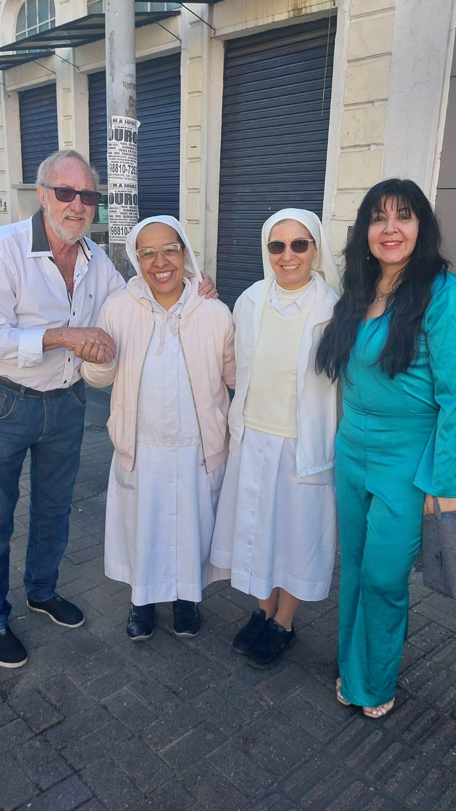

# Palavras Amigas das Freiras: Fé e Esperança que Chegam de Mãos Dadas

<!-- intro -->
Em abril de 2025, o Instituto Sempre Com Você recebeu uma visita muito especial: duas freiras vieram trazer palavras de fé, esperança e carinho para o nosso paciente Alceu e para a nossa presidente Andrea. Uma conversa amiga que aqueceu todos os corações presentes!
<!-- /intro -->

Há um tipo especial de paz que vem quando pessoas de fé genuína chegam com palavras simples e verdadeiras. As freiras que nos visitaram trouxeram exatamente isso: a presença serena, o olhar acolhedor, as palavras que encontram o caminho direto ao coração.

Para o Alceu — um paciente que sustenta o tratamento com muita fé — esse encontro foi especialmente significativo. A fé, em todas as suas formas, tem o poder de suportar o que a razão sozinha não consegue.

Somos gratas pela visita e pelas palavras de esperança que ficaram gravadas em nossos corações. Momentos como esse nos lembram que cuidar de alguém é também cuidar da sua espiritualidade e do seu caminho interior.

Obrigada, irmãs! 🙏💙
